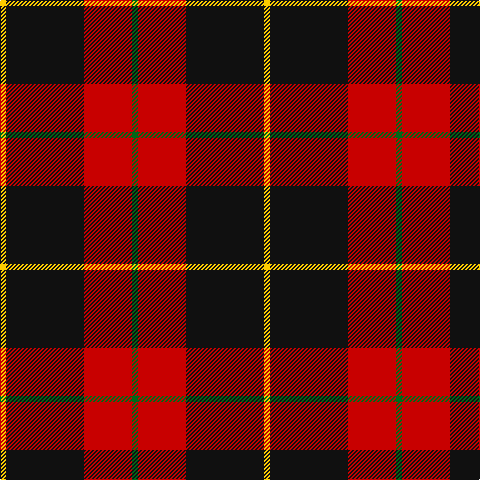

**Bands:** [YKRG](/stripes/ykrg/) · **Stripes:** [LY K R G](/stripes/stripes4/) LY K R G

This was sourced from tartans-authority.  It is a [4 band tartan](/bands/bands4/).

Original link http://www.tartansauthority.com/tartan-ferret/display/11143/

## Variants

Other setts woven to the same stripe pattern.

- [Billy Apple® Red](/setts/s4/g1r13k8ly1~x6/)

## Thread count
Y/6 K78 R48 G/6

## Palette
Each colour and its ΔE from the base-6 reference it is a variant of.

| Colour | Shade | Base | ΔE (OKLab) |
|---|---|---|---|
| G | <code style="background-color:#006818;">#006818</code> `#006818` | G <code style="background-color:#006100;">#006100</code> | 0.02 |
| K | <code style="background-color:#101010;">#101010</code> `#101010` | K <code style="background-color:#000000;">#000000</code> | 0.17 |
| R | <code style="background-color:#C80000;">#C80000</code> `#C80000` | R <code style="background-color:#CC0000;">#CC0000</code> | 0.01 |
| Y | <code style="background-color:#FCCC00;">#FCCC00</code> `#FCCC00` | Y <code style="background-color:#F2BF00;">#F2BF00</code> | 0.04 |

# Sample pattern

## Nearest tartans

The nearest existing variants by ΔTartan distance.

1. [Templar Grand Priory USA](/setts/s4/db3k32r27w2~x2/) — ΔT 0.79
1. [MacIver](/setts/s5/k16r2k2r12w1~x2/) — ΔT 1.25
1. [Skinner](/setts/s4/db1r16k16ly1~x4/) — ΔT 1.26
1. [Calgary Firefighters (Corporate)](/setts/s5/o4k48o16r12db3~x2/) — ΔT 1.27
1. [Oklahoma State University (Corporate](/setts/s4/r80k52w7o12/) — ΔT 1.27
1. [Papua New Guinea](/setts/s5/g3ly5r14k36w3~x2/) — ΔT 1.31
1. [MacQueen](/setts/s6/k2r6k2r6k12ly1~x4/) — ΔT 1.33
1. [Swanstrom (Personal)](/setts/s6/k8r1k8r11ly1r1~x4/) — ΔT 1.36
1. [Bodog.com](/setts/s5/r3k25r25k10lb3~x2/) — ΔT 1.36
1. [Calgary Firefighters](/setts/s5/y4k48y16r12b3~x2/) — ΔT 1.38

## Neighbour map

Every grey dot is one of 14299 variants placed by the first two principal components of the ΔTartan feature space (44% of its variance). Red is this tartan; blue dots are its nearest — click one to open its page.

<svg viewBox="0 0 640 380" role="img" style="max-width:100%;height:auto;border:1px solid #e0e0e0;border-radius:4px;display:block" xmlns="http://www.w3.org/2000/svg"><image href="/nn/cloud.v1.png" width="640" height="380"/><a href="/setts/s4/db3k32r27w2~x2/"><circle cx="315.6" cy="199.6" r="4" fill="#3465a4"><title>Templar Grand Priory USA</title></circle></a><a href="/setts/s5/k16r2k2r12w1~x2/"><circle cx="360.3" cy="195.2" r="4" fill="#3465a4"><title>MacIver</title></circle></a><a href="/setts/s4/db1r16k16ly1~x4/"><circle cx="299.3" cy="192.3" r="4" fill="#3465a4"><title>Skinner</title></circle></a><a href="/setts/s5/o4k48o16r12db3~x2/"><circle cx="336.1" cy="188.8" r="4" fill="#3465a4"><title>Calgary Firefighters (Corporate)</title></circle></a><a href="/setts/s4/r80k52w7o12/"><circle cx="289.6" cy="205.7" r="4" fill="#3465a4"><title>Oklahoma State University (Corporate</title></circle></a><a href="/setts/s5/g3ly5r14k36w3~x2/"><circle cx="299.0" cy="169.4" r="4" fill="#3465a4"><title>Papua New Guinea</title></circle></a><a href="/setts/s6/k2r6k2r6k12ly1~x4/"><circle cx="342.4" cy="216.7" r="4" fill="#3465a4"><title>MacQueen</title></circle></a><a href="/setts/s6/k8r1k8r11ly1r1~x4/"><circle cx="336.5" cy="214.7" r="4" fill="#3465a4"><title>Swanstrom (Personal)</title></circle></a><a href="/setts/s5/r3k25r25k10lb3~x2/"><circle cx="317.5" cy="237.3" r="4" fill="#3465a4"><title>Bodog.com</title></circle></a><a href="/setts/s5/y4k48y16r12b3~x2/"><circle cx="342.5" cy="192.8" r="4" fill="#3465a4"><title>Calgary Firefighters</title></circle></a><circle cx="332.4" cy="206.9" r="5" fill="#c00000"/></svg>

ID: /setts/s4/g1r8k13ly1~x6/
