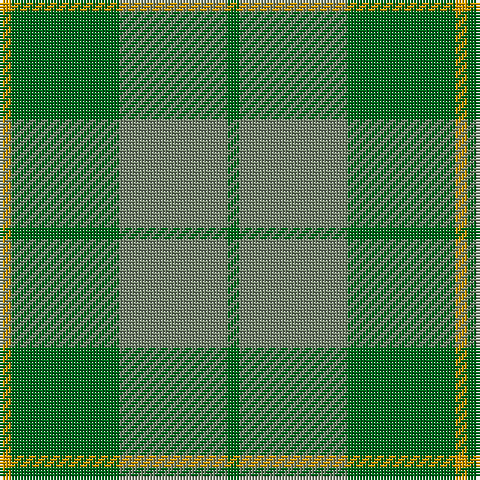

**Bands:** [YGGG](/stripes/yggg/) · **Stripes:** [LO G Y G](/stripes/stripes4/) LO G Y G

This was sourced from tartans-authority.  It is a [4 band tartan](/bands/bands4/).

Original link http://www.tartansauthority.com/tartan-ferret/display/5311/

## Thread count
DY/4 G36 N36 G/4

## Palette
Each colour and its ΔE from the base-6 reference it is a variant of.

| Colour | Shade | Base | ΔE (OKLab) |
|---|---|---|---|
| DY | <code style="background-color:#D09800;">#D09800</code> `#D09800` | Y <code style="background-color:#F2BF00;">#F2BF00</code> | 0.12 |
| G | <code style="background-color:#006818;">#006818</code> `#006818` | G <code style="background-color:#006100;">#006100</code> | 0.02 |
| N | <code style="background-color:#74846C;">#74846C</code> `#74846C` | G <code style="background-color:#006100;">#006100</code> | 0.20 |

# Sample pattern

## Nearest tartans

The nearest existing variants by ΔTartan distance.

1. [Spring Morning](/setts/s6/y9g9lo1g9y9g1~x4/) — ΔT 1.22
1. [Confederate Artillery (Military)](/setts/s6/r2g12o3g8o14g2~x2/) — ΔT 1.53
1. [Ledford (Name)](/setts/s3/g9o4ly1~x16/) — ΔT 1.62
1. [Harmony, 11](/setts/s6/o6g2o29g29o2g6~x2/) — ΔT 1.62
1. [Canadian Fancy](/setts/s6/g4o25g6t12g12t3~x2/) — ΔT 1.78
1. [Irving of Bonshaw](/setts/s5/g27g14dt2g2ly2~x4/) — ΔT 1.83
1. [Colonial Marine (Corporate)](/setts/s4/g56dy13lo13lo5~x2/) — ΔT 1.85
1. [Campbell Simpson (Dalgliesh)](/setts/s6/g22k3g3g16g6k4~x2/) — ΔT 1.91
1. [MacKinnon Hunting Clan Tartan Tartan Number: 917. Earliest known date: 1960 The modern hunting MacKinnon is based on the sett published in the Vestiarium Scoticum in 1842. The change is simply from red in the V.S. to brown in the modern version. The result was registered with Lord Lyon in 1960. See products available Copyright © Blair Urquhart, Comrie, 2015](/setts/s7/g1dy8g8r1g8dy8w1~x2/) — ΔT 1.92
1. [Celtic 2009 (Sports)](/setts/s5/g40dg15g4dg4g4~x2/) — ΔT 1.93

## Neighbour map

Every grey dot is one of 14299 variants placed by the first two principal components of the ΔTartan feature space (44% of its variance). Red is this tartan; blue dots are its nearest — click one to open its page.

<svg viewBox="0 0 640 380" role="img" style="max-width:100%;height:auto;border:1px solid #e0e0e0;border-radius:4px;display:block" xmlns="http://www.w3.org/2000/svg"><image href="/nn/cloud.v1.png" width="640" height="380"/><a href="/setts/s6/y9g9lo1g9y9g1~x4/"><circle cx="402.3" cy="322.2" r="4" fill="#3465a4"><title>Spring Morning</title></circle></a><a href="/setts/s6/r2g12o3g8o14g2~x2/"><circle cx="385.1" cy="298.1" r="4" fill="#3465a4"><title>Confederate Artillery (Military)</title></circle></a><a href="/setts/s3/g9o4ly1~x16/"><circle cx="455.4" cy="325.0" r="4" fill="#3465a4"><title>Ledford (Name)</title></circle></a><a href="/setts/s6/o6g2o29g29o2g6~x2/"><circle cx="480.9" cy="285.3" r="4" fill="#3465a4"><title>Harmony, 11</title></circle></a><a href="/setts/s6/g4o25g6t12g12t3~x2/"><circle cx="315.3" cy="294.4" r="4" fill="#3465a4"><title>Canadian Fancy</title></circle></a><a href="/setts/s5/g27g14dt2g2ly2~x4/"><circle cx="424.7" cy="250.5" r="4" fill="#3465a4"><title>Irving of Bonshaw</title></circle></a><a href="/setts/s4/g56dy13lo13lo5~x2/"><circle cx="459.4" cy="280.9" r="4" fill="#3465a4"><title>Colonial Marine (Corporate)</title></circle></a><a href="/setts/s6/g22k3g3g16g6k4~x2/"><circle cx="373.9" cy="285.5" r="4" fill="#3465a4"><title>Campbell Simpson (Dalgliesh)</title></circle></a><a href="/setts/s7/g1dy8g8r1g8dy8w1~x2/"><circle cx="353.1" cy="281.6" r="4" fill="#3465a4"><title>MacKinnon Hunting Clan Tartan Tartan Number: 917. Earliest known date: 1960 The modern hunting MacKinnon is based on the sett published in the Vestiarium Scoticum in 1842. The change is simply from red in the V.S. to brown in the modern version. The result was registered with Lord Lyon in 1960. See products available Copyright © Blair Urquhart, Comrie, 2015</title></circle></a><a href="/setts/s5/g40dg15g4dg4g4~x2/"><circle cx="487.9" cy="307.2" r="4" fill="#3465a4"><title>Celtic 2009 (Sports)</title></circle></a><circle cx="413.6" cy="313.0" r="5" fill="#c00000"/></svg>

ID: /setts/s4/g1y9g9lo1~x4/
