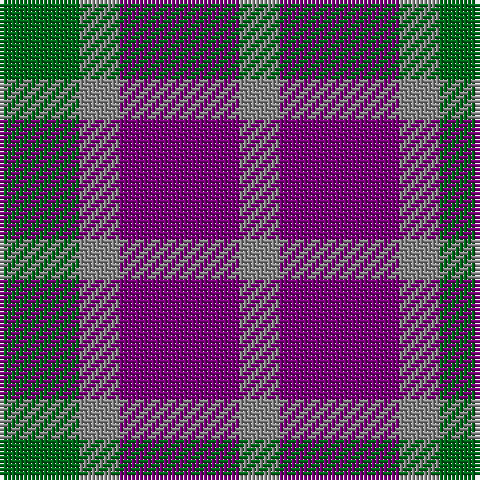

In pattern [GRBR](/patterns/grbr/).

This was sourced from tartans-authority.  It is a [4 stripes tartan](/stripes/stripes4/).

Original link http://www.tartansauthority.com/tartan-ferret/display/11027/

## Thread count
G/20 N10 P30 N/10

## Palette
Each colour and its ΔE from the base-6 reference it is a variant of.

| Colour | Shade | Base | ΔE (OKLab) |
|---|---|---|---|
| G | <code style="background-color:#006818;">#006818</code> `#006818` | G <code style="background-color:#006400;">#006400</code> | 0.02 |
| N | <code style="background-color:#888888;">#888888</code> `#888888` | R <code style="background-color:#C80000;">#C80000</code> | 0.24 |
| P | <code style="background-color:#780078;">#780078</code> `#780078` | B <code style="background-color:#2C4084;">#2C4084</code> | 0.16 |

# Sample pattern

## Nearest tartans

The nearest existing variants by ΔTartan distance.

1. [Coleman, Sarah-Louise (Personal)](/setts/s4/g20r10b30r10-b780078-g007800-r888888/) — ΔT 0.29
1. [Wilson's, No 209](/setts/s3/b10g8ba4-b800080-ba5480b0-g008000/) — ΔT 1.19
1. [Masai Shuka 19 (Artefact)](/setts/s3/b20r20ra6-b1474b4-rc80000-raac0000/) — ΔT 1.42
1. [Wilson's, No 95](/setts/s5/b4ba12r4g12b4-b5480b0-ba800080-g008000-rc00000/) — ΔT 1.49
1. [Agnew](/setts/s3/b106g84r28-b2c2c80-g006818-rc80000/) — ΔT 1.53
1. [Agnew Family Tartan Tartan Number: 182. Earliest known date: 1978 Nothing See products available Copyright © Blair Urquhart, Comrie, 2015](/setts/s3/b53g42r14-b2c2c80-g006818-rc80000/) — ΔT 1.53
1. [Bedford Check](/setts/s4/b6r12k8b4-b2888c4-k101010-r888888/) — ΔT 1.54
1. [Wilson's No.95](/setts/s5/b4ba12r4g12b4-b3c82af-ba5a008c-g005020-rdc0000/) — ΔT 1.55
1. [Kucher, Gregory (Personal)](/setts/s4/b20r10k10y10-b506878-k101010-r880000-ya0a0a0/) — ΔT 1.61
1. [Austin (Wilson's No 137)](/setts/s5/b6k6b6g12r4-b5a008c-g005020-k101010-rdc0000/) — ΔT 1.67

## Neighbour map

Every grey dot is one of 15726 variants placed by the first two principal components of the ΔTartan feature space (44% of its variance). Red is this tartan; blue dots are its nearest — click one to open its page.

<svg viewBox="0 0 640 380" role="img" style="max-width:100%;height:auto;border:1px solid #e0e0e0;border-radius:4px;display:block" xmlns="http://www.w3.org/2000/svg"><image href="/nn/cloud.v1.png" width="640" height="380"/><a href="/setts/s4/g20r10b30r10-b780078-g007800-r888888/"><circle cx="196.3" cy="323.7" r="4" fill="#3465a4"><title>Coleman, Sarah-Louise (Personal)</title></circle></a><a href="/setts/s3/b10g8ba4-b800080-ba5480b0-g008000/"><circle cx="187.4" cy="361.1" r="4" fill="#3465a4"><title>Wilson's, No 209</title></circle></a><a href="/setts/s3/b20r20ra6-b1474b4-rc80000-raac0000/"><circle cx="240.2" cy="337.8" r="4" fill="#3465a4"><title>Masai Shuka 19 (Artefact)</title></circle></a><a href="/setts/s5/b4ba12r4g12b4-b5480b0-ba800080-g008000-rc00000/"><circle cx="123.1" cy="286.5" r="4" fill="#3465a4"><title>Wilson's, No 95</title></circle></a><a href="/setts/s3/b106g84r28-b2c2c80-g006818-rc80000/"><circle cx="252.6" cy="345.5" r="4" fill="#3465a4"><title>Agnew</title></circle></a><a href="/setts/s3/b53g42r14-b2c2c80-g006818-rc80000/"><circle cx="252.6" cy="345.5" r="4" fill="#3465a4"><title>Agnew Family Tartan Tartan Number: 182. Earliest known date: 1978 Nothing See products available Copyright © Blair Urquhart, Comrie, 2015</title></circle></a><a href="/setts/s4/b6r12k8b4-b2888c4-k101010-r888888/"><circle cx="149.3" cy="333.0" r="4" fill="#3465a4"><title>Bedford Check</title></circle></a><a href="/setts/s5/b4ba12r4g12b4-b3c82af-ba5a008c-g005020-rdc0000/"><circle cx="127.2" cy="292.7" r="4" fill="#3465a4"><title>Wilson's No.95</title></circle></a><a href="/setts/s4/b20r10k10y10-b506878-k101010-r880000-ya0a0a0/"><circle cx="105.3" cy="338.1" r="4" fill="#3465a4"><title>Kucher, Gregory (Personal)</title></circle></a><a href="/setts/s5/b6k6b6g12r4-b5a008c-g005020-k101010-rdc0000/"><circle cx="121.8" cy="313.6" r="4" fill="#3465a4"><title>Austin (Wilson's No 137)</title></circle></a><circle cx="203.3" cy="326.7" r="5" fill="#c00000"/></svg>

ID: /setts/s4/g20r10b30r10-b780078-g006818-r888888/
