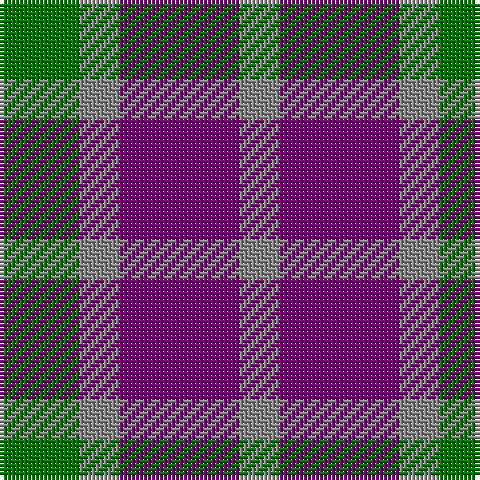

In pattern [GRBR](/patterns/grbr/).

This was sourced from register-of-tartans.  It is a [4 stripes tartan](/stripes/stripes4/).

Original link https://www.tartanregister.gov.uk/tartanDetails.aspx?ref=11027

## Thread count
G/20 N10 P30 N/10

## Palette
Each colour and its ΔE from the base-6 reference it is a variant of.

| Colour | Shade | Base | ΔE (OKLab) |
|---|---|---|---|
| G | <code style="background-color:#007800;">#007800</code> `#007800` | G <code style="background-color:#006400;">#006400</code> | 0.06 |
| N | <code style="background-color:#888888;">#888888</code> `#888888` | R <code style="background-color:#C80000;">#C80000</code> | 0.24 |
| P | <code style="background-color:#780078;">#780078</code> `#780078` | B <code style="background-color:#2C4084;">#2C4084</code> | 0.16 |

# Sample pattern

ID: /setts/s4/g20r10b30r10-b780078-g007800-r888888/
