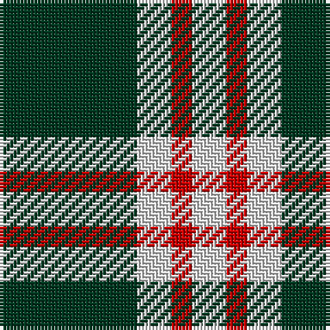

In pattern [GWRW](/patterns/gwrw/).

This was sourced from register-of-tartans.  It is a [4 stripes tartan](/stripes/stripes4/).

Original link https://www.tartanregister.gov.uk/tartanDetails.aspx?ref=4999

## Thread count
DG/40 LN10 R6 LN/10

## Palette
Each colour and its ΔE from the base-6 reference it is a variant of.

| Colour | Shade | Base | ΔE (OKLab) |
|---|---|---|---|
| DG | <code style="background-color:#003820;">#003820</code> `#003820` | G <code style="background-color:#006100;">#006100</code> | 0.15 |
| LN | <code style="background-color:#E0E0E0;">#E0E0E0</code> `#E0E0E0` | W <code style="background-color:#F7F7F7;">#F7F7F7</code> | 0.07 |
| R | <code style="background-color:#C80000;">#C80000</code> `#C80000` | R <code style="background-color:#CC0000;">#CC0000</code> | 0.01 |

# Sample pattern

## Nearest tartans

The nearest existing variants by ΔTartan distance.

1. [Takla Makan #2 (Artefact)](/setts/s4/k4y15k4w2~k000000-we0e0e0-ya08858~x2/) — ΔT 0.85
1. [Special Saffron Tartan Tartan Number: 201. Earliest known date: pre 2003 Y = Saffron See products available Copyright © Blair Urquhart, Comrie, 2015](/setts/s4/g21y43g86b10~b2888c4-g003820-ye8c000/) — ΔT 1.35
1. [Lords of Skye (Fashion?)](/setts/s4/k46g7k8w20~g604000-k101010-wfcfcfc~x2/) — ΔT 1.35
1. [Shembe Zulu Church](/setts/s5/k5w25r6k45w4~k101010-rc80000-wfcfcfc~x2/) — ΔT 1.40
1. [Cairn (Marton Mills)](/setts/s5/k2w1k8w8k1~k101010-we0e0e0~x8/) — ΔT 1.41
1. [Special Saffron (Fashion)](/setts/s4/g21y44g86b10~b2888c4-g003820-ydc943c/) — ΔT 1.44
1. [Lords of Skye Trade Tartan Tartan Number: 1218. Earliest known date: 1983 Nothing See products available Copyright © Blair Urquhart, Comrie, 2015](/setts/s4/k46g7k8w20~g604000-k101010-we0e0e0~x2/) — ΔT 1.45
1. [Lords of Skye](/setts/s4/k46g7k8w20~g503c14-k101010-we0e0e0~x2/) — ΔT 1.46
1. [Juchter (Personal)](/setts/s3/g20w5r3~g003820-rc80000-we0e0e0~x2/) — ΔT 1.48
1. [Loch Rannoch](/setts/s5/g19w5g2k5w2~g006818-k101010-wfcfcfc~x2/) — ΔT 1.51

## Neighbour map

Every grey dot is one of 15726 variants placed by the first two principal components of the ΔTartan feature space (44% of its variance). Red is this tartan; blue dots are its nearest — click one to open its page.

<svg viewBox="0 0 640 380" role="img" style="max-width:100%;height:auto;border:1px solid #e0e0e0;border-radius:4px;display:block" xmlns="http://www.w3.org/2000/svg"><image href="/nn/cloud.v1.png" width="640" height="380"/><a href="/setts/s4/k4y15k4w2~k000000-we0e0e0-ya08858~x2/"><circle cx="306.4" cy="243.6" r="4" fill="#3465a4"><title>Takla Makan #2 (Artefact)</title></circle></a><a href="/setts/s4/g21y43g86b10~b2888c4-g003820-ye8c000/"><circle cx="355.4" cy="261.1" r="4" fill="#3465a4"><title>Special Saffron Tartan Tartan Number: 201. Earliest known date: pre 2003 Y = Saffron See products available Copyright © Blair Urquhart, Comrie, 2015</title></circle></a><a href="/setts/s4/k46g7k8w20~g604000-k101010-wfcfcfc~x2/"><circle cx="333.6" cy="258.1" r="4" fill="#3465a4"><title>Lords of Skye (Fashion?)</title></circle></a><a href="/setts/s5/k5w25r6k45w4~k101010-rc80000-wfcfcfc~x2/"><circle cx="314.7" cy="206.4" r="4" fill="#3465a4"><title>Shembe Zulu Church</title></circle></a><a href="/setts/s5/k2w1k8w8k1~k101010-we0e0e0~x8/"><circle cx="310.2" cy="245.9" r="4" fill="#3465a4"><title>Cairn (Marton Mills)</title></circle></a><a href="/setts/s4/g21y44g86b10~b2888c4-g003820-ydc943c/"><circle cx="370.8" cy="266.9" r="4" fill="#3465a4"><title>Special Saffron (Fashion)</title></circle></a><a href="/setts/s4/k46g7k8w20~g604000-k101010-we0e0e0~x2/"><circle cx="339.0" cy="261.0" r="4" fill="#3465a4"><title>Lords of Skye Trade Tartan Tartan Number: 1218. Earliest known date: 1983 Nothing See products available Copyright © Blair Urquhart, Comrie, 2015</title></circle></a><a href="/setts/s4/k46g7k8w20~g503c14-k101010-we0e0e0~x2/"><circle cx="339.0" cy="261.3" r="4" fill="#3465a4"><title>Lords of Skye</title></circle></a><a href="/setts/s3/g20w5r3~g003820-rc80000-we0e0e0~x2/"><circle cx="388.2" cy="275.8" r="4" fill="#3465a4"><title>Juchter (Personal)</title></circle></a><a href="/setts/s5/g19w5g2k5w2~g006818-k101010-wfcfcfc~x2/"><circle cx="330.4" cy="222.2" r="4" fill="#3465a4"><title>Loch Rannoch</title></circle></a><circle cx="304.2" cy="249.5" r="5" fill="#c00000"/></svg>

ID: /setts/s4/g20w5r3w5~g003820-rc80000-we0e0e0~x2/
