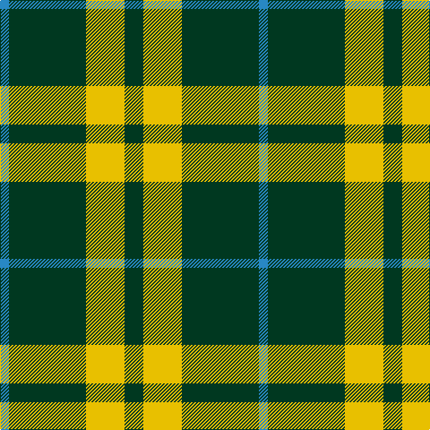

In pattern [BGYG](/patterns/bgyg/).

This was sourced from house-of-tartan.  It is a [4 stripes tartan](/stripes/stripes4/).

Original link http://www.house-of-tartan.scotland.net/house/TartanViewjs.asp?colr=Def&tnam=201

## Thread count
B/10 DG86 Y43 DG/21

## Palette
Each colour and its ΔE from the base-6 reference it is a variant of.

| Colour | Shade | Base | ΔE (OKLab) |
|---|---|---|---|
| B | <code style="background-color:#2888C4;">#2888C4</code> `#2888C4` | B <code style="background-color:#2A418A;">#2A418A</code> | 0.21 |
| DG | <code style="background-color:#003820;">#003820</code> `#003820` | G <code style="background-color:#006100;">#006100</code> | 0.15 |
| Y | <code style="background-color:#E8C000;">#E8C000</code> `#E8C000` | Y <code style="background-color:#F2BF00;">#F2BF00</code> | 0.02 |

# Sample pattern

## Nearest tartans

The nearest existing variants by ΔTartan distance.

1. [Special Saffron (Fashion)](/setts/s4/g21y44g86b10~b2888c4-g003820-ydc943c/) — ΔT 0.71
1. [Special, Saffron](/setts/s4/g21y43g86b10~b8080d0-g003000-yd08010/) — ΔT 0.88
1. [Juchter (Personal)](/setts/s3/g20w5r3~g003820-rc80000-we0e0e0~x2/) — ΔT 1.18
1. [Special Saffron](/setts/s6/g86y44g21y44g86b10~b2888c4-g003820-ydc943c/) — ΔT 1.18
1. [Loch Rannoch](/setts/s5/g19w5g2k5w2~g006818-k101010-wfcfcfc~x2/) — ΔT 1.33
1. [Juchter (Personal)](/setts/s4/g20w5r3w5~g003820-rc80000-we0e0e0~x2/) — ΔT 1.35
1. [Heritage #2](/setts/s7/g20w2g9w2y5w7g10~g005020-we0e0e0-ye8c000~x2/) — ΔT 1.39
1. [Cowie, Justine (Personal)](/setts/s3/g9k18r2~g289c18-k101010-rc80000~x4/) — ΔT 1.41
1. [Loch Rannoch Fancy Tartan Tartan Number: 943. Earliest known date: 1975 Nothing See products available Copyright © Blair Urquhart, Comrie, 2015](/setts/s5/g37w9g3k9w3~g006818-k101010-we0e0e0/) — ΔT 1.44
1. [Wilson's No.189](/setts/s4/b4g10r1w1~b440044-g006818-rc80000-wfcfcfc~x2/) — ΔT 1.48

## Neighbour map

Every grey dot is one of 15726 variants placed by the first two principal components of the ΔTartan feature space (44% of its variance). Red is this tartan; blue dots are its nearest — click one to open its page.

<svg viewBox="0 0 640 380" role="img" style="max-width:100%;height:auto;border:1px solid #e0e0e0;border-radius:4px;display:block" xmlns="http://www.w3.org/2000/svg"><image href="/nn/cloud.v1.png" width="640" height="380"/><a href="/setts/s4/g21y44g86b10~b2888c4-g003820-ydc943c/"><circle cx="370.8" cy="266.9" r="4" fill="#3465a4"><title>Special Saffron (Fashion)</title></circle></a><a href="/setts/s4/g21y43g86b10~b8080d0-g003000-yd08010/"><circle cx="377.3" cy="268.5" r="4" fill="#3465a4"><title>Special, Saffron</title></circle></a><a href="/setts/s3/g20w5r3~g003820-rc80000-we0e0e0~x2/"><circle cx="388.2" cy="275.8" r="4" fill="#3465a4"><title>Juchter (Personal)</title></circle></a><a href="/setts/s6/g86y44g21y44g86b10~b2888c4-g003820-ydc943c/"><circle cx="353.3" cy="261.2" r="4" fill="#3465a4"><title>Special Saffron</title></circle></a><a href="/setts/s5/g19w5g2k5w2~g006818-k101010-wfcfcfc~x2/"><circle cx="330.4" cy="222.2" r="4" fill="#3465a4"><title>Loch Rannoch</title></circle></a><a href="/setts/s4/g20w5r3w5~g003820-rc80000-we0e0e0~x2/"><circle cx="304.2" cy="249.5" r="4" fill="#3465a4"><title>Juchter (Personal)</title></circle></a><a href="/setts/s7/g20w2g9w2y5w7g10~g005020-we0e0e0-ye8c000~x2/"><circle cx="370.5" cy="231.4" r="4" fill="#3465a4"><title>Heritage #2</title></circle></a><a href="/setts/s3/g9k18r2~g289c18-k101010-rc80000~x4/"><circle cx="340.9" cy="282.8" r="4" fill="#3465a4"><title>Cowie, Justine (Personal)</title></circle></a><a href="/setts/s5/g37w9g3k9w3~g006818-k101010-we0e0e0/"><circle cx="370.3" cy="214.2" r="4" fill="#3465a4"><title>Loch Rannoch Fancy Tartan Tartan Number: 943. Earliest known date: 1975 Nothing See products available Copyright © Blair Urquhart, Comrie, 2015</title></circle></a><a href="/setts/s4/b4g10r1w1~b440044-g006818-rc80000-wfcfcfc~x2/"><circle cx="341.1" cy="226.7" r="4" fill="#3465a4"><title>Wilson's No.189</title></circle></a><circle cx="355.4" cy="261.1" r="5" fill="#c00000"/></svg>

ID: /setts/s4/g21y43g86b10~b2888c4-g003820-ye8c000/
