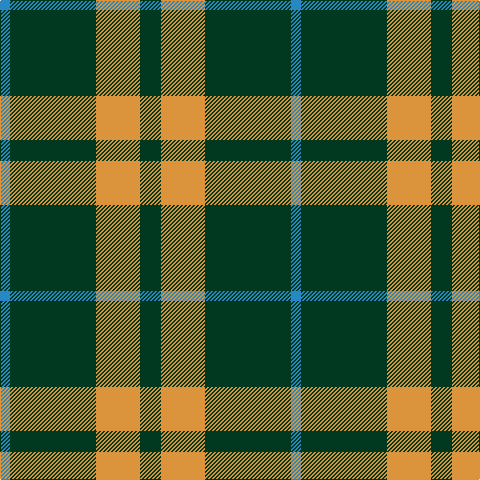

In pattern [BGYG](/patterns/bgyg/).

This was sourced from tartans-authority.  It is a [4 stripes tartan](/stripes/stripes4/).

Original link http://www.tartansauthority.com/tartan-ferret/display/201/

## Thread count
B/10 DG86 O44 DG/21

## Palette
Each colour and its ΔE from the base-6 reference it is a variant of.

| Colour | Shade | Base | ΔE (OKLab) |
|---|---|---|---|
| B | <code style="background-color:#2888C4;">#2888C4</code> `#2888C4` | B <code style="background-color:#2A418A;">#2A418A</code> | 0.21 |
| DG | <code style="background-color:#003820;">#003820</code> `#003820` | G <code style="background-color:#006100;">#006100</code> | 0.15 |
| O | <code style="background-color:#DC943C;">#DC943C</code> `#DC943C` | Y <code style="background-color:#F2BF00;">#F2BF00</code> | 0.12 |

# Sample pattern

## Nearest tartans

The nearest existing variants by ΔTartan distance.

1. [Special, Saffron](/setts/s4/g21y43g86b10-b8080d0-g003000-yd08010/) — ΔT 0.54
1. [Special Saffron Tartan Tartan Number: 201. Earliest known date: pre 2003 Y = Saffron See products available Copyright © Blair Urquhart, Comrie, 2015](/setts/s4/g21y43g86b10-b2888c4-g003820-ye8c000/) — ΔT 0.70
1. [Special Saffron](/setts/s6/g86y44g21y44g86b10-b2888c4-g003820-ydc943c/) — ΔT 0.99
1. [Juchter (Personal)](/setts/s3/g40w10r6-g003820-rc80000-we0e0e0/) — ΔT 1.12
1. [Cowie, Justine (Personal)](/setts/s3/g36k72r8-g289c18-k101010-rc80000/) — ΔT 1.21
1. [Wilson's, No 211](/setts/s4/g32b16g4b8-b800080-g008000/) — ΔT 1.23
1. [Bumbee #1 (Fashion)](/setts/s4/g80k16b40g8-b300048-g006818-k000000/) — ΔT 1.26
1. [Wilson's No.189](/setts/s4/b8g20r2w2-b440044-g006818-rc80000-wfcfcfc/) — ΔT 1.28
1. [Wilson's No.192](/setts/s4/b8g20r2y2-b440044-g006818-rc80000-ye8c000/) — ΔT 1.38
1. [Juchter (Personal)](/setts/s4/g40w10r6w10-g003820-rc80000-we0e0e0/) — ΔT 1.43

## Neighbour map

Every grey dot is one of 15726 variants placed by the first two principal components of the ΔTartan feature space (44% of its variance). Red is this tartan; blue dots are its nearest — click one to open its page.

<svg viewBox="0 0 640 380" role="img" style="max-width:100%;height:auto;border:1px solid #e0e0e0;border-radius:4px;display:block" xmlns="http://www.w3.org/2000/svg"><image href="/nn/cloud.v1.png" width="640" height="380"/><a href="/setts/s4/g21y43g86b10-b8080d0-g003000-yd08010/"><circle cx="380.0" cy="264.0" r="4" fill="#3465a4"><title>Special, Saffron</title></circle></a><a href="/setts/s4/g21y43g86b10-b2888c4-g003820-ye8c000/"><circle cx="358.3" cy="256.2" r="4" fill="#3465a4"><title>Special Saffron Tartan Tartan Number: 201. Earliest known date: pre 2003 Y = Saffron See products available Copyright © Blair Urquhart, Comrie, 2015</title></circle></a><a href="/setts/s6/g86y44g21y44g86b10-b2888c4-g003820-ydc943c/"><circle cx="356.0" cy="257.0" r="4" fill="#3465a4"><title>Special Saffron</title></circle></a><a href="/setts/s3/g40w10r6-g003820-rc80000-we0e0e0/"><circle cx="391.5" cy="270.1" r="4" fill="#3465a4"><title>Juchter (Personal)</title></circle></a><a href="/setts/s3/g36k72r8-g289c18-k101010-rc80000/"><circle cx="343.7" cy="278.1" r="4" fill="#3465a4"><title>Cowie, Justine (Personal)</title></circle></a><a href="/setts/s4/g32b16g4b8-b800080-g008000/"><circle cx="376.5" cy="281.7" r="4" fill="#3465a4"><title>Wilson's, No 211</title></circle></a><a href="/setts/s4/g80k16b40g8-b300048-g006818-k000000/"><circle cx="354.9" cy="262.0" r="4" fill="#3465a4"><title>Bumbee #1 (Fashion)</title></circle></a><a href="/setts/s4/b8g20r2w2-b440044-g006818-rc80000-wfcfcfc/"><circle cx="342.5" cy="223.3" r="4" fill="#3465a4"><title>Wilson's No.189</title></circle></a><a href="/setts/s4/b8g20r2y2-b440044-g006818-rc80000-ye8c000/"><circle cx="356.7" cy="229.4" r="4" fill="#3465a4"><title>Wilson's No.192</title></circle></a><a href="/setts/s4/g40w10r6w10-g003820-rc80000-we0e0e0/"><circle cx="306.8" cy="245.0" r="4" fill="#3465a4"><title>Juchter (Personal)</title></circle></a><circle cx="373.4" cy="262.5" r="5" fill="#c00000"/></svg>

ID: /setts/s4/g21y44g86b10-b2888c4-g003820-ydc943c/
