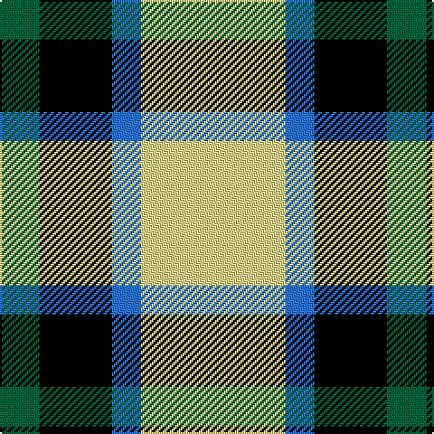

In pattern [GKBY](/patterns/gkby/).

This was sourced from register-of-tartans.  It is a [4 stripes tartan](/stripes/stripes4/).

Original link https://www.tartanregister.gov.uk/tartanDetails.aspx?ref=11528

## Thread count
G/22 K40 B16 LY/80

## Palette
Each colour and its ΔE from the base-6 reference it is a variant of.

| Colour | Shade | Base | ΔE (OKLab) |
|---|---|---|---|
| B | <code style="background-color:#2474E8;">#2474E8</code> `#2474E8` | B <code style="background-color:#2C4084;">#2C4084</code> | 0.20 |
| G | <code style="background-color:#00643C;">#00643C</code> `#00643C` | G <code style="background-color:#006400;">#006400</code> | 0.06 |
| K | <code style="background-color:#000000;">#000000</code> `#000000` | K <code style="background-color:#000000;">#000000</code> | 0.00 |
| LY | <code style="background-color:#F8E38C;">#F8E38C</code> `#F8E38C` | Y <code style="background-color:#E8C000;">#E8C000</code> | 0.11 |

# Sample pattern

ID: /setts/s4/g22k40b16y80-b2474e8-g00643c-k000000-yf8e38c/
