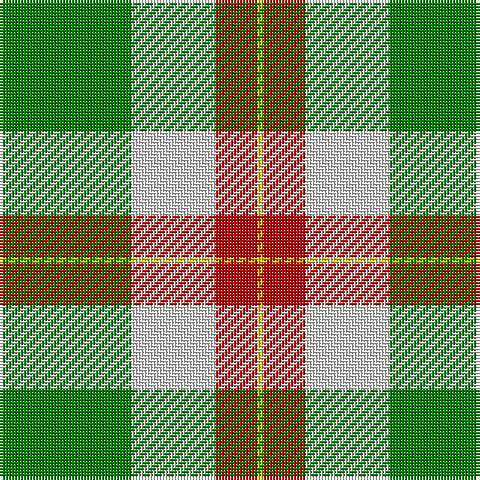

This page is one **sett** — a single exact thread-count. It belongs to the [tartan](/tartans/g22ln14r7y1/)
(the same proportion at any scale), whose colour order is pattern [GWRY](/stripes/gwry/).

Sourced from weddslist.  It is a [4 stripe tartan](/stripes/stripes4/).

Original link http://www.weddslist.com/cgi-bin/tartans/pg.pl?source=sts

## Thread count
G/44 LN28 R14 Y/2

## Palette
Each colour and the base-6 reference it is a variant of.

| Colour | Shade | Base |
|---|---|---|
| G | <code style="background-color:#008000;">#008000</code> `oklch(52.0% 0.177 142.5)` <small>#008000</small> | G <code style="background-color:#006100;">#006100</code> |
| LN | <code style="background-color:#E0E0E0;">#E0E0E0</code> `oklch(90.7% 0.000 89.9)` <small>#E0E0E0</small> | W <code style="background-color:#F7F7F7;">#F7F7F7</code> |
| R | <code style="background-color:#C00000;">#C00000</code> `oklch(50.7% 0.208 29.2)` <small>#C00000</small> | R <code style="background-color:#CC0000;">#CC0000</code> |
| Y | <code style="background-color:#F0C000;">#F0C000</code> `oklch(82.7% 0.169 90.5)` <small>#F0C000</small> | Y <code style="background-color:#F2BF00;">#F2BF00</code> |

# Sample pattern

## Nearest tartans

The nearest existing variants by ΔTartan distance, with this tartan at the top so the swatches line up against it.

ΔTartan

Tartan

Sett

—

<a href="/ttd/edit/#slug=g22w14r7ly1~x2">Loch Lomond</a> <a class="nn-out" href="/setts/s4/g22w14r7ly1~x2/" title="open its dictionary page">↗</a>

1.25

<a href="/ttd/edit/#slug=g22w14r7ly2~x2">Loch Lomond #3</a> <a class="nn-out" href="/setts/s4/g22w14r7ly2~x2/" title="open its dictionary page">↗</a>

1.26

<a href="/ttd/edit/#slug=ly30g30r1db16~x2">Barber Family (Personal)</a> <a class="nn-out" href="/setts/s4/ly30g30r1db16~x2/" title="open its dictionary page">↗</a>

1.41

<a href="/ttd/edit/#slug=dg27r9n2ly14~x4">Englehart, City of</a> <a class="nn-out" href="/setts/s4/dg27r9n2ly14~x4/" title="open its dictionary page">↗</a>

1.55

<a href="/ttd/edit/#slug=k5g25k10lg15ly1lg5~x2">Delaware Fine Spirits Guild (Corp)</a> <a class="nn-out" href="/setts/s6/k5g25k10lg15ly1lg5~x2/" title="open its dictionary page">↗</a>

1.63

<a href="/ttd/edit/#slug=g53r13db2ly22~x2">Englehart</a> <a class="nn-out" href="/setts/s4/g53r13db2ly22~x2/" title="open its dictionary page">↗</a>

1.70

<a href="/ttd/edit/#slug=ly70k30w3dg30k3ly10">Jacobite #2</a> <a class="nn-out" href="/setts/s6/ly70k30w3dg30k3ly10/" title="open its dictionary page">↗</a>

1.76

<a href="/ttd/edit/#slug=g6lo2g32k8w6lo20g5~x2">Pollock (Name)</a> <a class="nn-out" href="/setts/s7/g6lo2g32k8w6lo20g5~x2/" title="open its dictionary page">↗</a>

1.78

<a href="/ttd/edit/#slug=g18w55o19g20w2g20k5">Michigan State University</a> <a class="nn-out" href="/setts/s7/g18w55o19g20w2g20k5/" title="open its dictionary page">↗</a>

1.83

<a href="/ttd/edit/#slug=m3lb35db4g47w3~x2">Exabyte</a> <a class="nn-out" href="/setts/s5/m3lb35db4g47w3~x2/" title="open its dictionary page">↗</a>

1.86

<a href="/ttd/edit/#slug=ly28r11g11db11w2~x2">Samye #2</a> <a class="nn-out" href="/setts/s5/ly28r11g11db11w2~x2/" title="open its dictionary page">↗</a>

## Neighbour map

Every grey dot is one of 14299 variants placed by the first two principal components of the ΔTartan feature space (44% of its variance). Red is this tartan; blue dots are its nearest — click one to open its page.

<svg viewBox="0 0 640 380" role="img" style="max-width:100%;height:auto;border:1px solid #e0e0e0;border-radius:4px;display:block" xmlns="http://www.w3.org/2000/svg"><image href="/nn/cloud.v1.png" width="640" height="380"/><a href="/setts/s4/g22w14r7ly2~x2/"><circle cx="214.9" cy="213.1" r="4" fill="#3465a4"><title>Loch Lomond #3</title></circle></a><a href="/setts/s4/ly30g30r1db16~x2/"><circle cx="214.5" cy="189.2" r="4" fill="#3465a4"><title>Barber Family (Personal)</title></circle></a><a href="/setts/s4/dg27r9n2ly14~x4/"><circle cx="265.6" cy="218.1" r="4" fill="#3465a4"><title>Englehart, City of</title></circle></a><a href="/setts/s6/k5g25k10lg15ly1lg5~x2/"><circle cx="225.1" cy="172.6" r="4" fill="#3465a4"><title>Delaware Fine Spirits Guild (Corp)</title></circle></a><a href="/setts/s4/g53r13db2ly22~x2/"><circle cx="356.2" cy="192.0" r="4" fill="#3465a4"><title>Englehart</title></circle></a><a href="/setts/s6/ly70k30w3dg30k3ly10/"><circle cx="288.1" cy="145.6" r="4" fill="#3465a4"><title>Jacobite #2</title></circle></a><a href="/setts/s7/g6lo2g32k8w6lo20g5~x2/"><circle cx="293.9" cy="174.1" r="4" fill="#3465a4"><title>Pollock (Name)</title></circle></a><a href="/setts/s7/g18w55o19g20w2g20k5/"><circle cx="218.9" cy="145.0" r="4" fill="#3465a4"><title>Michigan State University</title></circle></a><a href="/setts/s5/m3lb35db4g47w3~x2/"><circle cx="290.8" cy="172.2" r="4" fill="#3465a4"><title>Exabyte</title></circle></a><a href="/setts/s5/ly28r11g11db11w2~x2/"><circle cx="183.6" cy="180.3" r="4" fill="#3465a4"><title>Samye #2</title></circle></a><circle cx="268.0" cy="193.9" r="5" fill="#c00000"/></svg>

ID: /setts/s4/g22w14r7ly1~x2/
