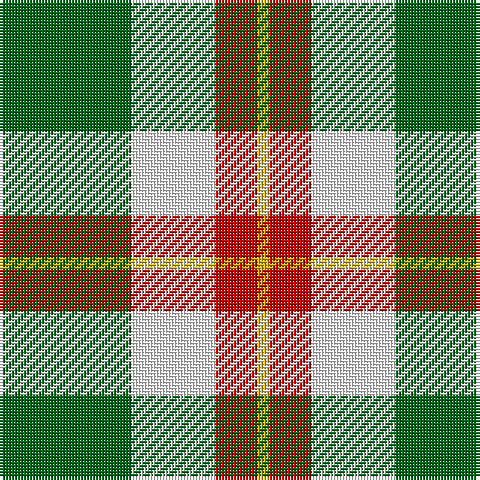

In pattern [GWRY](/patterns/gwry/).

This was sourced from register-of-tartans.  It is a [4 stripes tartan](/stripes/stripes4/).

Original link https://www.tartanregister.gov.uk/tartanDetails.aspx?ref=2151

## Attestations

This cloth appears in 2 source records; the oldest owns this page.

- 01/01/2002 — Loch Lomond #3 (register-of-tartans, [record](https://www.tartanregister.gov.uk/tartanDetails.aspx?ref=2151))
- pre 2002 — Loch Lomond #2 (Fashion) (tartans-authority, [record](http://www.tartansauthority.com/tartan-ferret/display/953/))

## Register references

External register numbers recorded for this tartan.

- Scottish Register of Tartans: [2151](https://www.tartanregister.gov.uk/tartanDetails.aspx?ref=2151)
- Scottish Tartans Authority (ITI): 953
- Scottish Tartans World Register: 953

## Thread count
G/44 W28 R14 Y/4

## Palette
Each colour and its ΔE from the base-6 reference it is a variant of.

| Colour | Shade | Base | ΔE (OKLab) |
|---|---|---|---|
| G | <code style="background-color:#006818;">#006818</code> `#006818` | G <code style="background-color:#006100;">#006100</code> | 0.02 |
| R | <code style="background-color:#C80000;">#C80000</code> `#C80000` | R <code style="background-color:#CC0000;">#CC0000</code> | 0.01 |
| W | <code style="background-color:#FCFCFC;">#FCFCFC</code> `#FCFCFC` | W <code style="background-color:#F7F7F7;">#F7F7F7</code> | 0.01 |
| Y | <code style="background-color:#D8B000;">#D8B000</code> `#D8B000` | Y <code style="background-color:#F2BF00;">#F2BF00</code> | 0.06 |

# Sample pattern

## Nearest tartans

The nearest existing variants by ΔTartan distance.

1. [Louisburg Canadian District Tartan Tartan Number: 5500. Earliest known date: 1994 Louisburg is a tiny seaside town in Nova Scotia about 20 miles southeast of Sydney and site of the 1758 Battle of Louisburgh. It was designed by Edith MacIntyre of Louisbourg with the assistance of Jean Kyte and Jean composed the following poem about the colours. CIDD count slightly different - RB/20 W8 Y20 LN/34 (John Fitzpatrick's July 2008 review of Canadian tartans). Gray fog and sea and rocks. The yellow sun. white spindrift on the harbour restless beneath an azure sky. Curent owners (2008): The Louisbourg Heritage Society P.O. Box 396 Louisbourg, B0A 1M0 Nova Scotia, Canada See products available Copyright © Blair Urquhart, Comrie, 2015](/setts/s4/r22y10w3k8~k000000-r888888-wf8f8f8-ye8c000~x2/) — ΔT 1.15
1. [Burberry (Genuine)](/setts/s5/k3w3k3y10r1~k101010-rc80000-wf8f4d0-yb8a47c~x6/) — ΔT 1.25
1. [Loch Lomond](/setts/s4/g22w14r7y1~g008000-rc00000-we0e0e0-yf0c000~x2/) — ΔT 1.25
1. [McCabe (2016)](/setts/s6/b8y1g5y12r1g2~b000080-g003820-rdc0000-yfff000~x6/) — ΔT 1.40
1. [Wilson's, No 195](/setts/s4/y5g7k1b1~b5480b0-g008000-k000000-yff8500~x4/) — ΔT 1.40
1. [Thistle and Kudzu Scottish Society](/setts/s4/b6y15g15w2~baa00ff-g006400-wffffff-y86c87c~x2/) — ΔT 1.44
1. [MacKinnon, dress](/setts/s4/g9r7w7ra1~g008000-r703000-rac00000-we0e0e0~x4/) — ΔT 1.44
1. [Englehart, City of](/setts/s4/g27r9b2y14~b506878-g00540c-rc80000-ye8c000~x4/) — ΔT 1.46
1. [Delroeux, John Michael Name Tartan Tartan Number: 10654. Earliest known date: 25/06/1985 Designed by Jean Michael Delroeux to show his affinity with Scotland. Colours: red, yellow and blue appear in the Delroeux coat of arms; green is for the landscapes of Scotland. See products available Copyright © Blair Urquhart, Comrie, 2015](/setts/s4/b3g6y1r3~b0000cd-g008b00-rff0000-yffe600~x10/) — ΔT 1.46
1. [Lewis, Green (Dance)](/setts/s4/g4w35ga31w4~g003820-ga006818-wf0e0c8~x2/) — ΔT 1.51

## Neighbour map

Every grey dot is one of 15726 variants placed by the first two principal components of the ΔTartan feature space (44% of its variance). Red is this tartan; blue dots are its nearest — click one to open its page.

<svg viewBox="0 0 640 380" role="img" style="max-width:100%;height:auto;border:1px solid #e0e0e0;border-radius:4px;display:block" xmlns="http://www.w3.org/2000/svg"><image href="/nn/cloud.v1.png" width="640" height="380"/><a href="/setts/s4/r22y10w3k8~k000000-r888888-wf8f8f8-ye8c000~x2/"><circle cx="199.0" cy="233.6" r="4" fill="#3465a4"><title>Louisburg Canadian District Tartan Tartan Number: 5500. Earliest known date: 1994 Louisburg is a tiny seaside town in Nova Scotia about 20 miles southeast of Sydney and site of the 1758 Battle of Louisburgh. It was designed by Edith MacIntyre of Louisbourg with the assistance of Jean Kyte and Jean composed the following poem about the colours. CIDD count slightly different - RB/20 W8 Y20 LN/34 (John Fitzpatrick's July 2008 review of Canadian tartans). Gray fog and sea and rocks. The yellow sun. white spindrift on the harbour restless beneath an azure sky. Curent owners (2008): The Louisbourg Heritage Society P.O. Box 396 Louisbourg, B0A 1M0 Nova Scotia, Canada See products available Copyright © Blair Urquhart, Comrie, 2015</title></circle></a><a href="/setts/s5/k3w3k3y10r1~k101010-rc80000-wf8f4d0-yb8a47c~x6/"><circle cx="221.9" cy="200.5" r="4" fill="#3465a4"><title>Burberry (Genuine)</title></circle></a><a href="/setts/s4/g22w14r7y1~g008000-rc00000-we0e0e0-yf0c000~x2/"><circle cx="266.3" cy="197.3" r="4" fill="#3465a4"><title>Loch Lomond</title></circle></a><a href="/setts/s6/b8y1g5y12r1g2~b000080-g003820-rdc0000-yfff000~x6/"><circle cx="185.4" cy="179.9" r="4" fill="#3465a4"><title>McCabe (2016)</title></circle></a><a href="/setts/s4/y5g7k1b1~b5480b0-g008000-k000000-yff8500~x4/"><circle cx="235.2" cy="238.5" r="4" fill="#3465a4"><title>Wilson's, No 195</title></circle></a><a href="/setts/s4/b6y15g15w2~baa00ff-g006400-wffffff-y86c87c~x2/"><circle cx="159.9" cy="247.3" r="4" fill="#3465a4"><title>Thistle and Kudzu Scottish Society</title></circle></a><a href="/setts/s4/g9r7w7ra1~g008000-r703000-rac00000-we0e0e0~x4/"><circle cx="147.5" cy="249.1" r="4" fill="#3465a4"><title>MacKinnon, dress</title></circle></a><a href="/setts/s4/g27r9b2y14~b506878-g00540c-rc80000-ye8c000~x4/"><circle cx="264.1" cy="221.3" r="4" fill="#3465a4"><title>Englehart, City of</title></circle></a><a href="/setts/s4/b3g6y1r3~b0000cd-g008b00-rff0000-yffe600~x10/"><circle cx="160.9" cy="257.4" r="4" fill="#3465a4"><title>Delroeux, John Michael Name Tartan Tartan Number: 10654. Earliest known date: 25/06/1985 Designed by Jean Michael Delroeux to show his affinity with Scotland. Colours: red, yellow and blue appear in the Delroeux coat of arms; green is for the landscapes of Scotland. See products available Copyright © Blair Urquhart, Comrie, 2015</title></circle></a><a href="/setts/s4/g4w35ga31w4~g003820-ga006818-wf0e0c8~x2/"><circle cx="279.9" cy="236.9" r="4" fill="#3465a4"><title>Lewis, Green (Dance)</title></circle></a><circle cx="213.0" cy="218.2" r="5" fill="#c00000"/></svg>

ID: /setts/s4/g22w14r7y2~g006818-rc80000-wfcfcfc-yd8b000~x2/
