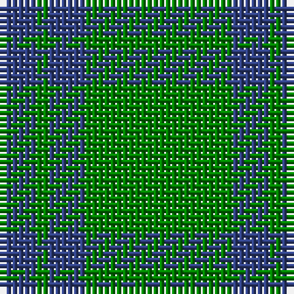

In pattern [BGBG](/patterns/bgbg/).

This was sourced from weddslist.  It is a [4 stripes tartan](/stripes/stripes4/).

Original link http://www.weddslist.com/cgi-bin/tartans/pg.pl?source=sts

## Thread count
B/6 G2 B6 G/24

## Palette
Each colour and its ΔE from the base-6 reference it is a variant of.

| Colour | Shade | Base | ΔE (OKLab) |
|---|---|---|---|
| B | <code style="background-color:#304080;">#304080</code> `#304080` | B <code style="background-color:#2A418A;">#2A418A</code> | 0.02 |
| G | <code style="background-color:#008000;">#008000</code> `#008000` | G <code style="background-color:#006100;">#006100</code> | 0.10 |

# Sample pattern

## Nearest tartans

The nearest existing variants by ΔTartan distance.

1. [Unidentified, pattern](/setts/s3/g48b12y4-b304080-g008000-yf0c000/) — ΔT 1.45
1. [Unidentified pattern #2](/setts/s3/g48b12y4-b2c4084-g005020-ye8c000/) — ΔT 1.48
1. [O'Neill, Red (Corporate?)](/setts/s4/g18r40g92y10-g006818-rb84c00-y48a4c0/) — ΔT 1.68
1. [Peterhead (Personal)](/setts/s5/g36b4g8k16g8-b487088-g407058-k101010/) — ΔT 1.72
1. [Ledford Family Tartan Tartan Number: 835. Earliest known date: 1987 A quantity of this cloth was woven in 1998 for a Ledford family in the USA. See products available Copyright © Blair Urquhart, Comrie, 2015](/setts/s3/g36r16y4-g006818-r888888-ye8c000/) — ΔT 1.72
1. [Highland Spring (1997) (Corporate)](/setts/s4/b14g46r6g14-b440044-g006818-rc80000/) — ΔT 1.74
1. [Ledford](/setts/s3/g72ga32y8-g005020-ga808080-yc89600/) — ΔT 1.75
1. [Tyrconnell (Personal)](/setts/s5/g88b18r4b18g4-b202060-g006818-rc80000/) — ΔT 1.75
1. [Montgomery](/setts/s4/g24b8g4b8-b2c2c80-g006818/) — ΔT 1.76
1. [Montgomery - 1842 (VS](/setts/s4/g48b16g8b16-b2c2c80-g006818/) — ΔT 1.76

## Neighbour map

Every grey dot is one of 15726 variants placed by the first two principal components of the ΔTartan feature space (44% of its variance). Red is this tartan; blue dots are its nearest — click one to open its page.

<svg viewBox="0 0 640 380" role="img" style="max-width:100%;height:auto;border:1px solid #e0e0e0;border-radius:4px;display:block" xmlns="http://www.w3.org/2000/svg"><image href="/nn/cloud.v1.png" width="640" height="380"/><a href="/setts/s3/g48b12y4-b304080-g008000-yf0c000/"><circle cx="496.4" cy="272.1" r="4" fill="#3465a4"><title>Unidentified, pattern</title></circle></a><a href="/setts/s3/g48b12y4-b2c4084-g005020-ye8c000/"><circle cx="516.4" cy="281.8" r="4" fill="#3465a4"><title>Unidentified pattern #2</title></circle></a><a href="/setts/s4/g18r40g92y10-g006818-rb84c00-y48a4c0/"><circle cx="464.4" cy="283.7" r="4" fill="#3465a4"><title>O'Neill, Red (Corporate?)</title></circle></a><a href="/setts/s5/g36b4g8k16g8-b487088-g407058-k101010/"><circle cx="461.7" cy="270.5" r="4" fill="#3465a4"><title>Peterhead (Personal)</title></circle></a><a href="/setts/s3/g36r16y4-g006818-r888888-ye8c000/"><circle cx="416.4" cy="299.3" r="4" fill="#3465a4"><title>Ledford Family Tartan Tartan Number: 835. Earliest known date: 1987 A quantity of this cloth was woven in 1998 for a Ledford family in the USA. See products available Copyright © Blair Urquhart, Comrie, 2015</title></circle></a><a href="/setts/s4/b14g46r6g14-b440044-g006818-rc80000/"><circle cx="472.9" cy="286.5" r="4" fill="#3465a4"><title>Highland Spring (1997) (Corporate)</title></circle></a><a href="/setts/s3/g72ga32y8-g005020-ga808080-yc89600/"><circle cx="421.9" cy="301.9" r="4" fill="#3465a4"><title>Ledford</title></circle></a><a href="/setts/s5/g88b18r4b18g4-b202060-g006818-rc80000/"><circle cx="511.2" cy="215.8" r="4" fill="#3465a4"><title>Tyrconnell (Personal)</title></circle></a><a href="/setts/s4/g24b8g4b8-b2c2c80-g006818/"><circle cx="426.6" cy="325.5" r="4" fill="#3465a4"><title>Montgomery</title></circle></a><a href="/setts/s4/g48b16g8b16-b2c2c80-g006818/"><circle cx="426.6" cy="325.5" r="4" fill="#3465a4"><title>Montgomery - 1842 (VS</title></circle></a><circle cx="485.8" cy="280.6" r="5" fill="#c00000"/></svg>

ID: /setts/s4/g24b6g2b6-b304080-g008000/
