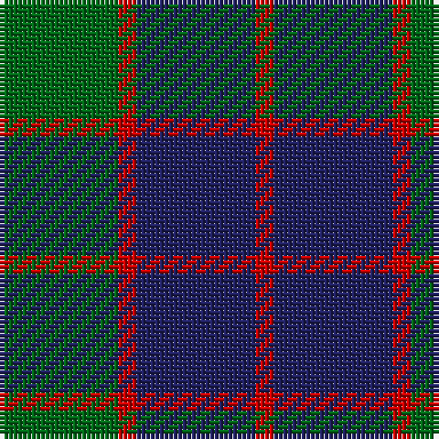

In pattern [GRBR](/patterns/grbr/).

This was sourced from register-of-tartans.  It is a [4 stripes tartan](/stripes/stripes4/).

Original link https://www.tartanregister.gov.uk/tartanDetails.aspx?ref=4662

## Thread count
G/26 R4 DB26 R/4

## Palette
Each colour and its ΔE from the base-6 reference it is a variant of.

| Colour | Shade | Base | ΔE (OKLab) |
|---|---|---|---|
| DB | <code style="background-color:#202060;">#202060</code> `#202060` | B <code style="background-color:#2C4084;">#2C4084</code> | 0.11 |
| DG | <code style="background-color:#003820;">#003820</code> `#003820` | G <code style="background-color:#006400;">#006400</code> | 0.16 |
| G | <code style="background-color:#006818;">#006818</code> `#006818` | G <code style="background-color:#006400;">#006400</code> | 0.02 |
| R | <code style="background-color:#C80000;">#C80000</code> `#C80000` | R <code style="background-color:#C80000;">#C80000</code> | 0.00 |

# Sample pattern

## Nearest tartans

The nearest existing variants by ΔTartan distance.

1. [MacNab](/setts/s4/g30r6b22ba4-b141e46-ba3c82af-g005020-rdc0000/) — ΔT 1.18
1. [MacNab WI2](/setts/s4/g15r3b11w2-b5a3094-g004c00-rc80000-wd0d0d0/) — ΔT 1.20
1. [Wilson's No.055](/setts/s3/g24b20ba4-b440044-ba5c8ca8-g006818/) — ΔT 1.21
1. [Mayer, Chris (Personal)](/setts/s4/b10ba60k60r10-b1c0070-ba5c5c5c-k101010-rc80000/) — ΔT 1.24
1. [Bethlehem, City of](/setts/s5/b12r40g36ra4g12-b1c0070-g003820-r888888-ra880000/) — ΔT 1.26
1. [Logan #5](/setts/s6/b18r6b2g18r6b2-b2c2c80-g006818-rc80000/) — ΔT 1.28
1. [Hamilton Hunting Clan Tartan Tartan Number: 139. Earliest known date: pre 2003 Sample presented to the Scottish Tartans Society by Wiebe Stodel. See products available Copyright © Blair Urquhart, Comrie, 2015](/setts/s5/b40g16b40g64w8-b2c2c80-g006818-we0e0e0/) — ΔT 1.38
1. [MacArthur of Milton (Clan)](/setts/s6/g28b4g4k16ba16k4-b28287c-ba700070-g006c3c-k101010/) — ΔT 1.39
1. [GS Gaelic School (School)](/setts/s7/b30r5g30r22b30r5g4-b003c64-g006818-rc80000/) — ΔT 1.39
1. [Pride of the Forth](/setts/s6/k6b46k6b6k40y6-b5c5c5c-k101010-y48a4c0/) — ΔT 1.40

## Neighbour map

Every grey dot is one of 15726 variants placed by the first two principal components of the ΔTartan feature space (44% of its variance). Red is this tartan; blue dots are its nearest — click one to open its page.

<svg viewBox="0 0 640 380" role="img" style="max-width:100%;height:auto;border:1px solid #e0e0e0;border-radius:4px;display:block" xmlns="http://www.w3.org/2000/svg"><image href="/nn/cloud.v1.png" width="640" height="380"/><a href="/setts/s4/g30r6b22ba4-b141e46-ba3c82af-g005020-rdc0000/"><circle cx="280.8" cy="273.1" r="4" fill="#3465a4"><title>MacNab</title></circle></a><a href="/setts/s4/g15r3b11w2-b5a3094-g004c00-rc80000-wd0d0d0/"><circle cx="252.1" cy="253.2" r="4" fill="#3465a4"><title>MacNab WI2</title></circle></a><a href="/setts/s3/g24b20ba4-b440044-ba5c8ca8-g006818/"><circle cx="290.1" cy="317.0" r="4" fill="#3465a4"><title>Wilson's No.055</title></circle></a><a href="/setts/s4/b10ba60k60r10-b1c0070-ba5c5c5c-k101010-rc80000/"><circle cx="252.3" cy="271.5" r="4" fill="#3465a4"><title>Mayer, Chris (Personal)</title></circle></a><a href="/setts/s5/b12r40g36ra4g12-b1c0070-g003820-r888888-ra880000/"><circle cx="254.3" cy="240.1" r="4" fill="#3465a4"><title>Bethlehem, City of</title></circle></a><a href="/setts/s6/b18r6b2g18r6b2-b2c2c80-g006818-rc80000/"><circle cx="258.9" cy="240.1" r="4" fill="#3465a4"><title>Logan #5</title></circle></a><a href="/setts/s5/b40g16b40g64w8-b2c2c80-g006818-we0e0e0/"><circle cx="287.7" cy="281.9" r="4" fill="#3465a4"><title>Hamilton Hunting Clan Tartan Tartan Number: 139. Earliest known date: pre 2003 Sample presented to the Scottish Tartans Society by Wiebe Stodel. See products available Copyright © Blair Urquhart, Comrie, 2015</title></circle></a><a href="/setts/s6/g28b4g4k16ba16k4-b28287c-ba700070-g006c3c-k101010/"><circle cx="230.6" cy="244.8" r="4" fill="#3465a4"><title>MacArthur of Milton (Clan)</title></circle></a><a href="/setts/s7/b30r5g30r22b30r5g4-b003c64-g006818-rc80000/"><circle cx="269.0" cy="258.6" r="4" fill="#3465a4"><title>GS Gaelic School (School)</title></circle></a><a href="/setts/s6/k6b46k6b6k40y6-b5c5c5c-k101010-y48a4c0/"><circle cx="323.4" cy="242.5" r="4" fill="#3465a4"><title>Pride of the Forth</title></circle></a><circle cx="271.8" cy="281.5" r="5" fill="#c00000"/></svg>

ID: /setts/s4/g26r4b26r4-b202060-g006818-rc80000/
