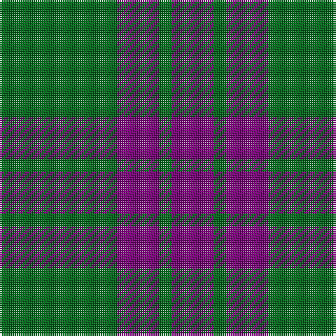

In pattern [BGBG](/stripes/bgbg/).

This was sourced from house-of-tartan.  It is a [4 stripe tartan](/stripes/stripes4/).

Original link http://www.house-of-tartan.scotland.net/house/TartanViewjs.asp?colr=Def&tnam=115

## Thread count
G/56 P20 G6 P/20

## Palette
Each colour and its ΔE from the base-6 reference it is a variant of.

| Colour | Shade | Base | ΔE (OKLab) |
|---|---|---|---|
| G | <code style="background-color:#006818;">#006818</code> `#006818` | G <code style="background-color:#006100;">#006100</code> | 0.02 |
| P | <code style="background-color:#780078;">#780078</code> `#780078` | B <code style="background-color:#2A418A;">#2A418A</code> | 0.17 |

# Sample pattern

## Nearest tartans

The nearest existing variants by ΔTartan distance.

1. [Wilson's, No 211](/setts/s4/g8p4g1p2~x4/) — ΔT 0.89
1. [Elphinstone](/setts/s4/g6dp2g1~x4/) — ΔT 1.07
1. [Elphinstone Check (Clan)](/setts/s4/g6dp2g1~x20/) — ΔT 1.07
1. [Grey Spirit (Fashion)](/setts/s6/n6k17n6k17n45k4~x2/) — ΔT 1.34
1. [Mackay (Blue)](/setts/s6/n1k3n1k3n8r1~x8/) — ΔT 1.55
1. [Elphinstone](/setts/s4/g12p3g1~x2/) — ΔT 1.58
1. [Grey Spirit Fashion Tartan Tartan Number: 6594. Earliest known date: 01/03/2005 A fashion tartan from ACS Clothing of Glasgow for use in their kilt hire business. Woven by Lochcarron. The grey is actually a grey/black marl (mixture) which can't be shown graphically. See products available Copyright © Blair Urquhart, Comrie, 2015](/setts/s6/n6k16n6k16n45k4~x2/) — ΔT 1.64
1. [Special Saffron (Fashion)](/setts/s4/dg21lo44dg86t10/) — ΔT 1.64
1. [Slanj, Grey (Corporate)](/setts/s6/k3n25k3n3k21n3~x2/) — ΔT 1.65
1. [Bumbee #1 (Fashion)](/setts/s4/g10k2dp5g1~x8/) — ΔT 1.72

## Neighbour map

Every grey dot is one of 14299 variants placed by the first two principal components of the ΔTartan feature space (44% of its variance). Red is this tartan; blue dots are its nearest — click one to open its page.

<svg viewBox="0 0 640 380" role="img" style="max-width:100%;height:auto;border:1px solid #e0e0e0;border-radius:4px;display:block" xmlns="http://www.w3.org/2000/svg"><image href="/nn/cloud.v1.png" width="640" height="380"/><a href="/setts/s4/g8p4g1p2~x4/"><circle cx="375.3" cy="281.6" r="4" fill="#3465a4"><title>Wilson's, No 211</title></circle></a><a href="/setts/s4/g6dp2g1~x4/"><circle cx="408.3" cy="314.5" r="4" fill="#3465a4"><title>Elphinstone</title></circle></a><a href="/setts/s4/g6dp2g1~x20/"><circle cx="408.3" cy="314.5" r="4" fill="#3465a4"><title>Elphinstone Check (Clan)</title></circle></a><a href="/setts/s6/n6k17n6k17n45k4~x2/"><circle cx="433.7" cy="260.9" r="4" fill="#3465a4"><title>Grey Spirit (Fashion)</title></circle></a><a href="/setts/s6/n1k3n1k3n8r1~x8/"><circle cx="362.2" cy="246.5" r="4" fill="#3465a4"><title>Mackay (Blue)</title></circle></a><a href="/setts/s4/g12p3g1~x2/"><circle cx="452.3" cy="257.5" r="4" fill="#3465a4"><title>Elphinstone</title></circle></a><a href="/setts/s6/n6k16n6k16n45k4~x2/"><circle cx="460.5" cy="268.2" r="4" fill="#3465a4"><title>Grey Spirit Fashion Tartan Tartan Number: 6594. Earliest known date: 01/03/2005 A fashion tartan from ACS Clothing of Glasgow for use in their kilt hire business. Woven by Lochcarron. The grey is actually a grey/black marl (mixture) which can't be shown graphically. See products available Copyright © Blair Urquhart, Comrie, 2015</title></circle></a><a href="/setts/s4/dg21lo44dg86t10/"><circle cx="372.7" cy="262.0" r="4" fill="#3465a4"><title>Special Saffron (Fashion)</title></circle></a><a href="/setts/s6/k3n25k3n3k21n3~x2/"><circle cx="401.1" cy="264.1" r="4" fill="#3465a4"><title>Slanj, Grey (Corporate)</title></circle></a><a href="/setts/s4/g10k2dp5g1~x8/"><circle cx="355.8" cy="263.8" r="4" fill="#3465a4"><title>Bumbee #1 (Fashion)</title></circle></a><circle cx="408.4" cy="287.6" r="5" fill="#c00000"/></svg>

ID: /setts/s4/g28dp10g3~x2/
