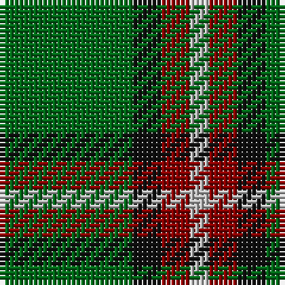

In pattern [GKRY](/patterns/gkry/).

This was sourced from tartans-authority.  It is a [4 stripes tartan](/stripes/stripes4/).

Original link http://www.tartansauthority.com/tartan-ferret/display/3625/

## Attestations

This cloth appears in 2 source records; the oldest owns this page.

- pre 2002 — Bacon, Green (Fashion) (tartans-authority, [record](http://www.tartansauthority.com/tartan-ferret/display/3625/))
- undated — Bacon, Green (register-of-tartans, [record](https://www.tartanregister.gov.uk/tartanDetails.aspx?ref=5175))

## Thread count
G/28 K6 DR6 N/4

## Palette
Each colour and its ΔE from the base-6 reference it is a variant of.

| Colour | Shade | Base | ΔE (OKLab) |
|---|---|---|---|
| DR | <code style="background-color:#880000;">#880000</code> `#880000` | R <code style="background-color:#C80000;">#C80000</code> | 0.14 |
| G | <code style="background-color:#006818;">#006818</code> `#006818` | G <code style="background-color:#006400;">#006400</code> | 0.02 |
| K | <code style="background-color:#101010;">#101010</code> `#101010` | K <code style="background-color:#000000;">#000000</code> | 0.17 |
| N | <code style="background-color:#B8B8B8;">#B8B8B8</code> `#B8B8B8` | Y <code style="background-color:#E8C000;">#E8C000</code> | 0.17 |

# Sample pattern

## Nearest tartans

The nearest existing variants by ΔTartan distance.

1. [Wilson's No.140](/setts/s4/k4y2g14b2-b5c8ca8-g006818-k101010-ye8c000/) — ΔT 0.60
1. [Wilson's No.192](/setts/s4/b8g20r2y2-b440044-g006818-rc80000-ye8c000/) — ΔT 0.79
1. [Wilson's No.174](/setts/s4/b2ba8g20y2-b2888c4-ba202060-g006818-ye8c000/) — ΔT 1.02
1. [Wilson's, No 192](/setts/s4/b8g20r2y2-b800080-g008000-rc00000-yf0c000/) — ΔT 1.08
1. [Wilson's No.189](/setts/s4/b8g20r2w2-b440044-g006818-rc80000-wfcfcfc/) — ΔT 1.11
1. [Wilson's, No 189](/setts/s4/b8g20w2r2-b800080-g008000-rc00000-we0e0e0/) — ΔT 1.21
1. [Wilson's, No 174](/setts/s4/b2ba8g20y2-b5480b0-ba304080-g008000-yf0c000/) — ΔT 1.27
1. [St Johns County Sheriff Office (Cor)](/setts/s5/r34b14y16g116k12-b1c0070-g006818-k101010-rc80000-ybc8c00/) — ΔT 1.31
1. [Wilson's, No 205](/setts/s4/b2ba8g20w2-b5480b0-ba304080-g008000-we0e0e0/) — ΔT 1.31
1. [Lauder](/setts/s6/g6b16g6k8g30r4-b304080-g008000-k000000-rc00000/) — ΔT 1.33

## Neighbour map

Every grey dot is one of 15726 variants placed by the first two principal components of the ΔTartan feature space (44% of its variance). Red is this tartan; blue dots are its nearest — click one to open its page.

<svg viewBox="0 0 640 380" role="img" style="max-width:100%;height:auto;border:1px solid #e0e0e0;border-radius:4px;display:block" xmlns="http://www.w3.org/2000/svg"><image href="/nn/cloud.v1.png" width="640" height="380"/><a href="/setts/s4/k4y2g14b2-b5c8ca8-g006818-k101010-ye8c000/"><circle cx="336.5" cy="246.1" r="4" fill="#3465a4"><title>Wilson's No.140</title></circle></a><a href="/setts/s4/b8g20r2y2-b440044-g006818-rc80000-ye8c000/"><circle cx="356.7" cy="229.4" r="4" fill="#3465a4"><title>Wilson's No.192</title></circle></a><a href="/setts/s4/b2ba8g20y2-b2888c4-ba202060-g006818-ye8c000/"><circle cx="361.0" cy="238.7" r="4" fill="#3465a4"><title>Wilson's No.174</title></circle></a><a href="/setts/s4/b8g20r2y2-b800080-g008000-rc00000-yf0c000/"><circle cx="347.8" cy="221.9" r="4" fill="#3465a4"><title>Wilson's, No 192</title></circle></a><a href="/setts/s4/b8g20r2w2-b440044-g006818-rc80000-wfcfcfc/"><circle cx="342.5" cy="223.3" r="4" fill="#3465a4"><title>Wilson's No.189</title></circle></a><a href="/setts/s4/b8g20w2r2-b800080-g008000-rc00000-we0e0e0/"><circle cx="342.9" cy="220.0" r="4" fill="#3465a4"><title>Wilson's, No 189</title></circle></a><a href="/setts/s4/b2ba8g20y2-b5480b0-ba304080-g008000-yf0c000/"><circle cx="366.1" cy="240.1" r="4" fill="#3465a4"><title>Wilson's, No 174</title></circle></a><a href="/setts/s5/r34b14y16g116k12-b1c0070-g006818-k101010-rc80000-ybc8c00/"><circle cx="323.9" cy="198.0" r="4" fill="#3465a4"><title>St Johns County Sheriff Office (Cor)</title></circle></a><a href="/setts/s4/b2ba8g20w2-b5480b0-ba304080-g008000-we0e0e0/"><circle cx="358.7" cy="237.0" r="4" fill="#3465a4"><title>Wilson's, No 205</title></circle></a><a href="/setts/s6/g6b16g6k8g30r4-b304080-g008000-k000000-rc00000/"><circle cx="286.7" cy="232.0" r="4" fill="#3465a4"><title>Lauder</title></circle></a><circle cx="346.8" cy="248.5" r="5" fill="#c00000"/></svg>

ID: /setts/s4/g28k6r6y4-g006818-k101010-r880000-yb8b8b8/
