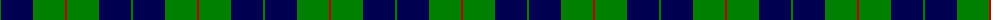
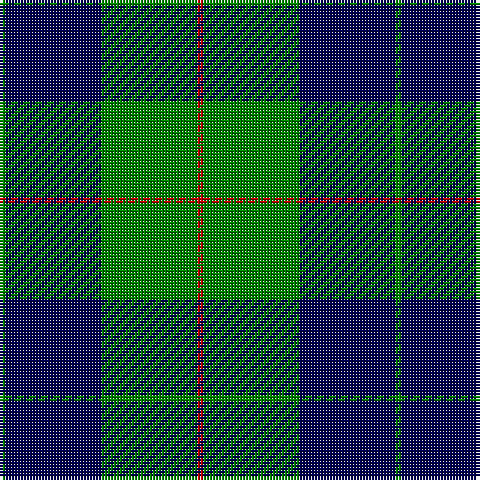

In pattern [GBGR](/patterns/gbgr/).

This was sourced from weddslist.  It is a [4 stripes tartan](/stripes/stripes4/).

Original link http://www.weddslist.com/cgi-bin/tartans/pg.pl?source=sts

## Thread count
G/2 DB32 G32 R/2

## Palette
Each colour and its ΔE from the base-6 reference it is a variant of.

| Colour | Shade | Base | ΔE (OKLab) |
|---|---|---|---|
| DB | <code style="background-color:#000050;">#000050</code> `#000050` | B <code style="background-color:#2C4084;">#2C4084</code> | 0.20 |
| G | <code style="background-color:#008000;">#008000</code> `#008000` | G <code style="background-color:#006400;">#006400</code> | 0.09 |
| R | <code style="background-color:#C00000;">#C00000</code> `#C00000` | R <code style="background-color:#C80000;">#C80000</code> | 0.02 |

# Sample pattern

## Nearest tartans

The nearest existing variants by ΔTartan distance.

1. [Gracie (Name)](/setts/s5/g94r6g12b70y6-b1c0070-g006818-r880000-yd09800/) — ΔT 1.45
1. [Bumbee #1 (Fashion)](/setts/s4/g80k16b40g8-b300048-g006818-k000000/) — ΔT 1.51
1. [Campbell of Loch Awe](/setts/s5/k4b22k52g22k4-b1474b4-g006818-k101010/) — ΔT 1.51
1. [Connacht Irish District Tartan Tartan Number: 4485. Earliest known date: 1994 Phil Smith obtained in Perthshire from a swatch dated 1994 shown to him by Keith Lumsden of the Scottish Tartans Society. However www.uniq-orn.com shows this as Connaught Green. See products available Copyright © Blair Urquhart, Comrie, 2015](/setts/s6/r4b64g28b10g32w4-b202060-g288028-ra00000-we0e0e0/) — ΔT 1.55
1. [Unidentified Furnishing #2](/setts/s6/r8g80k42y4k42g4-g50783c-k000034-rc82800-yc88c00/) — ΔT 1.58
1. [MacIntyre L](/setts/s6/g4b12r3b12g32w4-b000064-g004c00-rc80000-wd0d0d0/) — ΔT 1.59
1. [Douglas (alternative threadcount)](/setts/s5/k12b8g88k82w8-b1c0070-g006818-k101010-we0e0e0/) — ΔT 1.60
1. [Hamworthy Association](/setts/s4/k82y32g28w4-g003c14-k101010-we0e0e0-y48a4c0/) — ΔT 1.61
1. [U.S. Border Patrol (Corporate)](/setts/s5/g80k30b20k20y6-b1474b4-g408060-k101010-ye8c000/) — ΔT 1.62
1. [St. Dennis & Cranley School](/setts/s7/b4g48b16w4b16g16b4-b1c0070-g006818-wc0c0c0/) — ΔT 1.63

## Neighbour map

Every grey dot is one of 15726 variants placed by the first two principal components of the ΔTartan feature space (44% of its variance). Red is this tartan; blue dots are its nearest — click one to open its page.

<svg viewBox="0 0 640 380" role="img" style="max-width:100%;height:auto;border:1px solid #e0e0e0;border-radius:4px;display:block" xmlns="http://www.w3.org/2000/svg"><image href="/nn/cloud.v1.png" width="640" height="380"/><a href="/setts/s5/g94r6g12b70y6-b1c0070-g006818-r880000-yd09800/"><circle cx="354.0" cy="207.1" r="4" fill="#3465a4"><title>Gracie (Name)</title></circle></a><a href="/setts/s4/g80k16b40g8-b300048-g006818-k000000/"><circle cx="354.9" cy="262.0" r="4" fill="#3465a4"><title>Bumbee #1 (Fashion)</title></circle></a><a href="/setts/s5/k4b22k52g22k4-b1474b4-g006818-k101010/"><circle cx="348.3" cy="240.8" r="4" fill="#3465a4"><title>Campbell of Loch Awe</title></circle></a><a href="/setts/s6/r4b64g28b10g32w4-b202060-g288028-ra00000-we0e0e0/"><circle cx="320.7" cy="199.6" r="4" fill="#3465a4"><title>Connacht Irish District Tartan Tartan Number: 4485. Earliest known date: 1994 Phil Smith obtained in Perthshire from a swatch dated 1994 shown to him by Keith Lumsden of the Scottish Tartans Society. However www.uniq-orn.com shows this as Connaught Green. See products available Copyright © Blair Urquhart, Comrie, 2015</title></circle></a><a href="/setts/s6/r8g80k42y4k42g4-g50783c-k000034-rc82800-yc88c00/"><circle cx="295.4" cy="183.6" r="4" fill="#3465a4"><title>Unidentified Furnishing #2</title></circle></a><a href="/setts/s6/g4b12r3b12g32w4-b000064-g004c00-rc80000-wd0d0d0/"><circle cx="298.2" cy="215.7" r="4" fill="#3465a4"><title>MacIntyre L</title></circle></a><a href="/setts/s5/k12b8g88k82w8-b1c0070-g006818-k101010-we0e0e0/"><circle cx="290.5" cy="220.0" r="4" fill="#3465a4"><title>Douglas (alternative threadcount)</title></circle></a><a href="/setts/s4/k82y32g28w4-g003c14-k101010-we0e0e0-y48a4c0/"><circle cx="310.2" cy="212.2" r="4" fill="#3465a4"><title>Hamworthy Association</title></circle></a><a href="/setts/s5/g80k30b20k20y6-b1474b4-g408060-k101010-ye8c000/"><circle cx="277.5" cy="214.3" r="4" fill="#3465a4"><title>U.S. Border Patrol (Corporate)</title></circle></a><a href="/setts/s7/b4g48b16w4b16g16b4-b1c0070-g006818-wc0c0c0/"><circle cx="367.2" cy="221.9" r="4" fill="#3465a4"><title>St. Dennis &amp; Cranley School</title></circle></a><circle cx="328.8" cy="232.6" r="5" fill="#c00000"/></svg>

ID: /setts/s4/g2b32g32r2-b000050-g008000-rc00000/
