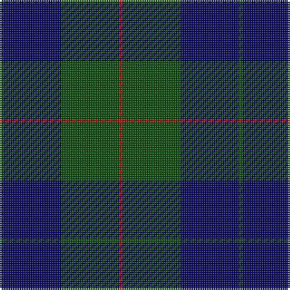

In pattern [GBGR](/patterns/gbgr/).

This was sourced from weddslist.  It is a [4 stripes tartan](/stripes/stripes4/).

Original link http://www.weddslist.com/cgi-bin/tartans/pg.pl?source=rb

## Thread count
G/2 DB32 G32 R/2

## Palette
Each colour and its ΔE from the base-6 reference it is a variant of.

| Colour | Shade | Base | ΔE (OKLab) |
|---|---|---|---|
| DB | <code style="background-color:#000064;">#000064</code> `#000064` | B <code style="background-color:#2A418A;">#2A418A</code> | 0.18 |
| G | <code style="background-color:#004C00;">#004C00</code> `#004C00` | G <code style="background-color:#006100;">#006100</code> | 0.07 |
| R | <code style="background-color:#C80000;">#C80000</code> `#C80000` | R <code style="background-color:#CC0000;">#CC0000</code> | 0.01 |

# Sample pattern

## Nearest tartans

The nearest existing variants by ΔTartan distance.

1. [Barclay Hunting](/setts/s4/g2b32g32r2-b000052-g11450d-raa0000/) — ΔT 0.64
1. [Barclay Hunting Clan Tartan Tartan Number: 705. Earliest known date: 1842 The 'Vestiarium' attempted to persuade its readers that the illustrated tartans were of great antiquity. Despite this fault the work contains the earliest record of many tartans some of which have been verified by other means. Innes, Stewart, and W & A K Johnston, also record this sett. See products available Copyright © Blair Urquhart, Comrie, 2015](/setts/s4/g2b32g32r2-b202060-g006818-rc80000/) — ΔT 0.82
1. [Barclay](/setts/s4/g2b32g32r2-b2c2c80-g006818-rc80000/) — ΔT 0.94
1. [Barclay Htg (Clan)](/setts/s4/g4b64g64r4-b2c2c80-g006818-rc80000/) — ΔT 0.94
1. [Wcwm 1255-1](/setts/s5/b16ba4g56b56r4-b000064-ba0000e0-g004c00-r8c0000/) — ΔT 1.16
1. [Campbell of Lochawe Clan Tartan Tartan Number: 1038. Earliest known date: pre 2003 MacKinlay strip. Sample in STS collection. See products available Copyright © Blair Urquhart, Comrie, 2015](/setts/s5/k4b22k52g22k4-b2c2c80-g006818-k101010/) — ΔT 1.30
1. [Campbell of Loch Awe](/setts/s5/k4b22k52g22k4-b1474b4-g006818-k101010/) — ΔT 1.39
1. [Hutton](/setts/s6/k12g42b12g42b96r6-b00004c-g005030-k101010-rc80000/) — ΔT 1.47
1. [St. Andrews Old Course Hotel (Corp)](/setts/s6/g104b40k12b8ga8b40-b1c0070-g006818-ga604000-k101010/) — ΔT 1.49
1. [MacKay (Blue) #2](/setts/s5/k30b8k30b56r4-b2c4084-k101010-rdc0000/) — ΔT 1.53

## Neighbour map

Every grey dot is one of 15726 variants placed by the first two principal components of the ΔTartan feature space (44% of its variance). Red is this tartan; blue dots are its nearest — click one to open its page.

<svg viewBox="0 0 640 380" role="img" style="max-width:100%;height:auto;border:1px solid #e0e0e0;border-radius:4px;display:block" xmlns="http://www.w3.org/2000/svg"><image href="/nn/cloud.v1.png" width="640" height="380"/><a href="/setts/s4/g2b32g32r2-b000052-g11450d-raa0000/"><circle cx="397.6" cy="262.5" r="4" fill="#3465a4"><title>Barclay Hunting</title></circle></a><a href="/setts/s4/g2b32g32r2-b202060-g006818-rc80000/"><circle cx="380.3" cy="250.4" r="4" fill="#3465a4"><title>Barclay Hunting Clan Tartan Tartan Number: 705. Earliest known date: 1842 The 'Vestiarium' attempted to persuade its readers that the illustrated tartans were of great antiquity. Despite this fault the work contains the earliest record of many tartans some of which have been verified by other means. Innes, Stewart, and W &amp; A K Johnston, also record this sett. See products available Copyright © Blair Urquhart, Comrie, 2015</title></circle></a><a href="/setts/s4/g2b32g32r2-b2c2c80-g006818-rc80000/"><circle cx="383.3" cy="251.0" r="4" fill="#3465a4"><title>Barclay</title></circle></a><a href="/setts/s4/g4b64g64r4-b2c2c80-g006818-rc80000/"><circle cx="383.3" cy="251.0" r="4" fill="#3465a4"><title>Barclay Htg (Clan)</title></circle></a><a href="/setts/s5/b16ba4g56b56r4-b000064-ba0000e0-g004c00-r8c0000/"><circle cx="356.5" cy="236.2" r="4" fill="#3465a4"><title>Wcwm 1255-1</title></circle></a><a href="/setts/s5/k4b22k52g22k4-b2c2c80-g006818-k101010/"><circle cx="383.0" cy="255.7" r="4" fill="#3465a4"><title>Campbell of Lochawe Clan Tartan Tartan Number: 1038. Earliest known date: pre 2003 MacKinlay strip. Sample in STS collection. See products available Copyright © Blair Urquhart, Comrie, 2015</title></circle></a><a href="/setts/s5/k4b22k52g22k4-b1474b4-g006818-k101010/"><circle cx="348.3" cy="240.8" r="4" fill="#3465a4"><title>Campbell of Loch Awe</title></circle></a><a href="/setts/s6/k12g42b12g42b96r6-b00004c-g005030-k101010-rc80000/"><circle cx="356.6" cy="227.5" r="4" fill="#3465a4"><title>Hutton</title></circle></a><a href="/setts/s6/g104b40k12b8ga8b40-b1c0070-g006818-ga604000-k101010/"><circle cx="311.9" cy="212.9" r="4" fill="#3465a4"><title>St. Andrews Old Course Hotel (Corp)</title></circle></a><a href="/setts/s5/k30b8k30b56r4-b2c4084-k101010-rdc0000/"><circle cx="376.3" cy="264.3" r="4" fill="#3465a4"><title>MacKay (Blue) #2</title></circle></a><circle cx="379.0" cy="254.8" r="5" fill="#c00000"/></svg>

ID: /setts/s4/g2b32g32r2-b000064-g004c00-rc80000/
