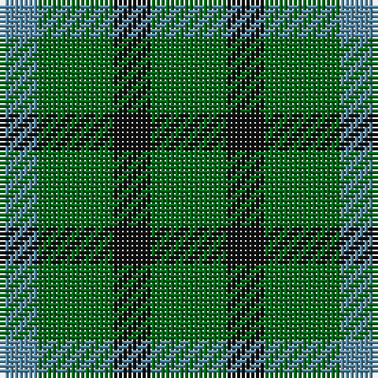

In pattern [BGKG](/patterns/bgkg/).

This was sourced from register-of-tartans.  It is a [4 stripes tartan](/stripes/stripes4/).

Original link https://www.tartanregister.gov.uk/tartanDetails.aspx?ref=4654

## Thread count
B/8 G16 K8 G/16

## Palette
Each colour and its ΔE from the base-6 reference it is a variant of.

| Colour | Shade | Base | ΔE (OKLab) |
|---|---|---|---|
| B | <code style="background-color:#5C8CA8;">#5C8CA8</code> `#5C8CA8` | B <code style="background-color:#2A418A;">#2A418A</code> | 0.23 |
| DG | <code style="background-color:#003820;">#003820</code> `#003820` | G <code style="background-color:#006100;">#006100</code> | 0.15 |
| G | <code style="background-color:#006818;">#006818</code> `#006818` | G <code style="background-color:#006100;">#006100</code> | 0.02 |
| K | <code style="background-color:#101010;">#101010</code> `#101010` | K <code style="background-color:#000000;">#000000</code> | 0.17 |
| LG | <code style="background-color:#789484;">#789484</code> `#789484` | G <code style="background-color:#006100;">#006100</code> | 0.24 |

# Sample pattern

## Nearest tartans

The nearest existing variants by ΔTartan distance.

1. [Glen Lyon #1](/setts/s4/k6g5r2g5~g006818-k101010-rc80000~x2/) — ΔT 1.77
1. [Wilson's No.207](/setts/s4/g2r2g2b1~b2888c4-g006818-rc80000~x4/) — ΔT 1.90
1. [Wilson's No.209](/setts/s4/g4b5g4ba2~b440044-ba2888c4-g006818~x2/) — ΔT 2.01
1. [Wilson's No.053 #2](/setts/s4/g4k5g4y1~g006818-k101010-yd8b000~x2/) — ΔT 2.09
1. [MacCurdie (Clan?)](/setts/s4/k5g14b12g4~b2c2c80-g006818-k101010~x4/) — ΔT 2.35
1. [Wilson's No.094](/setts/s4/g4k5g4r2~g408060-k101010-rc80000~x2/) — ΔT 2.39
1. [Wilson's No.052](/setts/s3/g7k4b4~b2888c4-g006818-k101010~x2/) — ΔT 2.47
1. [Daks (House)](/setts/s5/b4g7k4g7y4~b2c2c80-g006818-k101010-ye8c000~x2/) — ΔT 2.50
1. [Kincaid of Kincaid](/setts/s4/g16k11g16r2~g006818-k101010-r880000~x4/) — ΔT 2.50
1. [Wilson's, No 208](/setts/s3/g7b2r4~b5480b0-g008000-rc00000~x2/) — ΔT 2.50

## Neighbour map

Every grey dot is one of 15726 variants placed by the first two principal components of the ΔTartan feature space (44% of its variance). Red is this tartan; blue dots are its nearest — click one to open its page.

<svg viewBox="0 0 640 380" role="img" style="max-width:100%;height:auto;border:1px solid #e0e0e0;border-radius:4px;display:block" xmlns="http://www.w3.org/2000/svg"><image href="/nn/cloud.v1.png" width="640" height="380"/><a href="/setts/s4/k6g5r2g5~g006818-k101010-rc80000~x2/"><circle cx="241.3" cy="360.9" r="4" fill="#3465a4"><title>Glen Lyon #1</title></circle></a><a href="/setts/s4/g2r2g2b1~b2888c4-g006818-rc80000~x4/"><circle cx="225.8" cy="366.0" r="4" fill="#3465a4"><title>Wilson's No.207</title></circle></a><a href="/setts/s4/g4b5g4ba2~b440044-ba2888c4-g006818~x2/"><circle cx="215.1" cy="366.0" r="4" fill="#3465a4"><title>Wilson's No.209</title></circle></a><a href="/setts/s4/g4k5g4y1~g006818-k101010-yd8b000~x2/"><circle cx="277.0" cy="328.8" r="4" fill="#3465a4"><title>Wilson's No.053 #2</title></circle></a><a href="/setts/s4/k5g14b12g4~b2c2c80-g006818-k101010~x4/"><circle cx="262.5" cy="342.4" r="4" fill="#3465a4"><title>MacCurdie (Clan?)</title></circle></a><a href="/setts/s4/g4k5g4r2~g408060-k101010-rc80000~x2/"><circle cx="198.1" cy="361.8" r="4" fill="#3465a4"><title>Wilson's No.094</title></circle></a><a href="/setts/s3/g7k4b4~b2888c4-g006818-k101010~x2/"><circle cx="150.4" cy="366.0" r="4" fill="#3465a4"><title>Wilson's No.052</title></circle></a><a href="/setts/s5/b4g7k4g7y4~b2c2c80-g006818-k101010-ye8c000~x2/"><circle cx="129.6" cy="347.6" r="4" fill="#3465a4"><title>Daks (House)</title></circle></a><a href="/setts/s4/g16k11g16r2~g006818-k101010-r880000~x4/"><circle cx="423.0" cy="321.1" r="4" fill="#3465a4"><title>Kincaid of Kincaid</title></circle></a><a href="/setts/s3/g7b2r4~b5480b0-g008000-rc00000~x2/"><circle cx="267.6" cy="339.6" r="4" fill="#3465a4"><title>Wilson's, No 208</title></circle></a><circle cx="299.6" cy="366.0" r="5" fill="#c00000"/></svg>

ID: /setts/s4/g2k1g2b1~b5c8ca8-g006818-k101010~x8/
