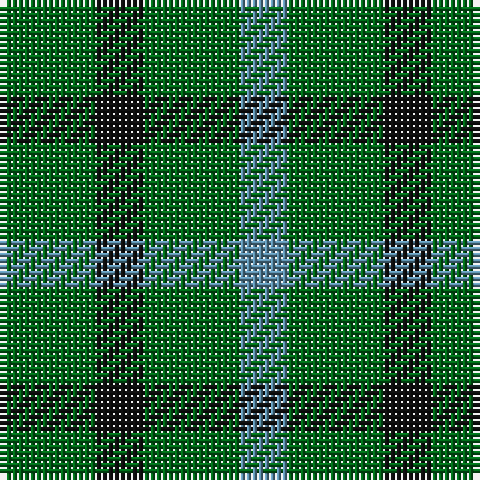

In pattern [BGKG](/stripes/bgkg/).

This was sourced from register-of-tartans.  It is a [4 stripe tartan](/stripes/stripes4/).

Original link https://www.tartanregister.gov.uk/tartanDetails.aspx?ref=4654

## Register references

External register numbers recorded for this tartan.

- Scottish Register of Tartans: [4654](https://www.tartanregister.gov.uk/tartanDetails.aspx?ref=4654)
- Scottish Tartans Authority (ITI): 723
- Scottish Tartans World Register: 723

## Thread count
G/16 K8 G16 B/8

## Palette
Each colour and the base-6 reference it is a variant of.

| Colour | Shade | Base |
|---|---|---|
| B | <code style="background-color:#5C8CA8;">#5C8CA8</code> `oklch(61.7% 0.067 235.0)` <small>#5C8CA8</small> | B <code style="background-color:#2A418A;">#2A418A</code> |
| DG | <code style="background-color:#003820;">#003820</code> `oklch(30.0% 0.070 158.3)` <small>#003820</small> | G <code style="background-color:#006100;">#006100</code> |
| G | <code style="background-color:#006818;">#006818</code> `oklch(45.0% 0.142 145.0)` <small>#006818</small> | G <code style="background-color:#006100;">#006100</code> |
| K | <code style="background-color:#101010;">#101010</code> `oklch(17.3% 0.000 89.9)` <small>#101010</small> | K <code style="background-color:#000000;">#000000</code> |
| LG | <code style="background-color:#789484;">#789484</code> `oklch(64.0% 0.040 160.0)` <small>#789484</small> | G <code style="background-color:#006100;">#006100</code> |

# Sample pattern

## Nearest tartans

The nearest existing variants by ΔTartan distance, with this tartan at the top so the swatches line up against it.

ΔTartan

Tartan

Sett

—

<a href="/ttd/edit/#slug=g2k1g2t1~x8">Wilson's No.045</a> <a class="nn-out" href="/setts/s4/g2k1g2t1~x8/" title="open its dictionary page">↗</a>

1.77

<a href="/setts/s4/k6g5r2~x2/">Glen Lyon #1</a>

1.91

<a href="/ttd/edit/#slug=g2r2g2t1~x4">Wilson's No.207</a> <a class="nn-out" href="/setts/s4/g2r2g2t1~x4/" title="open its dictionary page">↗</a>

2.01

<a href="/ttd/edit/#slug=g4dp5g4t2~x2">Wilson's No.209</a> <a class="nn-out" href="/setts/s4/g4dp5g4t2~x2/" title="open its dictionary page">↗</a>

2.09

<a href="/ttd/edit/#slug=g4k5g4ly1~x2">Wilson's No.053 #2</a> <a class="nn-out" href="/setts/s4/g4k5g4ly1~x2/" title="open its dictionary page">↗</a>

2.35

<a href="/ttd/edit/#slug=k5g14db12g4~x4">MacCurdie (Clan?)</a> <a class="nn-out" href="/setts/s4/k5g14db12g4~x4/" title="open its dictionary page">↗</a>

2.39

<a href="/ttd/edit/#slug=g4k5g4r2~x2">Wilson's No.094</a> <a class="nn-out" href="/setts/s4/g4k5g4r2~x2/" title="open its dictionary page">↗</a>

2.46

<a href="/ttd/edit/#slug=g7k4t4~x2">Wilson's No.052</a> <a class="nn-out" href="/setts/s3/g7k4t4~x2/" title="open its dictionary page">↗</a>

2.49

<a href="/ttd/edit/#slug=db4g7k4g7ly4~x2">Daks (House)</a> <a class="nn-out" href="/setts/s5/db4g7k4g7ly4~x2/" title="open its dictionary page">↗</a>

2.50

<a href="/ttd/edit/#slug=g16k11g16r2~x4">Kincaid of Kincaid</a> <a class="nn-out" href="/setts/s4/g16k11g16r2~x4/" title="open its dictionary page">↗</a>

2.51

<a href="/ttd/edit/#slug=g7t2r4~x2">Wilson's, No 208</a> <a class="nn-out" href="/setts/s3/g7t2r4~x2/" title="open its dictionary page">↗</a>

## Neighbour map

Every grey dot is one of 14299 variants placed by the first two principal components of the ΔTartan feature space (44% of its variance). Red is this tartan; blue dots are its nearest — click one to open its page.

<svg viewBox="0 0 640 380" role="img" style="max-width:100%;height:auto;border:1px solid #e0e0e0;border-radius:4px;display:block" xmlns="http://www.w3.org/2000/svg"><image href="/nn/cloud.v1.png" width="640" height="380"/><a href="/setts/s4/k6g5r2~x2/"><circle cx="243.4" cy="360.4" r="4" fill="#3465a4"><title>Glen Lyon #1</title></circle></a><a href="/setts/s4/g2r2g2t1~x4/"><circle cx="226.9" cy="366.0" r="4" fill="#3465a4"><title>Wilson's No.207</title></circle></a><a href="/setts/s4/g4dp5g4t2~x2/"><circle cx="217.4" cy="366.0" r="4" fill="#3465a4"><title>Wilson's No.209</title></circle></a><a href="/setts/s4/g4k5g4ly1~x2/"><circle cx="279.5" cy="327.5" r="4" fill="#3465a4"><title>Wilson's No.053 #2</title></circle></a><a href="/setts/s4/k5g14db12g4~x4/"><circle cx="265.3" cy="345.9" r="4" fill="#3465a4"><title>MacCurdie (Clan?)</title></circle></a><a href="/setts/s4/g4k5g4r2~x2/"><circle cx="200.2" cy="359.2" r="4" fill="#3465a4"><title>Wilson's No.094</title></circle></a><a href="/setts/s3/g7k4t4~x2/"><circle cx="153.6" cy="366.0" r="4" fill="#3465a4"><title>Wilson's No.052</title></circle></a><a href="/setts/s5/db4g7k4g7ly4~x2/"><circle cx="132.3" cy="346.5" r="4" fill="#3465a4"><title>Daks (House)</title></circle></a><a href="/setts/s4/g16k11g16r2~x4/"><circle cx="424.7" cy="321.6" r="4" fill="#3465a4"><title>Kincaid of Kincaid</title></circle></a><a href="/setts/s3/g7t2r4~x2/"><circle cx="268.7" cy="339.0" r="4" fill="#3465a4"><title>Wilson's, No 208</title></circle></a><circle cx="301.7" cy="366.0" r="5" fill="#c00000"/></svg>

ID: /setts/s4/g2k1g2t1~x8/
