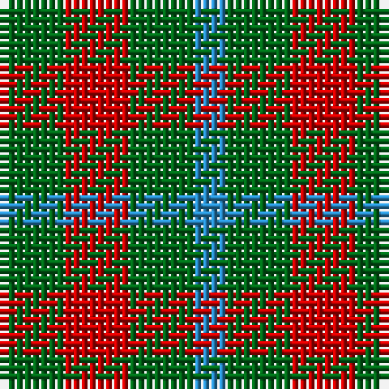

**Bands:** [GRGB](/stripes/grgb/) · **Stripes:** [G R G T](/stripes/stripes4/) G R G T

This was sourced from register-of-tartans.  It is a [4 band tartan](/bands/bands4/).

Original link https://www.tartanregister.gov.uk/tartanDetails.aspx?ref=4738

## Register references

External register numbers recorded for this tartan.

- Scottish Register of Tartans: [4738](https://www.tartanregister.gov.uk/tartanDetails.aspx?ref=4738)
- Scottish Tartans Authority (ITI): 183
- Scottish Tartans World Register: 183

## Variants

Other setts woven to the same stripe pattern.

- [Wilson's No.188](/setts/s4/g2r4g2t1~x4/)

## Thread count
G/8 R8 G8 B/4

## Palette
Each colour and its ΔE from the base-6 reference it is a variant of.

| Colour | Shade | Base | ΔE (OKLab) |
|---|---|---|---|
| B | <code style="background-color:#2888C4;">#2888C4</code> `#2888C4` | B <code style="background-color:#2A418A;">#2A418A</code> | 0.21 |
| DG | <code style="background-color:#003820;">#003820</code> `#003820` | G <code style="background-color:#006100;">#006100</code> | 0.15 |
| G | <code style="background-color:#006818;">#006818</code> `#006818` | G <code style="background-color:#006100;">#006100</code> | 0.02 |
| LG | <code style="background-color:#789484;">#789484</code> `#789484` | G <code style="background-color:#006100;">#006100</code> | 0.24 |
| P | <code style="background-color:#780078;">#780078</code> `#780078` | B <code style="background-color:#2A418A;">#2A418A</code> | 0.17 |
| R | <code style="background-color:#C80000;">#C80000</code> `#C80000` | R <code style="background-color:#CC0000;">#CC0000</code> | 0.01 |
| Ra | <code style="background-color:#C80000;">#C80000</code> `#C80000` | R <code style="background-color:#CC0000;">#CC0000</code> | 0.01 |

# Sample pattern

## Nearest tartans

The nearest existing variants by ΔTartan distance.

1. [Wilson's, No 61](/setts/s3/r4g7t4~x2/) — ΔT 1.31
1. [Wilson's No.094](/setts/s4/g4k5g4r2~x2/) — ΔT 1.42
1. [Wilson's No.209](/setts/s4/g4dp5g4t2~x2/) — ΔT 1.47
1. [Glen Lyon #1](/setts/s4/k6g5r2~x2/) — ΔT 1.51
1. [Gearach Woodcock Tweed (Corporate)](/setts/s3/dy2t1lo1~x2/) — ΔT 1.58
1. [Angle Dress (Fashion)](/setts/s5/k5g8lo5g3lo5~x4/) — ΔT 1.69
1. [Wilson's No.202](/setts/s3/g7k4r4~x2/) — ΔT 1.69
1. [Wilson's No.061](/setts/s3/r4dg7t4~x2/) — ΔT 1.74
1. [Wilson's, No 207](/setts/s3/r2g2t1~x4/) — ΔT 1.79
1. [Wilson's, No 208](/setts/s3/g7t2r4~x2/) — ΔT 1.83

## Neighbour map

Every grey dot is one of 14299 variants placed by the first two principal components of the ΔTartan feature space (44% of its variance). Red is this tartan; blue dots are its nearest — click one to open its page.

<svg viewBox="0 0 640 380" role="img" style="max-width:100%;height:auto;border:1px solid #e0e0e0;border-radius:4px;display:block" xmlns="http://www.w3.org/2000/svg"><image href="/nn/cloud.v1.png" width="640" height="380"/><a href="/setts/s3/r4g7t4~x2/"><circle cx="175.1" cy="366.0" r="4" fill="#3465a4"><title>Wilson's, No 61</title></circle></a><a href="/setts/s4/g4k5g4r2~x2/"><circle cx="200.2" cy="359.2" r="4" fill="#3465a4"><title>Wilson's No.094</title></circle></a><a href="/setts/s4/g4dp5g4t2~x2/"><circle cx="217.4" cy="366.0" r="4" fill="#3465a4"><title>Wilson's No.209</title></circle></a><a href="/setts/s4/k6g5r2~x2/"><circle cx="243.4" cy="360.4" r="4" fill="#3465a4"><title>Glen Lyon #1</title></circle></a><a href="/setts/s3/dy2t1lo1~x2/"><circle cx="224.7" cy="366.0" r="4" fill="#3465a4"><title>Gearach Woodcock Tweed (Corporate)</title></circle></a><a href="/setts/s5/k5g8lo5g3lo5~x4/"><circle cx="149.5" cy="341.3" r="4" fill="#3465a4"><title>Angle Dress (Fashion)</title></circle></a><a href="/setts/s3/g7k4r4~x2/"><circle cx="160.0" cy="366.0" r="4" fill="#3465a4"><title>Wilson's No.202</title></circle></a><a href="/setts/s3/r4dg7t4~x2/"><circle cx="161.9" cy="366.0" r="4" fill="#3465a4"><title>Wilson's No.061</title></circle></a><a href="/setts/s3/r2g2t1~x4/"><circle cx="158.4" cy="366.0" r="4" fill="#3465a4"><title>Wilson's, No 207</title></circle></a><a href="/setts/s3/g7t2r4~x2/"><circle cx="268.7" cy="339.0" r="4" fill="#3465a4"><title>Wilson's, No 208</title></circle></a><circle cx="226.9" cy="366.0" r="5" fill="#c00000"/></svg>

ID: /setts/s4/g2r2g2t1~x4/
