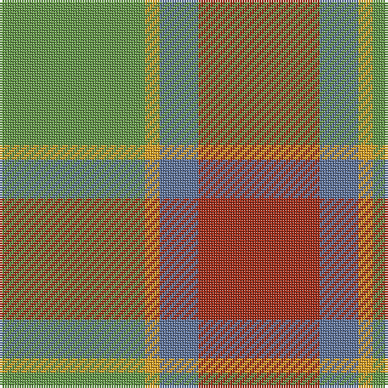

In pattern [GYBR](/patterns/gybr/).

This was sourced from register-of-tartans.  It is a [4 stripes tartan](/stripes/stripes4/).

Original link https://www.tartanregister.gov.uk/tartanDetails.aspx?ref=10665

## Attestations

This cloth appears in 2 source records; the oldest owns this page.

- 30/07/2012 — Dohmen Family (Zuid-Nederland) (register-of-tartans, [record](https://www.tartanregister.gov.uk/tartanDetails.aspx?ref=10665))
- undated — Dohmen Family (Zuid-Nederland) Name Tartan Tartan Number: 10665. Earliest known date: 6 August 2012 Designed by Hub Dohmen to celebrate his family’s strong affinity with Scotland. Colours: green represents a link with Scotland and the mountains of Zuid-Limburg, from where the family originates; blue represents the dominant eye colour of the Dohmen family; rust represents the McDohmen Reserve whisky, bottled at the Bruichladdich Distillery (Islay); gold/orange represents the family hair colour and the Netherlands. See products available Copyright © Blair Urquhart, Comrie, 2015 (house-of-tartan, [record](http://www.house-of-tartan.scotland.net/house/TartanViewjs.asp?colr=Def&tnam=10665))

## Register references

External register numbers recorded for this tartan.

- Scottish Register of Tartans: [10665](https://www.tartanregister.gov.uk/tartanDetails.aspx?ref=10665)

## Thread count
LG/60 Y6 B16 R/50

## Palette
Each colour and its ΔE from the base-6 reference it is a variant of.

| Colour | Shade | Base | ΔE (OKLab) |
|---|---|---|---|
| B | <code style="background-color:#5F749C;">#5F749C</code> `#5F749C` | B <code style="background-color:#2A418A;">#2A418A</code> | 0.17 |
| LG | <code style="background-color:#649848;">#649848</code> `#649848` | G <code style="background-color:#006100;">#006100</code> | 0.20 |
| R | <code style="background-color:#A32D18;">#A32D18</code> `#A32D18` | R <code style="background-color:#CC0000;">#CC0000</code> | 0.08 |
| Y | <code style="background-color:#E0A126;">#E0A126</code> `#E0A126` | Y <code style="background-color:#F2BF00;">#F2BF00</code> | 0.08 |

# Sample pattern

## Nearest tartans

The nearest existing variants by ΔTartan distance.

1. [MacKinnon, hunting](/setts/s4/r1g8ra8w1~g008000-rc00000-ra806050-we0e0e0~x2/) — ΔT 1.22
1. [Prince of Orange Tartan Tartan Number: 389. Earliest known date: pre 2003 Sales help Princess Diana Memorial Trust See products available Copyright © Blair Urquhart, Comrie, 2015](/setts/s4/b6y28g20b3~b5c8ca8-g604000-yd87c00~x2/) — ΔT 1.26
1. [MacKinnon Hunting (Var) Clan Tartan Tartan Number: 1542. Earliest known date: pre 2003 Two times actual count given in letter from MacKinnon of MacKinnon 1908 as 'the Composition of the MacKinnon tartan...' See products available Copyright © Blair Urquhart, Comrie, 2015](/setts/s4/r1g8ga8w1~g006818-ga604000-rc80000-we0e0e0~x2/) — ΔT 1.50
1. [Prince of Orange](/setts/s4/b6y28r20b3~b5480b0-r806050-yff8500~x2/) — ΔT 1.53
1. [Dohmen (Personal)](/setts/s4/g30y3b8r25~b2c2c80-g006818-ra00000-yfccc00~x2/) — ΔT 1.63
1. [Rotary Corporate Tartan Tartan Number: 2187. Earliest known date: 1995 The tartan was designed by K. Lumsden of the Scottish Tartans Society in conjuntion with the Rotary Club of Glasgow. It was decided to use as a base the City of Glasgow Tartan; the colours being brightened and the gold and the deep blue of the Rotary Wheel added. The actual shades are specific Rotary colours. The tartan is currently available only from Geoffrey (Tailor) Highland Crafts, The Royal Mile, Edinburgh. See products available Copyright © Blair Urquhart, Comrie, 2015](/setts/s7/g19r3b19r11g19y2ba4~b5c8ca8-ba2c2c80-g5c6428-rc80000-ye8c000~x2/) — ΔT 1.64
1. [Harmony 8](/setts/s5/b2g10r15b10g2~b401000-g808080-r906030~x4/) — ΔT 1.68
1. [Trinity Bicycles](/setts/s5/g4y11g14r30ra4~g6b4226-r8b7355-racd0000-y6ca6cd~x2/) — ΔT 1.70
1. [Harmony, 6](/setts/s5/b2g10r15b10g2~b800070-g008000-r806050~x4/) — ΔT 1.75
1. [Hutcheson (Name)](/setts/s6/b8g4r30ga30y3ga4~b003c64-g789484-ga00643c-rcc4438-ydc943c~x2/) — ΔT 1.76

## Neighbour map

Every grey dot is one of 15726 variants placed by the first two principal components of the ΔTartan feature space (44% of its variance). Red is this tartan; blue dots are its nearest — click one to open its page.

<svg viewBox="0 0 640 380" role="img" style="max-width:100%;height:auto;border:1px solid #e0e0e0;border-radius:4px;display:block" xmlns="http://www.w3.org/2000/svg"><image href="/nn/cloud.v1.png" width="640" height="380"/><a href="/setts/s4/r1g8ra8w1~g008000-rc00000-ra806050-we0e0e0~x2/"><circle cx="300.5" cy="262.5" r="4" fill="#3465a4"><title>MacKinnon, hunting</title></circle></a><a href="/setts/s4/b6y28g20b3~b5c8ca8-g604000-yd87c00~x2/"><circle cx="322.8" cy="261.4" r="4" fill="#3465a4"><title>Prince of Orange Tartan Tartan Number: 389. Earliest known date: pre 2003 Sales help Princess Diana Memorial Trust See products available Copyright © Blair Urquhart, Comrie, 2015</title></circle></a><a href="/setts/s4/r1g8ga8w1~g006818-ga604000-rc80000-we0e0e0~x2/"><circle cx="304.3" cy="267.2" r="4" fill="#3465a4"><title>MacKinnon Hunting (Var) Clan Tartan Tartan Number: 1542. Earliest known date: pre 2003 Two times actual count given in letter from MacKinnon of MacKinnon 1908 as 'the Composition of the MacKinnon tartan...' See products available Copyright © Blair Urquhart, Comrie, 2015</title></circle></a><a href="/setts/s4/b6y28r20b3~b5480b0-r806050-yff8500~x2/"><circle cx="330.3" cy="258.8" r="4" fill="#3465a4"><title>Prince of Orange</title></circle></a><a href="/setts/s4/g30y3b8r25~b2c2c80-g006818-ra00000-yfccc00~x2/"><circle cx="261.5" cy="246.2" r="4" fill="#3465a4"><title>Dohmen (Personal)</title></circle></a><a href="/setts/s7/g19r3b19r11g19y2ba4~b5c8ca8-ba2c2c80-g5c6428-rc80000-ye8c000~x2/"><circle cx="264.5" cy="219.3" r="4" fill="#3465a4"><title>Rotary Corporate Tartan Tartan Number: 2187. Earliest known date: 1995 The tartan was designed by K. Lumsden of the Scottish Tartans Society in conjuntion with the Rotary Club of Glasgow. It was decided to use as a base the City of Glasgow Tartan; the colours being brightened and the gold and the deep blue of the Rotary Wheel added. The actual shades are specific Rotary colours. The tartan is currently available only from Geoffrey (Tailor) Highland Crafts, The Royal Mile, Edinburgh. See products available Copyright © Blair Urquhart, Comrie, 2015</title></circle></a><a href="/setts/s5/b2g10r15b10g2~b401000-g808080-r906030~x4/"><circle cx="256.1" cy="273.1" r="4" fill="#3465a4"><title>Harmony 8</title></circle></a><a href="/setts/s5/g4y11g14r30ra4~g6b4226-r8b7355-racd0000-y6ca6cd~x2/"><circle cx="317.1" cy="261.5" r="4" fill="#3465a4"><title>Trinity Bicycles</title></circle></a><a href="/setts/s5/b2g10r15b10g2~b800070-g008000-r806050~x4/"><circle cx="252.5" cy="273.6" r="4" fill="#3465a4"><title>Harmony, 6</title></circle></a><a href="/setts/s6/b8g4r30ga30y3ga4~b003c64-g789484-ga00643c-rcc4438-ydc943c~x2/"><circle cx="254.7" cy="196.1" r="4" fill="#3465a4"><title>Hutcheson (Name)</title></circle></a><circle cx="294.4" cy="254.3" r="5" fill="#c00000"/></svg>

ID: /setts/s4/g30y3b8r25~b5f749c-g649848-ra32d18-ye0a126~x2/
