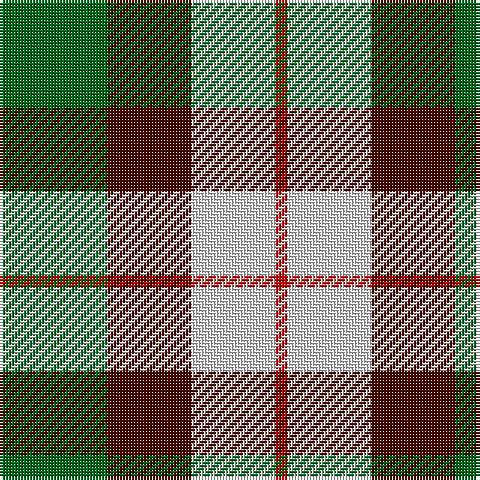

In pattern [GBWR](/patterns/gbwr/).

This was sourced from house-of-tartan.  It is a [4 stripes tartan](/stripes/stripes4/).

Original link http://www.house-of-tartan.scotland.net/house/TartanViewjs.asp?colr=Def&tnam=921

## Thread count
G/36 DR28 LN28 R/4

## Palette
Each colour and its ΔE from the base-6 reference it is a variant of.

| Colour | Shade | Base | ΔE (OKLab) |
|---|---|---|---|
| DR | <code style="background-color:#480800;">#480800</code> `#480800` | B <code style="background-color:#2C4084;">#2C4084</code> | 0.23 |
| G | <code style="background-color:#006818;">#006818</code> `#006818` | G <code style="background-color:#006400;">#006400</code> | 0.02 |
| LN | <code style="background-color:#E0E0E0;">#E0E0E0</code> `#E0E0E0` | W <code style="background-color:#F4F4F0;">#F4F4F0</code> | 0.06 |
| R | <code style="background-color:#C80000;">#C80000</code> `#C80000` | R <code style="background-color:#C80000;">#C80000</code> | 0.00 |

# Sample pattern

## Nearest tartans

The nearest existing variants by ΔTartan distance.

1. [MacKinnon Dress](/setts/s4/g36ga28w28r4-g005020-ga482800-rdc0000-we0e0e0/) — ΔT 0.24
1. [MacKinnon Dress Hunting (Fashion)](/setts/s4/g42b42w42r6-b480800-g285800-rc80000-we0e0e0/) — ΔT 0.73
1. [MacKinnon, dress](/setts/s4/g36r28w28ra4-g008000-r703000-rac00000-we0e0e0/) — ΔT 0.83
1. [Delroeux, John Michael Name Tartan Tartan Number: 10654. Earliest known date: 25/06/1985 Designed by Jean Michael Delroeux to show his affinity with Scotland. Colours: red, yellow and blue appear in the Delroeux coat of arms; green is for the landscapes of Scotland. See products available Copyright © Blair Urquhart, Comrie, 2015](/setts/s4/b30g60y10r30-b0000cd-g008b00-rff0000-yffe600/) — ΔT 1.07
1. [Thistle and Kudzu Scottish Socie Corporate Tartan Tartan Number: 10655. Earliest known date: 01/09/2010 The Thistle and Kudzu Scottish Society of Athens is an informal group that organizes and supports Scottish activities in Athens, Georgia, USA. Activities include Royal Scottish Country Dance lessons and demonstrations, annual Robert Burns Dinners, a Scottish Festival, and the Thistle & Kudzu Pipes and Drums band and piping lessons. In 2010 a tartan design contest was organized to create a unique tartan that represented the Thistle and Kudzu Scottish Society. Members used an online tartan design programme (http://www.houseoftartan.co.uk/interactive/weaver/index.html) to create and submit various tartan designs that were then voted on by the Scottish dance class. The design that received the most votes was selected as the official tartan of the group. The overall design was submitted by Stephanie Bohan and the thread count established for weaving by Dorothy Harnish. Colours: dark green represents the kudzu vine which grows abundantly throughout Georgia and is well known in that state; light green, purple and white represent the thistle plant and flower in bloom. See products available Copyright © Blair Urquhart, Comrie, 2015](/setts/s4/b12y30g30k4-baa00ff-g006400-k000000-y86c87c/) — ΔT 1.26
1. [Delroeux, John Michael (Personal)](/setts/s4/b30g60y10r30-b0000cd-g125d24-rff0000-yffe600/) — ΔT 1.31
1. [Inverness Basque (District)](/setts/s5/r66g18k10g48w66-g006818-k101010-rc80000-we0e0e0/) — ΔT 1.32
1. [Harbison (2015)](/setts/s4/b42g68r28w12-b2c2c80-g006818-rc80000-wfcfcfc/) — ΔT 1.40
1. [Fraser, dress](/setts/s6/r6k14r6g14w27k4-g008000-k000000-rc00000-we0e0e0/) — ΔT 1.41
1. [Delroeux (Personal)](/setts/s4/b30g60y10r30-b2c2c80-g006818-rc80000-yfccc00/) — ΔT 1.44

## Neighbour map

Every grey dot is one of 15726 variants placed by the first two principal components of the ΔTartan feature space (44% of its variance). Red is this tartan; blue dots are its nearest — click one to open its page.

<svg viewBox="0 0 640 380" role="img" style="max-width:100%;height:auto;border:1px solid #e0e0e0;border-radius:4px;display:block" xmlns="http://www.w3.org/2000/svg"><image href="/nn/cloud.v1.png" width="640" height="380"/><a href="/setts/s4/g36ga28w28r4-g005020-ga482800-rdc0000-we0e0e0/"><circle cx="142.8" cy="248.4" r="4" fill="#3465a4"><title>MacKinnon Dress</title></circle></a><a href="/setts/s4/g42b42w42r6-b480800-g285800-rc80000-we0e0e0/"><circle cx="107.3" cy="255.0" r="4" fill="#3465a4"><title>MacKinnon Dress Hunting (Fashion)</title></circle></a><a href="/setts/s4/g36r28w28ra4-g008000-r703000-rac00000-we0e0e0/"><circle cx="149.2" cy="248.2" r="4" fill="#3465a4"><title>MacKinnon, dress</title></circle></a><a href="/setts/s4/b30g60y10r30-b0000cd-g008b00-rff0000-yffe600/"><circle cx="163.1" cy="255.6" r="4" fill="#3465a4"><title>Delroeux, John Michael Name Tartan Tartan Number: 10654. Earliest known date: 25/06/1985 Designed by Jean Michael Delroeux to show his affinity with Scotland. Colours: red, yellow and blue appear in the Delroeux coat of arms; green is for the landscapes of Scotland. See products available Copyright © Blair Urquhart, Comrie, 2015</title></circle></a><a href="/setts/s4/b12y30g30k4-baa00ff-g006400-k000000-y86c87c/"><circle cx="156.6" cy="246.3" r="4" fill="#3465a4"><title>Thistle and Kudzu Scottish Socie Corporate Tartan Tartan Number: 10655. Earliest known date: 01/09/2010 The Thistle and Kudzu Scottish Society of Athens is an informal group that organizes and supports Scottish activities in Athens, Georgia, USA. Activities include Royal Scottish Country Dance lessons and demonstrations, annual Robert Burns Dinners, a Scottish Festival, and the Thistle &amp; Kudzu Pipes and Drums band and piping lessons. In 2010 a tartan design contest was organized to create a unique tartan that represented the Thistle and Kudzu Scottish Society. Members used an online tartan design programme (http://www.houseoftartan.co.uk/interactive/weaver/index.html) to create and submit various tartan designs that were then voted on by the Scottish dance class. The design that received the most votes was selected as the official tartan of the group. The overall design was submitted by Stephanie Bohan and the thread count established for weaving by Dorothy Harnish. Colours: dark green represents the kudzu vine which grows abundantly throughout Georgia and is well known in that state; light green, purple and white represent the thistle plant and flower in bloom. See products available Copyright © Blair Urquhart, Comrie, 2015</title></circle></a><a href="/setts/s4/b30g60y10r30-b0000cd-g125d24-rff0000-yffe600/"><circle cx="170.5" cy="258.1" r="4" fill="#3465a4"><title>Delroeux, John Michael (Personal)</title></circle></a><a href="/setts/s5/r66g18k10g48w66-g006818-k101010-rc80000-we0e0e0/"><circle cx="117.7" cy="232.3" r="4" fill="#3465a4"><title>Inverness Basque (District)</title></circle></a><a href="/setts/s4/b42g68r28w12-b2c2c80-g006818-rc80000-wfcfcfc/"><circle cx="177.9" cy="268.2" r="4" fill="#3465a4"><title>Harbison (2015)</title></circle></a><a href="/setts/s6/r6k14r6g14w27k4-g008000-k000000-rc00000-we0e0e0/"><circle cx="111.8" cy="210.4" r="4" fill="#3465a4"><title>Fraser, dress</title></circle></a><a href="/setts/s4/b30g60y10r30-b2c2c80-g006818-rc80000-yfccc00/"><circle cx="194.5" cy="269.1" r="4" fill="#3465a4"><title>Delroeux (Personal)</title></circle></a><circle cx="139.8" cy="245.4" r="5" fill="#c00000"/></svg>

ID: /setts/s4/g36b28w28r4-b480800-g006818-rc80000-we0e0e0/
