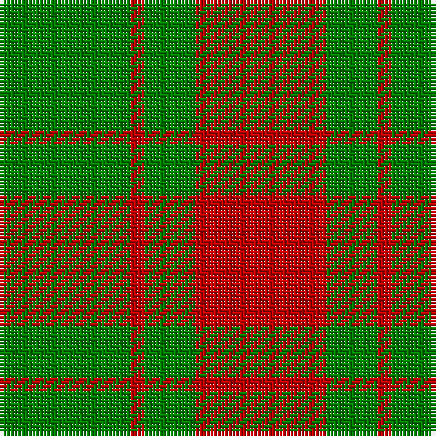

In pattern [GRGR](/patterns/grgr/).

This was sourced from weddslist.  It is a [4 stripes tartan](/stripes/stripes4/).

Original link http://www.weddslist.com/cgi-bin/tartans/pg.pl?source=sts

## Thread count
G/36 R4 G14 R/36

## Palette
Each colour and its ΔE from the base-6 reference it is a variant of.

| Colour | Shade | Base | ΔE (OKLab) |
|---|---|---|---|
| G | <code style="background-color:#008000;">#008000</code> `#008000` | G <code style="background-color:#006400;">#006400</code> | 0.09 |
| R | <code style="background-color:#C00000;">#C00000</code> `#C00000` | R <code style="background-color:#C80000;">#C80000</code> | 0.02 |

# Sample pattern

## Nearest tartans

The nearest existing variants by ΔTartan distance.

1. [Applecross](/setts/s4/g36r4g14r36-g006818-rc80000/) — ΔT 0.54
1. [Applecross (District)](/setts/s4/g72r8g28r72-g006818-rc80000/) — ΔT 0.54
1. [MacGregor of Glenstrae](/setts/s4/r34g18r4g18-g008000-rc00000/) — ΔT 0.62
1. [MacGregor of Glen Strae](/setts/s5/g16r4g18r32g2-g008000-rc00000/) — ΔT 1.25
1. [Middleton](/setts/s4/g128r8g16r88-g008000-rc00000/) — ΔT 1.29
1. [Middleton](/setts/s4/g128r8g16r88-g006818-rc80000/) — ΔT 1.33
1. [MacGregor of Glen Straye Htg Clan Tartan Tartan Number: 866. Earliest known date: 1842 This sett appears in the text of the Vestiarium but is not illustrated. Glen Straye (Glenstrae) lies in the heart of Campbell country and was the scene of a noteable period in the history of Clan Gregor which led to the prosciption of the name. See products available Copyright © Blair Urquhart, Comrie, 2015](/setts/s5/g16r4g18r32g2-g006818-rc80000/) — ΔT 1.43
1. [MacGregor of Glenstrae #2](/setts/s4/r34g18r4g18-g005020-rdc0000/) — ΔT 1.46
1. [Bryce](/setts/s4/r4g28r36y4-g008000-rc00000-yf0c000/) — ΔT 1.51
1. [MacKinnon 11](/setts/s4/r12g80r100w12-g008000-rc00000-we0e0e0/) — ΔT 1.56

## Neighbour map

Every grey dot is one of 15726 variants placed by the first two principal components of the ΔTartan feature space (44% of its variance). Red is this tartan; blue dots are its nearest — click one to open its page.

<svg viewBox="0 0 640 380" role="img" style="max-width:100%;height:auto;border:1px solid #e0e0e0;border-radius:4px;display:block" xmlns="http://www.w3.org/2000/svg"><image href="/nn/cloud.v1.png" width="640" height="380"/><a href="/setts/s4/g36r4g14r36-g006818-rc80000/"><circle cx="385.3" cy="291.9" r="4" fill="#3465a4"><title>Applecross</title></circle></a><a href="/setts/s4/g72r8g28r72-g006818-rc80000/"><circle cx="385.3" cy="291.9" r="4" fill="#3465a4"><title>Applecross (District)</title></circle></a><a href="/setts/s4/r34g18r4g18-g008000-rc00000/"><circle cx="358.0" cy="293.9" r="4" fill="#3465a4"><title>MacGregor of Glenstrae</title></circle></a><a href="/setts/s5/g16r4g18r32g2-g008000-rc00000/"><circle cx="388.3" cy="244.3" r="4" fill="#3465a4"><title>MacGregor of Glen Strae</title></circle></a><a href="/setts/s4/g128r8g16r88-g008000-rc00000/"><circle cx="436.9" cy="251.2" r="4" fill="#3465a4"><title>Middleton</title></circle></a><a href="/setts/s4/g128r8g16r88-g006818-rc80000/"><circle cx="444.6" cy="253.8" r="4" fill="#3465a4"><title>Middleton</title></circle></a><a href="/setts/s5/g16r4g18r32g2-g006818-rc80000/"><circle cx="395.4" cy="246.5" r="4" fill="#3465a4"><title>MacGregor of Glen Straye Htg Clan Tartan Tartan Number: 866. Earliest known date: 1842 This sett appears in the text of the Vestiarium but is not illustrated. Glen Straye (Glenstrae) lies in the heart of Campbell country and was the scene of a noteable period in the history of Clan Gregor which led to the prosciption of the name. See products available Copyright © Blair Urquhart, Comrie, 2015</title></circle></a><a href="/setts/s4/r34g18r4g18-g005020-rdc0000/"><circle cx="352.8" cy="288.4" r="4" fill="#3465a4"><title>MacGregor of Glenstrae #2</title></circle></a><a href="/setts/s4/r4g28r36y4-g008000-rc00000-yf0c000/"><circle cx="358.1" cy="246.8" r="4" fill="#3465a4"><title>Bryce</title></circle></a><a href="/setts/s4/r12g80r100w12-g008000-rc00000-we0e0e0/"><circle cx="341.8" cy="247.6" r="4" fill="#3465a4"><title>MacKinnon 11</title></circle></a><circle cx="377.8" cy="289.5" r="5" fill="#c00000"/></svg>

ID: /setts/s4/g36r4g14r36-g008000-rc00000/
