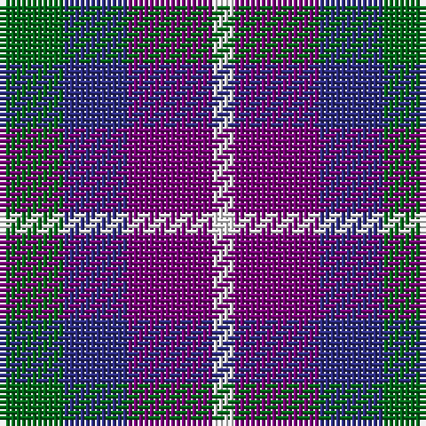

In pattern [GBBW](/patterns/gbbw/).

This was sourced from tartans-authority.  It is a [4 stripes tartan](/stripes/stripes4/).

Original link http://www.tartansauthority.com/tartan-ferret/display/11091/

## Thread count
G/12 DB12 P16 W/4

## Palette
Each colour and its ΔE from the base-6 reference it is a variant of.

| Colour | Shade | Base | ΔE (OKLab) |
|---|---|---|---|
| DB | <code style="background-color:#2C2C80;">#2C2C80</code> `#2C2C80` | B <code style="background-color:#2A418A;">#2A418A</code> | 0.06 |
| G | <code style="background-color:#006818;">#006818</code> `#006818` | G <code style="background-color:#006100;">#006100</code> | 0.02 |
| P | <code style="background-color:#780078;">#780078</code> `#780078` | B <code style="background-color:#2A418A;">#2A418A</code> | 0.17 |
| W | <code style="background-color:#FCFCFC;">#FCFCFC</code> `#FCFCFC` | W <code style="background-color:#F7F7F7;">#F7F7F7</code> | 0.01 |

# Sample pattern

## Nearest tartans

The nearest existing variants by ΔTartan distance.

1. [Pride of the Glen](/setts/s4/g3b3ba4w1~b000080-ba780078-g006818-wffffff~x4/) — ΔT 0.55
1. [Austin (Wilson's No 173)](/setts/s5/b3k3b3g6y2~b5a008c-g005020-k101010-ye8c000~x2/) — ΔT 1.21
1. [Battle of Prestonpans (1745) Heritage Trust, The](/setts/s5/b9r12g9b5w2~b0000cd-g008b00-re3170d-wffffff~x4/) — ΔT 1.35
1. [Wilson's No.220](/setts/s4/b5k5g5w1~b740074-g006818-k101010-we0e0e0~x4/) — ΔT 1.37
1. [Wilson's No 220](/setts/s4/b8k11g9w2~b5a008c-g005020-k101010-we0e0e0~x2/) — ΔT 1.40
1. [Austin (Wilson's No 137)](/setts/s5/b3k3b3g6r2~b5a008c-g005020-k101010-rdc0000~x2/) — ΔT 1.41
1. [Wilson's No.95](/setts/s5/b1ba3r1g3b1~b3c82af-ba5a008c-g005020-rdc0000~x4/) — ΔT 1.41
1. [Battle of Prestonpans (1745) Herit](/setts/s5/b9r12g9b5w2~b2c2c80-g285800-rc80000-wfcfcfc~x4/) — ΔT 1.47
1. [Gandy of Myrton (Name)](/setts/s6/r14w5b20k10ba10b10~b003c64-ba5c8ca8-k101010-rc80000-we0e0e0~x2/) — ΔT 1.47
1. [Raven (Fashion)](/setts/s4/k19b18w9r3~b1c0070-k101010-rc80000-we0e0e0~x4/) — ΔT 1.58

## Neighbour map

Every grey dot is one of 15726 variants placed by the first two principal components of the ΔTartan feature space (44% of its variance). Red is this tartan; blue dots are its nearest — click one to open its page.

<svg viewBox="0 0 640 380" role="img" style="max-width:100%;height:auto;border:1px solid #e0e0e0;border-radius:4px;display:block" xmlns="http://www.w3.org/2000/svg"><image href="/nn/cloud.v1.png" width="640" height="380"/><a href="/setts/s4/g3b3ba4w1~b000080-ba780078-g006818-wffffff~x4/"><circle cx="96.7" cy="297.6" r="4" fill="#3465a4"><title>Pride of the Glen</title></circle></a><a href="/setts/s5/b3k3b3g6y2~b5a008c-g005020-k101010-ye8c000~x2/"><circle cx="90.6" cy="304.0" r="4" fill="#3465a4"><title>Austin (Wilson's No 173)</title></circle></a><a href="/setts/s5/b9r12g9b5w2~b0000cd-g008b00-re3170d-wffffff~x4/"><circle cx="118.0" cy="254.8" r="4" fill="#3465a4"><title>Battle of Prestonpans (1745) Heritage Trust, The</title></circle></a><a href="/setts/s4/b5k5g5w1~b740074-g006818-k101010-we0e0e0~x4/"><circle cx="109.6" cy="291.4" r="4" fill="#3465a4"><title>Wilson's No.220</title></circle></a><a href="/setts/s4/b8k11g9w2~b5a008c-g005020-k101010-we0e0e0~x2/"><circle cx="139.1" cy="292.9" r="4" fill="#3465a4"><title>Wilson's No 220</title></circle></a><a href="/setts/s5/b3k3b3g6r2~b5a008c-g005020-k101010-rdc0000~x2/"><circle cx="120.1" cy="313.2" r="4" fill="#3465a4"><title>Austin (Wilson's No 137)</title></circle></a><a href="/setts/s5/b1ba3r1g3b1~b3c82af-ba5a008c-g005020-rdc0000~x4/"><circle cx="126.2" cy="292.1" r="4" fill="#3465a4"><title>Wilson's No.95</title></circle></a><a href="/setts/s5/b9r12g9b5w2~b2c2c80-g285800-rc80000-wfcfcfc~x4/"><circle cx="148.8" cy="264.0" r="4" fill="#3465a4"><title>Battle of Prestonpans (1745) Herit</title></circle></a><a href="/setts/s6/r14w5b20k10ba10b10~b003c64-ba5c8ca8-k101010-rc80000-we0e0e0~x2/"><circle cx="101.5" cy="266.6" r="4" fill="#3465a4"><title>Gandy of Myrton (Name)</title></circle></a><a href="/setts/s4/k19b18w9r3~b1c0070-k101010-rc80000-we0e0e0~x4/"><circle cx="142.8" cy="263.7" r="4" fill="#3465a4"><title>Raven (Fashion)</title></circle></a><circle cx="108.3" cy="299.5" r="5" fill="#c00000"/></svg>

ID: /setts/s4/g3b3ba4w1~b2c2c80-ba780078-g006818-wfcfcfc~x4/
