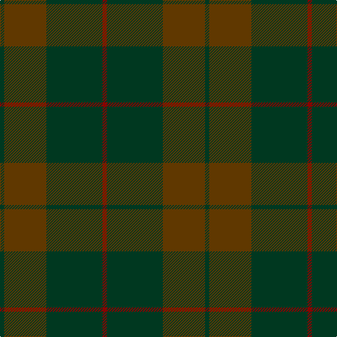

In pattern [GGGR](/patterns/gggr/).

This was sourced from register-of-tartans.  It is a [4 stripes tartan](/stripes/stripes4/).

Original link https://www.tartanregister.gov.uk/tartanDetails.aspx?ref=4823

## Attestations

This cloth appears in 2 source records; the oldest owns this page.

- 01/12/1999 — Sanix Muted (register-of-tartans, [record](https://www.tartanregister.gov.uk/tartanDetails.aspx?ref=4823))
- Dec. 1999 — Sanix Muted (Fashion) (tartans-authority, [record](http://www.tartansauthority.com/tartan-ferret/display/2644/))

## Thread count
DG/6 T60 DG80 DR/6

## Palette
Each colour and its ΔE from the base-6 reference it is a variant of.

| Colour | Shade | Base | ΔE (OKLab) |
|---|---|---|---|
| DG | <code style="background-color:#003820;">#003820</code> `#003820` | G <code style="background-color:#006100;">#006100</code> | 0.15 |
| DR | <code style="background-color:#880000;">#880000</code> `#880000` | R <code style="background-color:#CC0000;">#CC0000</code> | 0.15 |
| T | <code style="background-color:#603800;">#603800</code> `#603800` | G <code style="background-color:#006100;">#006100</code> | 0.16 |

# Sample pattern

## Nearest tartans

The nearest existing variants by ΔTartan distance.

1. [Cairns, David (Personal)](/setts/s5/b11ba1b4ba8r1x8~b393939-ba5b5b5b-ra40b00/) — ΔT 1.40
1. [Glen Boig Trade Tartan Tartan Number: 915. Earliest known date: Modern Many new designs have been given district names to promote their Scottish connections. However, these names should not be confused with the District tartans which have earned their title through 'use and wont' and not a little history. See products available Copyright © Blair Urquhart, Comrie, 2015](/setts/s5/g37ga9g3b9ga3x2~b441800-g5c6428-ga604000/) — ΔT 1.56
1. [McGuigan, Julia (St Monans, Fife) (Personal)](/setts/s4/g9ga52gb15y4x2~g70714d-ga5a601e-gb4e3d20-ybfab40/) — ΔT 1.74
1. [Glen Boig](/setts/s5/g13ga3g1b3ga1x6~b4c3428-g006818-ga604000/) — ΔT 1.87
1. [Hector, James (Corporate)](/setts/s5/b2g11ba27g8r2x2~b441800-ba003c64-g003820-r880000/) — ΔT 1.96
1. [Highland Greenford (Personal)](/setts/s4/g50ga25y2b6x2~b440044-g5c6428-ga604000-yc4bc68/) — ΔT 2.26
1. [Taiheiyo Club, Inc.](/setts/s7/k46g6k6g6k42g47k12~g003820-k101010/) — ΔT 2.27
1. [Cairns, David (Personal)](/setts/s5/b11r1b4r8ra1x8~b5c5c5c-r888888-ra880000/) — ΔT 2.28
1. [Feddinch Club, St Andrews Limited, The](/setts/s4/g43k14ka14r2x2~g003820-k101010-ka1c0030-r880000/) — ΔT 2.30
1. [MacKinnon Htg (Clan)](/setts/s7/g1ga8g8ga1g8ga8g1x4~g604000-ga006818/) — ΔT 2.33

## Neighbour map

Every grey dot is one of 15726 variants placed by the first two principal components of the ΔTartan feature space (44% of its variance). Red is this tartan; blue dots are its nearest — click one to open its page.

<svg viewBox="0 0 640 380" role="img" style="max-width:100%;height:auto;border:1px solid #e0e0e0;border-radius:4px;display:block" xmlns="http://www.w3.org/2000/svg"><image href="/nn/cloud.v1.png" width="640" height="380"/><a href="/setts/s5/b11ba1b4ba8r1x8~b393939-ba5b5b5b-ra40b00/"><circle cx="545.7" cy="320.9" r="4" fill="#3465a4"><title>Cairns, David (Personal)</title></circle></a><a href="/setts/s5/g37ga9g3b9ga3x2~b441800-g5c6428-ga604000/"><circle cx="555.4" cy="283.3" r="4" fill="#3465a4"><title>Glen Boig Trade Tartan Tartan Number: 915. Earliest known date: Modern Many new designs have been given district names to promote their Scottish connections. However, these names should not be confused with the District tartans which have earned their title through 'use and wont' and not a little history. See products available Copyright © Blair Urquhart, Comrie, 2015</title></circle></a><a href="/setts/s4/g9ga52gb15y4x2~g70714d-ga5a601e-gb4e3d20-ybfab40/"><circle cx="538.8" cy="286.7" r="4" fill="#3465a4"><title>McGuigan, Julia (St Monans, Fife) (Personal)</title></circle></a><a href="/setts/s5/g13ga3g1b3ga1x6~b4c3428-g006818-ga604000/"><circle cx="568.5" cy="290.1" r="4" fill="#3465a4"><title>Glen Boig</title></circle></a><a href="/setts/s5/b2g11ba27g8r2x2~b441800-ba003c64-g003820-r880000/"><circle cx="491.0" cy="289.4" r="4" fill="#3465a4"><title>Hector, James (Corporate)</title></circle></a><a href="/setts/s4/g50ga25y2b6x2~b440044-g5c6428-ga604000-yc4bc68/"><circle cx="506.1" cy="248.8" r="4" fill="#3465a4"><title>Highland Greenford (Personal)</title></circle></a><a href="/setts/s7/k46g6k6g6k42g47k12~g003820-k101010/"><circle cx="575.8" cy="347.5" r="4" fill="#3465a4"><title>Taiheiyo Club, Inc.</title></circle></a><a href="/setts/s5/b11r1b4r8ra1x8~b5c5c5c-r888888-ra880000/"><circle cx="505.2" cy="297.6" r="4" fill="#3465a4"><title>Cairns, David (Personal)</title></circle></a><a href="/setts/s4/g43k14ka14r2x2~g003820-k101010-ka1c0030-r880000/"><circle cx="479.2" cy="273.4" r="4" fill="#3465a4"><title>Feddinch Club, St Andrews Limited, The</title></circle></a><a href="/setts/s7/g1ga8g8ga1g8ga8g1x4~g604000-ga006818/"><circle cx="445.5" cy="312.4" r="4" fill="#3465a4"><title>MacKinnon Htg (Clan)</title></circle></a><circle cx="536.9" cy="317.0" r="5" fill="#c00000"/></svg>

ID: /setts/s4/g3ga30g40r3x2~g003820-ga603800-r880000/
