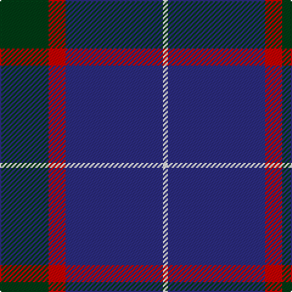

In pattern [GRBW](/patterns/grbw/).

This was sourced from register-of-tartans.  It is a [4 stripes tartan](/stripes/stripes4/).

Original link https://www.tartanregister.gov.uk/tartanDetails.aspx?ref=11140

## Thread count
DG/40 R14 DB80 W/4

## Palette
Each colour and its ΔE from the base-6 reference it is a variant of.

| Colour | Shade | Base | ΔE (OKLab) |
|---|---|---|---|
| DB | <code style="background-color:#2C2C80;">#2C2C80</code> `#2C2C80` | B <code style="background-color:#2C4084;">#2C4084</code> | 0.05 |
| DG | <code style="background-color:#003C14;">#003C14</code> `#003C14` | G <code style="background-color:#006400;">#006400</code> | 0.14 |
| R | <code style="background-color:#C80000;">#C80000</code> `#C80000` | R <code style="background-color:#C80000;">#C80000</code> | 0.00 |
| W | <code style="background-color:#F8F8F8;">#F8F8F8</code> `#F8F8F8` | W <code style="background-color:#F4F4F0;">#F4F4F0</code> | 0.01 |

# Sample pattern

## Nearest tartans

The nearest existing variants by ΔTartan distance.

1. [McNiff, Kevin (Personal)](/setts/s4/g40r14b80w4-b1c0070-g006818-ra00000-wfcfcfc/) — ΔT 0.89
1. [Mirror (Corporate)](/setts/s4/r20b104k48w8-b2c2c80-k101010-rc80000-wfcfcfc/) — ΔT 1.15
1. [Connaught Green](/setts/s6/r2b24g10b4g8w2-b202060-g5c6428-ra00000-wc0c0c0/) — ΔT 1.30
1. [MacKerral Family Tartan Tartan Number: 1757. Earliest known date: 1975 A sample was presented to the Scottish Tartans Society by John Drummond Bowman. This version of the tartan has the unusual feature of exchanging red for yellow in the weft. It is larger than the sett recorded in the Lyon Court Books in 1982. The name, MacKerral or MacKerrell, is recorded in Ayrshire in the 12th century. See products available Copyright © Blair Urquhart, Comrie, 2015](/setts/s4/w8b68ba120y6-b5c8ca8-ba2c2c80-we0e0e0-ye8c000/) — ΔT 1.34
1. [Connecticut State Police PB (Cor.)](/setts/s6/b84ba4b4ba34y16ba8-b646464-ba00008c-yc88c00/) — ΔT 1.38
1. [Discover Islay (District)](/setts/s6/b24y4b80ba24g76b8-b780078-ba2c2c80-g006818-ye8c000/) — ΔT 1.39
1. [Scottish Nuclear (Corporate)](/setts/s4/r4b36k16w4-b2c2c80-k101010-rc80000-wc0c0c0/) — ΔT 1.39
1. [Joker, The](/setts/s6/b36k4b8k12ba24y2-b1474b4-ba780078-k101010-yd87c00/) — ΔT 1.41
1. [Press & Journal](/setts/s5/k18b6k56b50w4-b4c5484-k101010-we0e0e0/) — ΔT 1.46
1. [McKerrell of Hillhouse](/setts/s4/w8b56ba98y6-b2888c4-ba202060-we0e0e0-ye8c000/) — ΔT 1.46

## Neighbour map

Every grey dot is one of 15726 variants placed by the first two principal components of the ΔTartan feature space (44% of its variance). Red is this tartan; blue dots are its nearest — click one to open its page.

<svg viewBox="0 0 640 380" role="img" style="max-width:100%;height:auto;border:1px solid #e0e0e0;border-radius:4px;display:block" xmlns="http://www.w3.org/2000/svg"><image href="/nn/cloud.v1.png" width="640" height="380"/><a href="/setts/s4/g40r14b80w4-b1c0070-g006818-ra00000-wfcfcfc/"><circle cx="343.7" cy="209.4" r="4" fill="#3465a4"><title>McNiff, Kevin (Personal)</title></circle></a><a href="/setts/s4/r20b104k48w8-b2c2c80-k101010-rc80000-wfcfcfc/"><circle cx="328.5" cy="224.8" r="4" fill="#3465a4"><title>Mirror (Corporate)</title></circle></a><a href="/setts/s6/r2b24g10b4g8w2-b202060-g5c6428-ra00000-wc0c0c0/"><circle cx="351.4" cy="215.8" r="4" fill="#3465a4"><title>Connaught Green</title></circle></a><a href="/setts/s4/w8b68ba120y6-b5c8ca8-ba2c2c80-we0e0e0-ye8c000/"><circle cx="378.4" cy="204.4" r="4" fill="#3465a4"><title>MacKerral Family Tartan Tartan Number: 1757. Earliest known date: 1975 A sample was presented to the Scottish Tartans Society by John Drummond Bowman. This version of the tartan has the unusual feature of exchanging red for yellow in the weft. It is larger than the sett recorded in the Lyon Court Books in 1982. The name, MacKerral or MacKerrell, is recorded in Ayrshire in the 12th century. See products available Copyright © Blair Urquhart, Comrie, 2015</title></circle></a><a href="/setts/s6/b84ba4b4ba34y16ba8-b646464-ba00008c-yc88c00/"><circle cx="378.2" cy="175.4" r="4" fill="#3465a4"><title>Connecticut State Police PB (Cor.)</title></circle></a><a href="/setts/s6/b24y4b80ba24g76b8-b780078-ba2c2c80-g006818-ye8c000/"><circle cx="335.2" cy="192.5" r="4" fill="#3465a4"><title>Discover Islay (District)</title></circle></a><a href="/setts/s4/r4b36k16w4-b2c2c80-k101010-rc80000-wc0c0c0/"><circle cx="345.0" cy="240.9" r="4" fill="#3465a4"><title>Scottish Nuclear (Corporate)</title></circle></a><a href="/setts/s6/b36k4b8k12ba24y2-b1474b4-ba780078-k101010-yd87c00/"><circle cx="303.5" cy="196.0" r="4" fill="#3465a4"><title>Joker, The</title></circle></a><a href="/setts/s5/k18b6k56b50w4-b4c5484-k101010-we0e0e0/"><circle cx="369.2" cy="239.1" r="4" fill="#3465a4"><title>Press &amp; Journal</title></circle></a><a href="/setts/s4/w8b56ba98y6-b2888c4-ba202060-we0e0e0-ye8c000/"><circle cx="343.4" cy="209.0" r="4" fill="#3465a4"><title>McKerrell of Hillhouse</title></circle></a><circle cx="368.5" cy="217.7" r="5" fill="#c00000"/></svg>

ID: /setts/s4/g40r14b80w4-b2c2c80-g003c14-rc80000-wf8f8f8/
