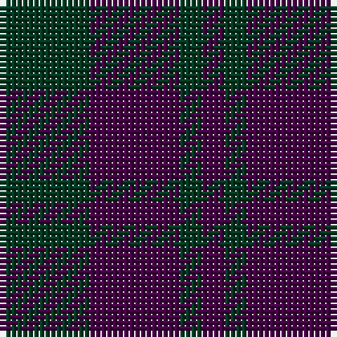

In pattern [BGBG](/patterns/bgbg/).

This was sourced from register-of-tartans.  It is a [4 stripes tartan](/stripes/stripes4/).

Original link https://www.tartanregister.gov.uk/tartanDetails.aspx?ref=4681

## Attestations

This cloth appears in 2 source records; the oldest owns this page.

- 01/01/1819 — Wilson's No.116 (register-of-tartans, [record](https://www.tartanregister.gov.uk/tartanDetails.aspx?ref=4681))
- 01/01/2002 — Wilson's No.211 (register-of-tartans, [record](https://www.tartanregister.gov.uk/tartanDetails.aspx?ref=4742))

## Thread count
DG/16 DP16 DG4 DP/4

## Palette
Each colour and its ΔE from the base-6 reference it is a variant of.

| Colour | Shade | Base | ΔE (OKLab) |
|---|---|---|---|
| DG | <code style="background-color:#003820;">#003820</code> `#003820` | G <code style="background-color:#006100;">#006100</code> | 0.15 |
| DP | <code style="background-color:#440044;">#440044</code> `#440044` | B <code style="background-color:#2A418A;">#2A418A</code> | 0.18 |
| G | <code style="background-color:#006818;">#006818</code> `#006818` | G <code style="background-color:#006100;">#006100</code> | 0.02 |
| P | <code style="background-color:#780078;">#780078</code> `#780078` | B <code style="background-color:#2A418A;">#2A418A</code> | 0.17 |

# Sample pattern

## Nearest tartans

The nearest existing variants by ΔTartan distance.

1. [Auchincloss (Personal)](/setts/s4/k34b13k7b14x2~b2c2c80-k101010/) — ΔT 1.55
1. [Barwell](/setts/s4/g1b3g3r1x4~b202060-g003820-r880000/) — ΔT 1.59
1. [Unidentified #24](/setts/s5/b16g2b16g19r4x3~b2c4084-g503c14-rdc0000/) — ΔT 2.21
1. [Unidentified 17](/setts/s5/b16r2b16r19ra4x3~b304080-r806050-rac00000/) — ΔT 2.32
1. [Mowbray (Personal)](/setts/s5/b16r2b10r14ba5x2~b5c5c5c-ba5c8ca8-r880000/) — ΔT 2.43
1. [Royal Scotsman Train](/setts/s7/b5k2b14k14b2k2r2x2~b141e46-k101010-rdc0000/) — ΔT 2.45
1. [Unidentified #29](/setts/s5/k5g14k16b12g4x2~b080848-g005020-k101010/) — ΔT 2.46
1. [Unidentified no. 54](/setts/s6/b2g6b6ba5b1ba2x2~b080848-ba280032-g005020/) — ΔT 2.47
1. [Wcwm 9275-1333-1](/setts/s4/b20k20b3k20x2~b440044-k101010/) — ΔT 2.49
1. [Feniston (Personal)](/setts/s5/b30ba10b3ba30r3x2~b680028-ba202060-rec34c4/) — ΔT 2.51

## Neighbour map

Every grey dot is one of 15726 variants placed by the first two principal components of the ΔTartan feature space (44% of its variance). Red is this tartan; blue dots are its nearest — click one to open its page.

<svg viewBox="0 0 640 380" role="img" style="max-width:100%;height:auto;border:1px solid #e0e0e0;border-radius:4px;display:block" xmlns="http://www.w3.org/2000/svg"><image href="/nn/cloud.v1.png" width="640" height="380"/><a href="/setts/s4/k34b13k7b14x2~b2c2c80-k101010/"><circle cx="439.1" cy="363.3" r="4" fill="#3465a4"><title>Auchincloss (Personal)</title></circle></a><a href="/setts/s4/g1b3g3r1x4~b202060-g003820-r880000/"><circle cx="332.6" cy="366.0" r="4" fill="#3465a4"><title>Barwell</title></circle></a><a href="/setts/s5/b16g2b16g19r4x3~b2c4084-g503c14-rdc0000/"><circle cx="398.3" cy="298.7" r="4" fill="#3465a4"><title>Unidentified #24</title></circle></a><a href="/setts/s5/b16r2b16r19ra4x3~b304080-r806050-rac00000/"><circle cx="407.5" cy="299.0" r="4" fill="#3465a4"><title>Unidentified 17</title></circle></a><a href="/setts/s5/b16r2b10r14ba5x2~b5c5c5c-ba5c8ca8-r880000/"><circle cx="398.1" cy="309.4" r="4" fill="#3465a4"><title>Mowbray (Personal)</title></circle></a><a href="/setts/s7/b5k2b14k14b2k2r2x2~b141e46-k101010-rdc0000/"><circle cx="429.8" cy="295.5" r="4" fill="#3465a4"><title>Royal Scotsman Train</title></circle></a><a href="/setts/s5/k5g14k16b12g4x2~b080848-g005020-k101010/"><circle cx="262.0" cy="353.2" r="4" fill="#3465a4"><title>Unidentified #29</title></circle></a><a href="/setts/s6/b2g6b6ba5b1ba2x2~b080848-ba280032-g005020/"><circle cx="287.4" cy="320.8" r="4" fill="#3465a4"><title>Unidentified no. 54</title></circle></a><a href="/setts/s4/b20k20b3k20x2~b440044-k101010/"><circle cx="531.8" cy="366.0" r="4" fill="#3465a4"><title>Wcwm 9275-1333-1</title></circle></a><a href="/setts/s5/b30ba10b3ba30r3x2~b680028-ba202060-rec34c4/"><circle cx="424.4" cy="277.7" r="4" fill="#3465a4"><title>Feniston (Personal)</title></circle></a><circle cx="417.1" cy="366.0" r="5" fill="#c00000"/></svg>

ID: /setts/s4/g4b4g1b1x4~b440044-g003820/
