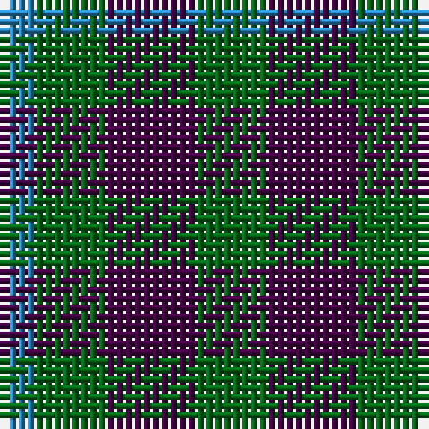

**Bands:** [BGBG](/stripes/bgbg/) · **Stripes:** [T G DP G](/stripes/stripes4/) T G DP G

This was sourced from register-of-tartans.  It is a [4 band tartan](/bands/bands4/).

Original link https://www.tartanregister.gov.uk/tartanDetails.aspx?ref=4740

## Register references

External register numbers recorded for this tartan.

- Scottish Register of Tartans: [4740](https://www.tartanregister.gov.uk/tartanDetails.aspx?ref=4740)
- Scottish Tartans Authority (ITI): 99
- Scottish Tartans World Register: 99

## Thread count
B/4 G8 DP10 G/8

## Palette
Each colour and its ΔE from the base-6 reference it is a variant of.

| Colour | Shade | Base | ΔE (OKLab) |
|---|---|---|---|
| B | <code style="background-color:#2888C4;">#2888C4</code> `#2888C4` | B <code style="background-color:#2A418A;">#2A418A</code> | 0.21 |
| DG | <code style="background-color:#003820;">#003820</code> `#003820` | G <code style="background-color:#006100;">#006100</code> | 0.15 |
| DP | <code style="background-color:#440044;">#440044</code> `#440044` | B <code style="background-color:#2A418A;">#2A418A</code> | 0.18 |
| G | <code style="background-color:#006818;">#006818</code> `#006818` | G <code style="background-color:#006100;">#006100</code> | 0.02 |
| LG | <code style="background-color:#789484;">#789484</code> `#789484` | G <code style="background-color:#006100;">#006100</code> | 0.24 |

# Sample pattern

## Nearest tartans

The nearest existing variants by ΔTartan distance.

1. [Wilson's No.094](/setts/s4/g4k5g4r2~x2/) — ΔT 0.91
1. [Glen Lyon #1](/setts/s4/k6g5r2g5~x2/) — ΔT 1.22
1. [Mull](/setts/s3/k5g4t2~x2/) — ΔT 1.25
1. [Wilson's No.052](/setts/s3/g7k4t4~x2/) — ΔT 1.36
1. [Agnew](/setts/s3/db53g42r14/) — ΔT 1.44
1. [Wilson's No.207](/setts/s4/g2r2g2t1~x4/) — ΔT 1.47
1. [Wilson's No.061](/setts/s3/r4dg7t4~x2/) — ΔT 1.55
1. [Agnew](/setts/s3/db53g42r14~x2/) — ΔT 1.58
1. [MacCurdie (Clan?)](/setts/s4/k5g14db12g4~x4/) — ΔT 1.58
1. [Glen Lyon (District)](/setts/s3/k5g4t3~x2/) — ΔT 1.73

## Neighbour map

Every grey dot is one of 14313 variants placed by the first two principal components of the ΔTartan feature space (44% of its variance). Red is this tartan; blue dots are its nearest — click one to open its page.

<svg viewBox="0 0 640 380" role="img" style="max-width:100%;height:auto;border:1px solid #e0e0e0;border-radius:4px;display:block" xmlns="http://www.w3.org/2000/svg"><image href="/nn/cloud.v1.png" width="640" height="380"/><a href="/setts/s4/g4k5g4r2~x2/"><circle cx="200.0" cy="359.5" r="4" fill="#3465a4"><title>Wilson's No.094</title></circle></a><a href="/setts/s4/k6g5r2g5~x2/"><circle cx="243.2" cy="360.6" r="4" fill="#3465a4"><title>Glen Lyon #1</title></circle></a><a href="/setts/s3/k5g4t2~x2/"><circle cx="177.9" cy="366.0" r="4" fill="#3465a4"><title>Mull</title></circle></a><a href="/setts/s3/g7k4t4~x2/"><circle cx="153.3" cy="366.0" r="4" fill="#3465a4"><title>Wilson's No.052</title></circle></a><a href="/setts/s3/db53g42r14/"><circle cx="247.9" cy="346.4" r="4" fill="#3465a4"><title>Agnew</title></circle></a><a href="/setts/s4/g2r2g2t1~x4/"><circle cx="226.9" cy="366.0" r="4" fill="#3465a4"><title>Wilson's No.207</title></circle></a><a href="/setts/s3/r4dg7t4~x2/"><circle cx="161.7" cy="366.0" r="4" fill="#3465a4"><title>Wilson's No.061</title></circle></a><a href="/setts/s3/db53g42r14~x2/"><circle cx="252.0" cy="348.3" r="4" fill="#3465a4"><title>Agnew</title></circle></a><a href="/setts/s4/k5g14db12g4~x4/"><circle cx="265.1" cy="346.0" r="4" fill="#3465a4"><title>MacCurdie (Clan?)</title></circle></a><a href="/setts/s3/k5g4t3~x2/"><circle cx="111.5" cy="366.0" r="4" fill="#3465a4"><title>Glen Lyon (District)</title></circle></a><circle cx="217.2" cy="366.0" r="5" fill="#c00000"/></svg>

ID: /setts/s4/g4dp5g4t2~x2/
