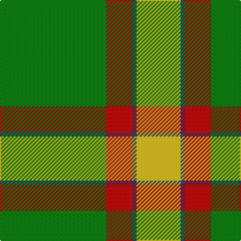

This page is one **sett** — a single exact thread-count. It belongs to the [tartan](/tartans/g53r13db2ly22/)
(the same proportion at any scale), whose colour order is pattern [GRBY](/stripes/grby/).

Sourced from weddslist.  It is a [4 stripe tartan](/stripes/stripes4/).

Original link http://www.weddslist.com/cgi-bin/tartans/pg.pl?source=sts

## Also known as

This cloth is also recorded under:

- Englehart Commemorative

2 attestations — the source records this cloth was collapsed from (oldest owns this page)

<ul>
<li>undated — Englehart (weddslist, <a href="http://www.weddslist.com/cgi-bin/tartans/pg.pl?source=sts">record</a>)</li>
<li>undated — Englehart Commemorative Tartan Tartan Number: 849. Earliest known date: 1958 Englehart semi-centennial. See products available Copyright © Blair Urquhart, Comrie, 2015 (house-of-tartan, <a href="http://www.house-of-tartan.scotland.net/house/TartanViewjs.asp?colr=Def&tnam=849">record</a>)</li>
</ul>

## Thread count
G/106 R26 B4 Y/44

## Palette

Palette: <strong>custom</strong>
<table><thead><tr><th>Colour</th><th>Threads</th><th>Shade</th><th>Base</th><th>OKLCh</th></tr></thead><tbody><tr><td>G/</td><td style="text-align:right;font-variant-numeric:tabular-nums">106</td><td><code style="background-color:#008000;">#008000</code> <small style="color:#888">#008000</small></td><td>G <code style="background-color:#006100;">#006100</code></td><td><small style="color:#888">oklch(52.0% 0.177 142.5)</small></td></tr><tr><td>R</td><td style="text-align:right;font-variant-numeric:tabular-nums">26</td><td><code style="background-color:#C00000;">#C00000</code> <small style="color:#888">#C00000</small></td><td>R <code style="background-color:#CC0000;">#CC0000</code></td><td><small style="color:#888">oklch(50.7% 0.208 29.2)</small></td></tr><tr><td>B</td><td style="text-align:right;font-variant-numeric:tabular-nums">4</td><td><code style="background-color:#304080;">#304080</code> <small style="color:#888">#304080</small></td><td>B <code style="background-color:#2A418A;">#2A418A</code></td><td><small style="color:#888">oklch(39.4% 0.109 270.2)</small></td></tr><tr><td>Y/</td><td style="text-align:right;font-variant-numeric:tabular-nums">44</td><td><code style="background-color:#F0C000;">#F0C000</code> <small style="color:#888">#F0C000</small></td><td>Y <code style="background-color:#F2BF00;">#F2BF00</code></td><td><small style="color:#888">oklch(82.7% 0.169 90.5)</small></td></tr></tbody></table>

# Sample pattern

## Nearest tartans

The nearest existing variants by ΔTartan distance, with this tartan at the top so the swatches line up against it.

ΔTartan

Tartan

Sett

—

<a href="/ttd/edit/#slug=g53r13db2ly22~x2">Englehart</a> <a class="nn-out" href="/setts/s4/g53r13db2ly22~x2/" title="open its dictionary page">↗</a>

1.60

<a href="/ttd/edit/#slug=g72r25ly8w5">Sugell (Name?)</a> <a class="nn-out" href="/setts/s4/g72r25ly8w5/" title="open its dictionary page">↗</a>

1.63

<a href="/ttd/edit/#slug=g22w14r7ly1~x2">Loch Lomond</a> <a class="nn-out" href="/setts/s4/g22w14r7ly1~x2/" title="open its dictionary page">↗</a>

1.75

<a href="/ttd/edit/#slug=dg27r9n2ly14~x4">Englehart, City of</a> <a class="nn-out" href="/setts/s4/dg27r9n2ly14~x4/" title="open its dictionary page">↗</a>

1.76

<a href="/ttd/edit/#slug=g56dy13ly13w5~x2">Colonial Marine (Aliens Legacy)</a> <a class="nn-out" href="/setts/s4/g56dy13ly13w5~x2/" title="open its dictionary page">↗</a>

1.86

<a href="/ttd/edit/#slug=g68r24g8lo18g3lo18~x2">MacMillan/Isetan</a> <a class="nn-out" href="/setts/s6/g68r24g8lo18g3lo18~x2/" title="open its dictionary page">↗</a>

1.93

<a href="/ttd/edit/#slug=ly70k30w3dg30k3ly10">Jacobite #2</a> <a class="nn-out" href="/setts/s6/ly70k30w3dg30k3ly10/" title="open its dictionary page">↗</a>

1.94

<a href="/ttd/edit/#slug=db9dg16g56ly4~x2">Oxford University</a> <a class="nn-out" href="/setts/s4/db9dg16g56ly4~x2/" title="open its dictionary page">↗</a>

2.00

<a href="/ttd/edit/#slug=g25k8y10r1y3~x4">Herbage</a> <a class="nn-out" href="/setts/s5/g25k8y10r1y3~x4/" title="open its dictionary page">↗</a>

2.02

<a href="/ttd/edit/#slug=dt5lo5dy13g41r3~x2">Clare, Richard (Personal)</a> <a class="nn-out" href="/setts/s5/dt5lo5dy13g41r3~x2/" title="open its dictionary page">↗</a>

2.02

<a href="/ttd/edit/#slug=g3r16w4k6g28r1g3~x2">Pollock</a> <a class="nn-out" href="/setts/s7/g3r16w4k6g28r1g3~x2/" title="open its dictionary page">↗</a>

## Neighbour map

Every grey dot is one of 14299 variants placed by the first two principal components of the ΔTartan feature space (44% of its variance). Red is this tartan; blue dots are its nearest — click one to open its page.

<svg viewBox="0 0 640 380" role="img" style="max-width:100%;height:auto;border:1px solid #e0e0e0;border-radius:4px;display:block" xmlns="http://www.w3.org/2000/svg"><image href="/nn/cloud.v1.png" width="640" height="380"/><a href="/setts/s4/g72r25ly8w5/"><circle cx="392.4" cy="208.0" r="4" fill="#3465a4"><title>Sugell (Name?)</title></circle></a><a href="/setts/s4/g22w14r7ly1~x2/"><circle cx="268.0" cy="193.9" r="4" fill="#3465a4"><title>Loch Lomond</title></circle></a><a href="/setts/s4/dg27r9n2ly14~x4/"><circle cx="265.6" cy="218.1" r="4" fill="#3465a4"><title>Englehart, City of</title></circle></a><a href="/setts/s4/g56dy13ly13w5~x2/"><circle cx="364.7" cy="224.6" r="4" fill="#3465a4"><title>Colonial Marine (Aliens Legacy)</title></circle></a><a href="/setts/s6/g68r24g8lo18g3lo18~x2/"><circle cx="367.9" cy="192.4" r="4" fill="#3465a4"><title>MacMillan/Isetan</title></circle></a><a href="/setts/s6/ly70k30w3dg30k3ly10/"><circle cx="288.1" cy="145.6" r="4" fill="#3465a4"><title>Jacobite #2</title></circle></a><a href="/setts/s4/db9dg16g56ly4~x2/"><circle cx="384.8" cy="220.9" r="4" fill="#3465a4"><title>Oxford University</title></circle></a><a href="/setts/s5/g25k8y10r1y3~x4/"><circle cx="301.9" cy="181.5" r="4" fill="#3465a4"><title>Herbage</title></circle></a><a href="/setts/s5/dt5lo5dy13g41r3~x2/"><circle cx="360.1" cy="196.7" r="4" fill="#3465a4"><title>Clare, Richard (Personal)</title></circle></a><a href="/setts/s7/g3r16w4k6g28r1g3~x2/"><circle cx="322.3" cy="141.5" r="4" fill="#3465a4"><title>Pollock</title></circle></a><circle cx="356.2" cy="192.0" r="5" fill="#c00000"/></svg>

ID: /setts/s4/g53r13db2ly22~x2/
