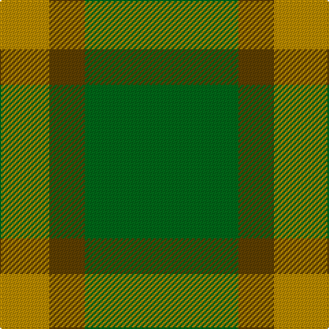

**Bands:** [GGYY](/stripes/ggyy/) · **Stripes:** [G DY LO LO](/stripes/stripes4/) G DY LO LO

This was sourced from tartans-authority.  It is a [4 band tartan](/bands/bands4/).

Original link http://www.tartansauthority.com/tartan-ferret/display/10487/

## Thread count
DY/10 DY26 T26 G/112

## Palette
Each colour and its ΔE from the base-6 reference it is a variant of.

| Colour | Shade | Base | ΔE (OKLab) |
|---|---|---|---|
| DY | <code style="background-color:#BC8C00;">#BC8C00</code> `#BC8C00` | Y <code style="background-color:#F2BF00;">#F2BF00</code> | 0.16 |
| G | <code style="background-color:#006818;">#006818</code> `#006818` | G <code style="background-color:#006100;">#006100</code> | 0.02 |
| T | <code style="background-color:#604000;">#604000</code> `#604000` | G <code style="background-color:#006100;">#006100</code> | 0.14 |

# Sample pattern

## Nearest tartans

The nearest existing variants by ΔTartan distance.

1. [O'Neill, Red (Corporate?)](/setts/s4/g9o20g46lg5~x2/) — ΔT 1.21
1. [Glen Boig](/setts/s5/g37o9g3dr9o3~x2/) — ΔT 1.23
1. [Ledford Family Tartan Tartan Number: 835. Earliest known date: 1987 A quantity of this cloth was woven in 1998 for a Ledford family in the USA. See products available Copyright © Blair Urquhart, Comrie, 2015](/setts/s3/g9o4ly1~x4/) — ΔT 1.62
1. [Confederate Artillery (Military)](/setts/s6/g2o14g8o3g12r2~x2/) — ΔT 1.68
1. [O'Neill, Red](/setts/s6/g46o20g9o20g46lg5~x2/) — ΔT 1.70
1. [Ledford (Name)](/setts/s3/g9o4ly1~x16/) — ΔT 1.72
1. [O'Neill (Australia) (Name)](/setts/s4/g9o20g40w5~x2/) — ΔT 1.76
1. [Campbell Simpson (Dalgliesh)](/setts/s6/g22k3g3g16g6k4~x2/) — ΔT 1.79
1. [O'Neill (Australia)](/setts/s6/o20g40w5g40o20g9~x2/) — ΔT 1.79
1. [Ledford](/setts/s3/dg9y4lo1~x8/) — ΔT 1.79

## Neighbour map

Every grey dot is one of 14313 variants placed by the first two principal components of the ΔTartan feature space (44% of its variance). Red is this tartan; blue dots are its nearest — click one to open its page.

<svg viewBox="0 0 640 380" role="img" style="max-width:100%;height:auto;border:1px solid #e0e0e0;border-radius:4px;display:block" xmlns="http://www.w3.org/2000/svg"><image href="/nn/cloud.v1.png" width="640" height="380"/><a href="/setts/s4/g9o20g46lg5~x2/"><circle cx="463.9" cy="288.8" r="4" fill="#3465a4"><title>O'Neill, Red (Corporate?)</title></circle></a><a href="/setts/s5/g37o9g3dr9o3~x2/"><circle cx="492.9" cy="271.5" r="4" fill="#3465a4"><title>Glen Boig</title></circle></a><a href="/setts/s3/g9o4ly1~x4/"><circle cx="416.0" cy="303.8" r="4" fill="#3465a4"><title>Ledford Family Tartan Tartan Number: 835. Earliest known date: 1987 A quantity of this cloth was woven in 1998 for a Ledford family in the USA. See products available Copyright © Blair Urquhart, Comrie, 2015</title></circle></a><a href="/setts/s6/g2o14g8o3g12r2~x2/"><circle cx="385.3" cy="298.2" r="4" fill="#3465a4"><title>Confederate Artillery (Military)</title></circle></a><a href="/setts/s6/g46o20g9o20g46lg5~x2/"><circle cx="455.7" cy="286.3" r="4" fill="#3465a4"><title>O'Neill, Red</title></circle></a><a href="/setts/s3/g9o4ly1~x16/"><circle cx="455.7" cy="325.2" r="4" fill="#3465a4"><title>Ledford (Name)</title></circle></a><a href="/setts/s4/g9o20g40w5~x2/"><circle cx="413.4" cy="287.2" r="4" fill="#3465a4"><title>O'Neill (Australia) (Name)</title></circle></a><a href="/setts/s6/g22k3g3g16g6k4~x2/"><circle cx="374.0" cy="285.6" r="4" fill="#3465a4"><title>Campbell Simpson (Dalgliesh)</title></circle></a><a href="/setts/s6/o20g40w5g40o20g9~x2/"><circle cx="422.1" cy="295.2" r="4" fill="#3465a4"><title>O'Neill (Australia)</title></circle></a><a href="/setts/s3/dg9y4lo1~x8/"><circle cx="421.6" cy="306.7" r="4" fill="#3465a4"><title>Ledford</title></circle></a><circle cx="459.6" cy="281.1" r="5" fill="#c00000"/></svg>

ID: /setts/s4/g56dy13lo13lo5~x2/
