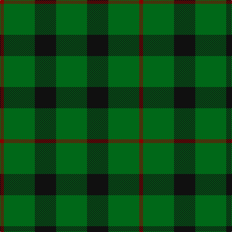

In pattern [GKGR](/patterns/gkgr/).

This was sourced from register-of-tartans.  It is a [4 stripes tartan](/stripes/stripes4/).

Original link https://www.tartanregister.gov.uk/tartanDetails.aspx?ref=1978

## Thread count
DR/8 G64 K44 G/64

## Palette
Each colour and its ΔE from the base-6 reference it is a variant of.

| Colour | Shade | Base | ΔE (OKLab) |
|---|---|---|---|
| DR | <code style="background-color:#880000;">#880000</code> `#880000` | R <code style="background-color:#C80000;">#C80000</code> | 0.14 |
| G | <code style="background-color:#006818;">#006818</code> `#006818` | G <code style="background-color:#006400;">#006400</code> | 0.02 |
| K | <code style="background-color:#101010;">#101010</code> `#101010` | K <code style="background-color:#000000;">#000000</code> | 0.17 |

# Sample pattern

## Nearest tartans

The nearest existing variants by ΔTartan distance.

1. [Highland Spring (1997) (Corporate)](/setts/s4/b14g46r6g14-b440044-g006818-rc80000/) — ΔT 1.35
1. [Scotch Tape (Corporate)](/setts/s3/g60k40g6-g006818-k101010/) — ΔT 1.52
1. [MacArthur (Highland Society)](/setts/s6/g36y4g36k8g4k30-g006818-k101010-yd8b000/) — ΔT 1.63
1. [O'Neill (Australia) (Name)](/setts/s4/g18r40g80w10-g006818-r98481c-we0e0e0/) — ΔT 1.66
1. [Highland Spring (Green)](/setts/s4/g14r6g46ra14-g008000-rc00000-ra802040/) — ΔT 1.68
1. [Ledford](/setts/s3/g72ga32y8-g005020-ga808080-yc89600/) — ΔT 1.73
1. [O'Neill (Australia)](/setts/s6/r40g80w10g80r40g18-g006818-r98481c-we0e0e0/) — ΔT 1.78
1. [Peterhead (Personal)](/setts/s5/g36b4g8k16g8-b487088-g407058-k101010/) — ΔT 1.83
1. [Elphinstone](/setts/s4/g24b8g4b8-b440044-g006818/) — ΔT 1.86
1. [Elphinstone Check (Clan)](/setts/s4/g120b40g20b40-b440044-g006818/) — ΔT 1.86

## Neighbour map

Every grey dot is one of 15726 variants placed by the first two principal components of the ΔTartan feature space (44% of its variance). Red is this tartan; blue dots are its nearest — click one to open its page.

<svg viewBox="0 0 640 380" role="img" style="max-width:100%;height:auto;border:1px solid #e0e0e0;border-radius:4px;display:block" xmlns="http://www.w3.org/2000/svg"><image href="/nn/cloud.v1.png" width="640" height="380"/><a href="/setts/s4/b14g46r6g14-b440044-g006818-rc80000/"><circle cx="472.9" cy="286.5" r="4" fill="#3465a4"><title>Highland Spring (1997) (Corporate)</title></circle></a><a href="/setts/s3/g60k40g6-g006818-k101010/"><circle cx="420.7" cy="320.1" r="4" fill="#3465a4"><title>Scotch Tape (Corporate)</title></circle></a><a href="/setts/s6/g36y4g36k8g4k30-g006818-k101010-yd8b000/"><circle cx="385.7" cy="262.1" r="4" fill="#3465a4"><title>MacArthur (Highland Society)</title></circle></a><a href="/setts/s4/g18r40g80w10-g006818-r98481c-we0e0e0/"><circle cx="414.1" cy="283.8" r="4" fill="#3465a4"><title>O'Neill (Australia) (Name)</title></circle></a><a href="/setts/s4/g14r6g46ra14-g008000-rc00000-ra802040/"><circle cx="475.8" cy="285.8" r="4" fill="#3465a4"><title>Highland Spring (Green)</title></circle></a><a href="/setts/s3/g72ga32y8-g005020-ga808080-yc89600/"><circle cx="421.9" cy="301.9" r="4" fill="#3465a4"><title>Ledford</title></circle></a><a href="/setts/s6/r40g80w10g80r40g18-g006818-r98481c-we0e0e0/"><circle cx="422.7" cy="290.1" r="4" fill="#3465a4"><title>O'Neill (Australia)</title></circle></a><a href="/setts/s5/g36b4g8k16g8-b487088-g407058-k101010/"><circle cx="461.7" cy="270.5" r="4" fill="#3465a4"><title>Peterhead (Personal)</title></circle></a><a href="/setts/s4/g24b8g4b8-b440044-g006818/"><circle cx="409.3" cy="312.1" r="4" fill="#3465a4"><title>Elphinstone</title></circle></a><a href="/setts/s4/g120b40g20b40-b440044-g006818/"><circle cx="409.3" cy="312.1" r="4" fill="#3465a4"><title>Elphinstone Check (Clan)</title></circle></a><circle cx="425.8" cy="318.0" r="5" fill="#c00000"/></svg>

ID: /setts/s4/g64k44g64r8-g006818-k101010-r880000/
