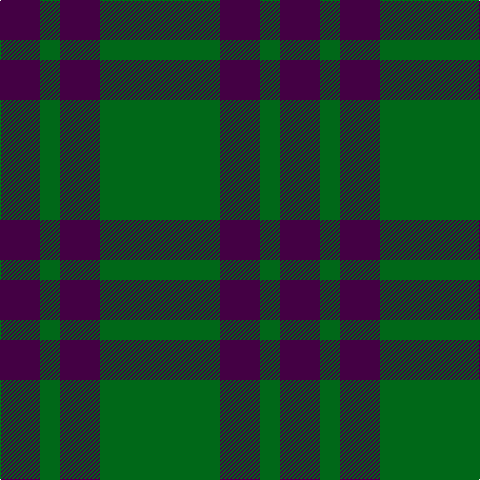

In pattern [BGBG](/patterns/bgbg/).

This was sourced from tartans-authority.  It is a [4 stripes tartan](/stripes/stripes4/).

Original link http://www.tartansauthority.com/tartan-ferret/display/115/

## Thread count
DP/40 G20 DP40 G/120

## Palette
Each colour and its ΔE from the base-6 reference it is a variant of.

| Colour | Shade | Base | ΔE (OKLab) |
|---|---|---|---|
| DP | <code style="background-color:#440044;">#440044</code> `#440044` | B <code style="background-color:#2A418A;">#2A418A</code> | 0.18 |
| G | <code style="background-color:#006818;">#006818</code> `#006818` | G <code style="background-color:#006100;">#006100</code> | 0.02 |

# Sample pattern

## Nearest tartans

The nearest existing variants by ΔTartan distance.

1. [Elphinstone](/setts/s4/g6b2g1b2x4~b440044-g006818/) — ΔT 0.00
1. [Elphinstone Clan Tartan Tartan Number: 115. Earliest known date: 1842 The village of Elphinstone is next to Tranent near Edinburgh in East Lothian. Sir Henry Elphinstone of Pittendriech in Midlothian was created Baron Elphinstone in 1509 and fell at Flodden Field. The Elphinstone tartan first appeared in the text of the Vestiarium Scoticum (1842). It is similar to some extent with the Montgomerie tartan and to the Montgomerie Hunting sett, suggesting a link to an early provenance. D.W. Stewart (1893) maintained that he could date the Montgomerie of Eglinton to 1707. See products available Copyright © Blair Urquhart, Comrie, 2015](/setts/s4/g28b10g3b10x2~b780078-g006818/) — ΔT 1.07
1. [Montgomery](/setts/s4/g6b2g1b2x4~b2c2c80-g006818/) — ΔT 1.27
1. [Montgomery - 1842 (VS](/setts/s4/g6b2g1b2x8~b2c2c80-g006818/) — ΔT 1.27
1. [Wilson's, No 211](/setts/s4/g8b4g1b2x4~b800080-g008000/) — ΔT 1.35
1. [Scotch Tape (Corporate)](/setts/s3/g30k20g3x2~g006818-k101010/) — ΔT 1.42
1. [MacArthur-Fox (Personal)](/setts/s5/k8g3k4g20r4x2~g006818-k101010-r880000/) — ΔT 1.58
1. [Peterhead (Personal)](/setts/s5/g9b1g2k4g2x4~b487088-g407058-k101010/) — ΔT 1.59
1. [Highland Spring (1997) (Corporate)](/setts/s4/b7g23r3g7x2~b440044-g006818-rc80000/) — ΔT 1.67
1. [Special Saffron (Fashion)](/setts/s4/g21y44g86b10~b2888c4-g003820-ydc943c/) — ΔT 1.69

## Neighbour map

Every grey dot is one of 15726 variants placed by the first two principal components of the ΔTartan feature space (44% of its variance). Red is this tartan; blue dots are its nearest — click one to open its page.

<svg viewBox="0 0 640 380" role="img" style="max-width:100%;height:auto;border:1px solid #e0e0e0;border-radius:4px;display:block" xmlns="http://www.w3.org/2000/svg"><image href="/nn/cloud.v1.png" width="640" height="380"/><a href="/setts/s4/g6b2g1b2x4~b440044-g006818/"><circle cx="406.5" cy="315.9" r="4" fill="#3465a4"><title>Elphinstone</title></circle></a><a href="/setts/s4/g28b10g3b10x2~b780078-g006818/"><circle cx="406.8" cy="289.8" r="4" fill="#3465a4"><title>Elphinstone Clan Tartan Tartan Number: 115. Earliest known date: 1842 The village of Elphinstone is next to Tranent near Edinburgh in East Lothian. Sir Henry Elphinstone of Pittendriech in Midlothian was created Baron Elphinstone in 1509 and fell at Flodden Field. The Elphinstone tartan first appeared in the text of the Vestiarium Scoticum (1842). It is similar to some extent with the Montgomerie tartan and to the Montgomerie Hunting sett, suggesting a link to an early provenance. D.W. Stewart (1893) maintained that he could date the Montgomerie of Eglinton to 1707. See products available Copyright © Blair Urquhart, Comrie, 2015</title></circle></a><a href="/setts/s4/g6b2g1b2x4~b2c2c80-g006818/"><circle cx="424.3" cy="328.2" r="4" fill="#3465a4"><title>Montgomery</title></circle></a><a href="/setts/s4/g6b2g1b2x8~b2c2c80-g006818/"><circle cx="424.3" cy="328.2" r="4" fill="#3465a4"><title>Montgomery - 1842 (VS</title></circle></a><a href="/setts/s4/g8b4g1b2x4~b800080-g008000/"><circle cx="373.6" cy="286.0" r="4" fill="#3465a4"><title>Wilson's, No 211</title></circle></a><a href="/setts/s3/g30k20g3x2~g006818-k101010/"><circle cx="417.9" cy="323.8" r="4" fill="#3465a4"><title>Scotch Tape (Corporate)</title></circle></a><a href="/setts/s5/k8g3k4g20r4x2~g006818-k101010-r880000/"><circle cx="353.7" cy="276.3" r="4" fill="#3465a4"><title>MacArthur-Fox (Personal)</title></circle></a><a href="/setts/s5/g9b1g2k4g2x4~b487088-g407058-k101010/"><circle cx="460.0" cy="273.8" r="4" fill="#3465a4"><title>Peterhead (Personal)</title></circle></a><a href="/setts/s4/b7g23r3g7x2~b440044-g006818-rc80000/"><circle cx="470.4" cy="290.4" r="4" fill="#3465a4"><title>Highland Spring (1997) (Corporate)</title></circle></a><a href="/setts/s4/g21y44g86b10~b2888c4-g003820-ydc943c/"><circle cx="370.8" cy="266.9" r="4" fill="#3465a4"><title>Special Saffron (Fashion)</title></circle></a><circle cx="406.5" cy="315.9" r="5" fill="#c00000"/></svg>

ID: /setts/s4/g6b2g1b2x20~b440044-g006818/
