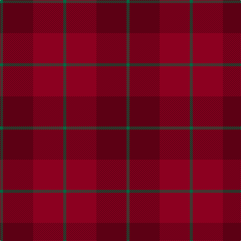

In pattern [GBRG](/patterns/gbrg/).

This was sourced from tartans-authority.  It is a [4 stripes tartan](/stripes/stripes4/).

Original link http://www.tartansauthority.com/tartan-ferret/display/7817/

## Thread count
G/6 DR60 DRa60 G/6

## Palette
Each colour and its ΔE from the base-6 reference it is a variant of.

| Colour | Shade | Base | ΔE (OKLab) |
|---|---|---|---|
| DR | <code style="background-color:#5C0014;">#5C0014</code> `#5C0014` | B <code style="background-color:#2C4084;">#2C4084</code> | 0.22 |
| DRa | <code style="background-color:#8C0020;">#8C0020</code> `#8C0020` | R <code style="background-color:#C80000;">#C80000</code> | 0.13 |
| G | <code style="background-color:#006840;">#006840</code> `#006840` | G <code style="background-color:#006400;">#006400</code> | 0.06 |

# Sample pattern

## Nearest tartans

The nearest existing variants by ΔTartan distance.

1. [Bryce](/setts/s4/r10b70r92y10-b684038-r880000-ya88000/) — ΔT 1.71
1. [Hamilton, Red (Fashion?)](/setts/s5/r46ra8r46ra64r8-r880000-rab84c00/) — ΔT 1.80
1. [MacNab 4](/setts/s5/r48g2b2g4ra48-b5480b0-g008000-r900030-rac00000/) — ΔT 2.28
1. [Hamilton, Red](/setts/s8/r64y8r64ra46r8ra46r8ra46-r880000-rab84c00-yd87c00/) — ΔT 2.31
1. [MacNab (Smith)](/setts/s5/r96g4b4g8ra96-b2888c4-g006818-ra00048-rac80000/) — ΔT 2.41
1. [Brown Heather (Fashion)](/setts/s6/b8g48b48g8ba48g8-b3c2010-ba5c5c5c-g64340c/) — ΔT 2.45
1. [Cypress](/setts/s6/b8r8b68ra68rb8ra8-b3c3c3c-re02cb8-ra70000c-rbb07430/) — ΔT 2.46
1. [Grelloch (Fashion)](/setts/s6/r8b4ra48rb48k4rb8-b5c8ca8-k101010-ra00048-ra901c38-rbc80000/) — ΔT 2.47
1. [MacNab WI 1](/setts/s5/b48g2ba2g4r48-b59110d-ba4367ae-g11450d-raa0000/) — ΔT 2.51
1. [Glenshee #2](/setts/s5/r74g18r6ga18g6-g503c14-ga005020-r960028/) — ΔT 2.52

## Neighbour map

Every grey dot is one of 15726 variants placed by the first two principal components of the ΔTartan feature space (44% of its variance). Red is this tartan; blue dots are its nearest — click one to open its page.

<svg viewBox="0 0 640 380" role="img" style="max-width:100%;height:auto;border:1px solid #e0e0e0;border-radius:4px;display:block" xmlns="http://www.w3.org/2000/svg"><image href="/nn/cloud.v1.png" width="640" height="380"/><a href="/setts/s4/r10b70r92y10-b684038-r880000-ya88000/"><circle cx="530.5" cy="324.5" r="4" fill="#3465a4"><title>Bryce</title></circle></a><a href="/setts/s5/r46ra8r46ra64r8-r880000-rab84c00/"><circle cx="485.7" cy="318.1" r="4" fill="#3465a4"><title>Hamilton, Red (Fashion?)</title></circle></a><a href="/setts/s5/r48g2b2g4ra48-b5480b0-g008000-r900030-rac00000/"><circle cx="472.7" cy="211.4" r="4" fill="#3465a4"><title>MacNab 4</title></circle></a><a href="/setts/s8/r64y8r64ra46r8ra46r8ra46-r880000-rab84c00-yd87c00/"><circle cx="442.0" cy="288.8" r="4" fill="#3465a4"><title>Hamilton, Red</title></circle></a><a href="/setts/s5/r96g4b4g8ra96-b2888c4-g006818-ra00048-rac80000/"><circle cx="474.9" cy="209.9" r="4" fill="#3465a4"><title>MacNab (Smith)</title></circle></a><a href="/setts/s6/b8g48b48g8ba48g8-b3c2010-ba5c5c5c-g64340c/"><circle cx="363.6" cy="326.6" r="4" fill="#3465a4"><title>Brown Heather (Fashion)</title></circle></a><a href="/setts/s6/b8r8b68ra68rb8ra8-b3c3c3c-re02cb8-ra70000c-rbb07430/"><circle cx="377.7" cy="243.0" r="4" fill="#3465a4"><title>Cypress</title></circle></a><a href="/setts/s6/r8b4ra48rb48k4rb8-b5c8ca8-k101010-ra00048-ra901c38-rbc80000/"><circle cx="409.5" cy="217.7" r="4" fill="#3465a4"><title>Grelloch (Fashion)</title></circle></a><a href="/setts/s5/b48g2ba2g4r48-b59110d-ba4367ae-g11450d-raa0000/"><circle cx="447.5" cy="207.2" r="4" fill="#3465a4"><title>MacNab WI 1</title></circle></a><a href="/setts/s5/r74g18r6ga18g6-g503c14-ga005020-r960028/"><circle cx="527.0" cy="254.1" r="4" fill="#3465a4"><title>Glenshee #2</title></circle></a><circle cx="453.5" cy="303.6" r="5" fill="#c00000"/></svg>

ID: /setts/s4/g6b60r60g6-b5c0014-g006840-r8c0020/
