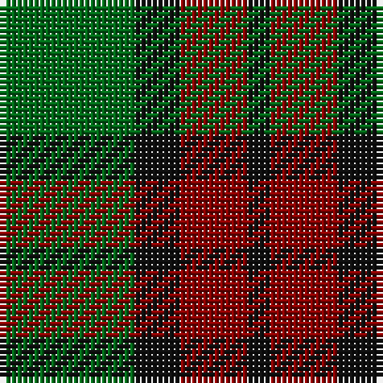

In pattern [GKRK](/stripes/gkrk/).

This was sourced from tartans-authority.  It is a [4 stripe tartan](/stripes/stripes4/).

Original link http://www.tartansauthority.com/tartan-ferret/display/5425/

## Thread count
G/24 K8 DR12 K/4

## Palette
Each colour and its ΔE from the base-6 reference it is a variant of.

| Colour | Shade | Base | ΔE (OKLab) |
|---|---|---|---|
| DR | <code style="background-color:#880000;">#880000</code> `#880000` | R <code style="background-color:#CC0000;">#CC0000</code> | 0.15 |
| G | <code style="background-color:#006818;">#006818</code> `#006818` | G <code style="background-color:#006100;">#006100</code> | 0.02 |
| K | <code style="background-color:#101010;">#101010</code> `#101010` | K <code style="background-color:#000000;">#000000</code> | 0.17 |

# Sample pattern

## Nearest tartans

The nearest existing variants by ΔTartan distance.

1. [Royal Guard of Oman 4th Band Squadron](/setts/s4/g38r24k9r9~x2/) — ΔT 0.99
1. [Cub Scouts of America](/setts/s5/g10db2r8lo2g5~x4/) — ΔT 1.29
1. [Kincaid of Kincaid (Clan)](/setts/s3/k11g16r2~x4/) — ΔT 1.35
1. [Wilson's No.050](/setts/s3/k5g6t1~x4/) — ΔT 1.39
1. [Confederate Cavalry (Military)](/setts/s6/dg2y14dg8y3dg12lo2~x2/) — ΔT 1.40
1. [Romsdal](/setts/s5/g22dt5r4dt5r3~x2/) — ΔT 1.43
1. [Wilson's No.084](/setts/s3/dg6dp5r1~x4/) — ΔT 1.43
1. [Confederate Artillery](/setts/s6/dg2o14dg8o3dg12r2~x2/) — ΔT 1.44
1. [Wilson's No.055](/setts/s3/g6dp5t1~x4/) — ΔT 1.45
1. [Wilson's No.062](/setts/s4/db13r2g13~x2/) — ΔT 1.45

## Neighbour map

Every grey dot is one of 14299 variants placed by the first two principal components of the ΔTartan feature space (44% of its variance). Red is this tartan; blue dots are its nearest — click one to open its page.

<svg viewBox="0 0 640 380" role="img" style="max-width:100%;height:auto;border:1px solid #e0e0e0;border-radius:4px;display:block" xmlns="http://www.w3.org/2000/svg"><image href="/nn/cloud.v1.png" width="640" height="380"/><a href="/setts/s4/g38r24k9r9~x2/"><circle cx="286.7" cy="317.5" r="4" fill="#3465a4"><title>Royal Guard of Oman 4th Band Squadron</title></circle></a><a href="/setts/s5/g10db2r8lo2g5~x4/"><circle cx="279.6" cy="282.4" r="4" fill="#3465a4"><title>Cub Scouts of America</title></circle></a><a href="/setts/s3/k11g16r2~x4/"><circle cx="339.1" cy="313.7" r="4" fill="#3465a4"><title>Kincaid of Kincaid (Clan)</title></circle></a><a href="/setts/s3/k5g6t1~x4/"><circle cx="284.7" cy="325.3" r="4" fill="#3465a4"><title>Wilson's No.050</title></circle></a><a href="/setts/s6/dg2y14dg8y3dg12lo2~x2/"><circle cx="337.0" cy="273.8" r="4" fill="#3465a4"><title>Confederate Cavalry (Military)</title></circle></a><a href="/setts/s5/g22dt5r4dt5r3~x2/"><circle cx="342.0" cy="256.5" r="4" fill="#3465a4"><title>Romsdal</title></circle></a><a href="/setts/s3/dg6dp5r1~x4/"><circle cx="309.3" cy="323.2" r="4" fill="#3465a4"><title>Wilson's No.084</title></circle></a><a href="/setts/s6/dg2o14dg8o3dg12r2~x2/"><circle cx="320.3" cy="262.9" r="4" fill="#3465a4"><title>Confederate Artillery</title></circle></a><a href="/setts/s3/g6dp5t1~x4/"><circle cx="289.9" cy="319.0" r="4" fill="#3465a4"><title>Wilson's No.055</title></circle></a><a href="/setts/s4/db13r2g13~x2/"><circle cx="273.1" cy="284.4" r="4" fill="#3465a4"><title>Wilson's No.062</title></circle></a><circle cx="283.7" cy="301.5" r="5" fill="#c00000"/></svg>

ID: /setts/s4/g6k2r3k1~x4/
