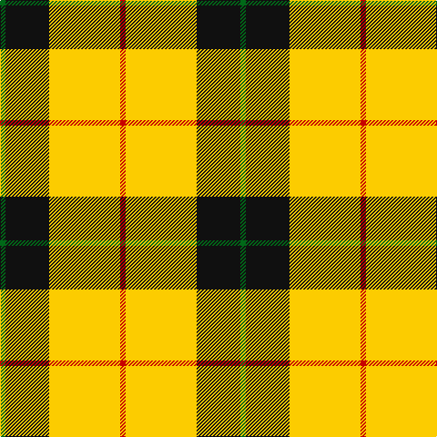

In pattern [GKYR](/patterns/gkyr/).

This was sourced from tartans-authority.  It is a [4 stripes tartan](/stripes/stripes4/).

Original link http://www.tartansauthority.com/tartan-ferret/display/11180/

## Thread count
G/6 K48 Y78 R/6

## Palette
Each colour and its ΔE from the base-6 reference it is a variant of.

| Colour | Shade | Base | ΔE (OKLab) |
|---|---|---|---|
| G | <code style="background-color:#006818;">#006818</code> `#006818` | G <code style="background-color:#006400;">#006400</code> | 0.02 |
| K | <code style="background-color:#101010;">#101010</code> `#101010` | K <code style="background-color:#000000;">#000000</code> | 0.17 |
| R | <code style="background-color:#C80000;">#C80000</code> `#C80000` | R <code style="background-color:#C80000;">#C80000</code> | 0.00 |
| Y | <code style="background-color:#FCCC00;">#FCCC00</code> `#FCCC00` | Y <code style="background-color:#E8C000;">#E8C000</code> | 0.04 |

# Sample pattern

## Nearest tartans

The nearest existing variants by ΔTartan distance.

1. [Billy Apple® Yellow](/setts/s4/g6k48y78r6-g006818-k101010-rdc0000-yffe600/) — ΔT 0.51
1. [Porter Drinkers (Commemorative)](/setts/s6/k4y12k4y22k18r2-k101010-rc80000-yfccc00/) — ΔT 1.38
1. [Porter Drinkers', The](/setts/s6/k4y12k4y22k18r2-k101010-rff0000-yffcc33/) — ΔT 1.40
1. [Jacobite #2](/setts/s6/y70k30w3g30k3y10-g005020-k101010-we0e0e0-ye8c000/) — ΔT 1.45
1. [MacDuck, Final version](/setts/s6/k8r10k4y42g16k4-g008000-k000000-rc00000-yf0c000/) — ΔT 1.47
1. [Jacobite](/setts/s6/y70k30w3g30k3y10-g008000-k000000-we0e0e0-yf0c000/) — ΔT 1.48
1. [MacDuck (Corporate)](/setts/s6/k8r10k4y42g16k4-g006818-k101010-rc80000-ye8c000/) — ΔT 1.51
1. [Unnamed C21st - Fashion](/setts/s6/k8y64k32r6k32y8-k101010-re87878-yfccc00/) — ΔT 1.57
1. [Baileville (Personal)](/setts/s7/y4k16y4k16y44r4y4-k101010-r901c38-ye8c000/) — ΔT 1.62
1. [Barclay Dress](/setts/s4/w10y64b64y10-b1c1c1c-we0e0e0-ye8c000/) — ΔT 1.64

## Neighbour map

Every grey dot is one of 15726 variants placed by the first two principal components of the ΔTartan feature space (44% of its variance). Red is this tartan; blue dots are its nearest — click one to open its page.

<svg viewBox="0 0 640 380" role="img" style="max-width:100%;height:auto;border:1px solid #e0e0e0;border-radius:4px;display:block" xmlns="http://www.w3.org/2000/svg"><image href="/nn/cloud.v1.png" width="640" height="380"/><a href="/setts/s4/g6k48y78r6-g006818-k101010-rdc0000-yffe600/"><circle cx="284.1" cy="186.8" r="4" fill="#3465a4"><title>Billy Apple® Yellow</title></circle></a><a href="/setts/s6/k4y12k4y22k18r2-k101010-rc80000-yfccc00/"><circle cx="288.7" cy="207.1" r="4" fill="#3465a4"><title>Porter Drinkers (Commemorative)</title></circle></a><a href="/setts/s6/k4y12k4y22k18r2-k101010-rff0000-yffcc33/"><circle cx="289.0" cy="206.2" r="4" fill="#3465a4"><title>Porter Drinkers', The</title></circle></a><a href="/setts/s6/y70k30w3g30k3y10-g005020-k101010-we0e0e0-ye8c000/"><circle cx="287.1" cy="148.2" r="4" fill="#3465a4"><title>Jacobite #2</title></circle></a><a href="/setts/s6/k8r10k4y42g16k4-g008000-k000000-rc00000-yf0c000/"><circle cx="217.7" cy="171.5" r="4" fill="#3465a4"><title>MacDuck, Final version</title></circle></a><a href="/setts/s6/y70k30w3g30k3y10-g008000-k000000-we0e0e0-yf0c000/"><circle cx="278.9" cy="145.5" r="4" fill="#3465a4"><title>Jacobite</title></circle></a><a href="/setts/s6/k8r10k4y42g16k4-g006818-k101010-rc80000-ye8c000/"><circle cx="227.4" cy="174.8" r="4" fill="#3465a4"><title>MacDuck (Corporate)</title></circle></a><a href="/setts/s6/k8y64k32r6k32y8-k101010-re87878-yfccc00/"><circle cx="267.9" cy="202.0" r="4" fill="#3465a4"><title>Unnamed C21st - Fashion</title></circle></a><a href="/setts/s7/y4k16y4k16y44r4y4-k101010-r901c38-ye8c000/"><circle cx="336.4" cy="177.9" r="4" fill="#3465a4"><title>Baileville (Personal)</title></circle></a><a href="/setts/s4/w10y64b64y10-b1c1c1c-we0e0e0-ye8c000/"><circle cx="250.5" cy="245.3" r="4" fill="#3465a4"><title>Barclay Dress</title></circle></a><circle cx="290.7" cy="188.0" r="5" fill="#c00000"/></svg>

ID: /setts/s4/g6k48y78r6-g006818-k101010-rc80000-yfccc00/
