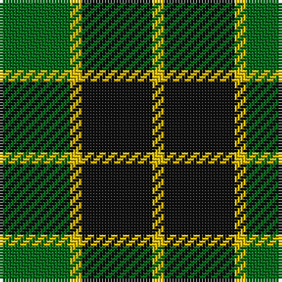

**Bands:** [GYKY](/stripes/gyky/) · **Stripes:** [G LY K LY](/stripes/stripes4/) G LY K LY

This was sourced from register-of-tartans.  It is a [4 band tartan](/bands/bands4/).

Original link https://www.tartanregister.gov.uk/tartanDetails.aspx?ref=4729

## Register references

External register numbers recorded for this tartan.

- Scottish Register of Tartans: [4729](https://www.tartanregister.gov.uk/tartanDetails.aspx?ref=4729)
- Scottish Tartans Authority (ITI): 1017
- Scottish Tartans World Register: 1017

## Thread count
G/24 Y4 K24 Y/4

## Palette
Each colour and its ΔE from the base-6 reference it is a variant of.

| Colour | Shade | Base | ΔE (OKLab) |
|---|---|---|---|
| DG | <code style="background-color:#003820;">#003820</code> `#003820` | G <code style="background-color:#006100;">#006100</code> | 0.15 |
| G | <code style="background-color:#006818;">#006818</code> `#006818` | G <code style="background-color:#006100;">#006100</code> | 0.02 |
| K | <code style="background-color:#101010;">#101010</code> `#101010` | K <code style="background-color:#000000;">#000000</code> | 0.17 |
| Y | <code style="background-color:#E8C000;">#E8C000</code> `#E8C000` | Y <code style="background-color:#F2BF00;">#F2BF00</code> | 0.02 |
| Ya | <code style="background-color:#D8B000;">#D8B000</code> `#D8B000` | Y <code style="background-color:#F2BF00;">#F2BF00</code> | 0.06 |

# Sample pattern

## Nearest tartans

The nearest existing variants by ΔTartan distance.

1. [Innes Hunting](/setts/s4/k30lb7g36k5~x2/) — ΔT 0.87
1. [Wilson's No.079](/setts/s4/k7w1g7t1~x2/) — ΔT 1.05
1. [MacArthur](/setts/s5/k9g3k3g12ly2~x4/) — ΔT 1.17
1. [Innes, hunting](/setts/s4/k30db7g36k5~x2/) — ΔT 1.23
1. [Romsdal](/setts/s5/g40k10r7k10r7/) — ΔT 1.26
1. [Wilson's, No 140](/setts/s4/k7ly1g7t1~x2/) — ΔT 1.29
1. [Barclay Dress](/setts/s4/lr1ly6k6ly1~x2/) — ΔT 1.37
1. [Scotch Tape 2 (Corporate)](/setts/s4/k3g15k20ly3~x2/) — ΔT 1.43
1. [Wilson's, No 197](/setts/s3/g6ly1k6~x4/) — ΔT 1.47
1. [Wallace, hunting](/setts/s4/k4g33k33ly4~x2/) — ΔT 1.51

## Neighbour map

Every grey dot is one of 14313 variants placed by the first two principal components of the ΔTartan feature space (44% of its variance). Red is this tartan; blue dots are its nearest — click one to open its page.

<svg viewBox="0 0 640 380" role="img" style="max-width:100%;height:auto;border:1px solid #e0e0e0;border-radius:4px;display:block" xmlns="http://www.w3.org/2000/svg"><image href="/nn/cloud.v1.png" width="640" height="380"/><a href="/setts/s4/k30lb7g36k5~x2/"><circle cx="264.5" cy="277.1" r="4" fill="#3465a4"><title>Innes Hunting</title></circle></a><a href="/setts/s4/k7w1g7t1~x2/"><circle cx="221.9" cy="251.3" r="4" fill="#3465a4"><title>Wilson's No.079</title></circle></a><a href="/setts/s5/k9g3k3g12ly2~x4/"><circle cx="282.4" cy="278.7" r="4" fill="#3465a4"><title>MacArthur</title></circle></a><a href="/setts/s4/k30db7g36k5~x2/"><circle cx="243.2" cy="271.3" r="4" fill="#3465a4"><title>Innes, hunting</title></circle></a><a href="/setts/s5/g40k10r7k10r7/"><circle cx="261.8" cy="245.2" r="4" fill="#3465a4"><title>Romsdal</title></circle></a><a href="/setts/s4/k7ly1g7t1~x2/"><circle cx="201.8" cy="244.7" r="4" fill="#3465a4"><title>Wilson's, No 140</title></circle></a><a href="/setts/s4/lr1ly6k6ly1~x2/"><circle cx="241.6" cy="255.5" r="4" fill="#3465a4"><title>Barclay Dress</title></circle></a><a href="/setts/s4/k3g15k20ly3~x2/"><circle cx="311.8" cy="278.9" r="4" fill="#3465a4"><title>Scotch Tape 2 (Corporate)</title></circle></a><a href="/setts/s3/g6ly1k6~x4/"><circle cx="221.1" cy="300.7" r="4" fill="#3465a4"><title>Wilson's, No 197</title></circle></a><a href="/setts/s4/k4g33k33ly4~x2/"><circle cx="273.3" cy="256.0" r="4" fill="#3465a4"><title>Wallace, hunting</title></circle></a><circle cx="224.4" cy="272.1" r="5" fill="#c00000"/></svg>

ID: /setts/s4/g6ly1k6ly1~x4/
