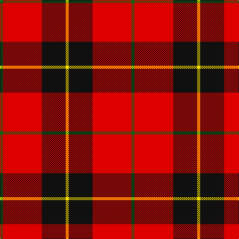

In pattern [GRKY](/patterns/grky/).

This was sourced from register-of-tartans.  It is a [4 stripes tartan](/stripes/stripes4/).

Original link https://www.tartanregister.gov.uk/tartanDetails.aspx?ref=11143

## Thread count
G/6 R78 K48 Y/6

## Palette
Each colour and its ΔE from the base-6 reference it is a variant of.

| Colour | Shade | Base | ΔE (OKLab) |
|---|---|---|---|
| G | <code style="background-color:#006818;">#006818</code> `#006818` | G <code style="background-color:#006400;">#006400</code> | 0.02 |
| K | <code style="background-color:#101010;">#101010</code> `#101010` | K <code style="background-color:#000000;">#000000</code> | 0.17 |
| R | <code style="background-color:#DC0000;">#DC0000</code> `#DC0000` | R <code style="background-color:#C80000;">#C80000</code> | 0.04 |
| Y | <code style="background-color:#FFE600;">#FFE600</code> `#FFE600` | Y <code style="background-color:#E8C000;">#E8C000</code> | 0.10 |

# Sample pattern

## Nearest tartans

The nearest existing variants by ΔTartan distance.

1. [Oklahoma State University (Corporate](/setts/s4/r80k52w7ra12-k101010-rd04804-ra888888-we0e0e0/) — ΔT 0.97
1. [Dunbar (Wilson's) District Tartan Tartan Number: 1236. Earliest known date: 1840 Restricted See products available Copyright © Blair Urquhart, Comrie, 2015](/setts/s4/r56k8w4k26-k101010-rc80000-we0e0e0/) — ΔT 1.06
1. [Dunbar #2](/setts/s6/k8r52k8w4k26y8-k101010-rdc0000-we0e0e0-ye8c000/) — ΔT 1.15
1. [Dunbar (District)](/setts/s4/r56k8w4k26-k101010-rcc4438-we0e0e0/) — ΔT 1.16
1. [MacKintosh #4](/setts/s6/r10w4r56k24g32r6-g005020-k101010-rdc0000-we0e0e0/) — ΔT 1.17
1. [MacGregor, Black (Personal)](/setts/s5/r82k38r14k18w6-k101010-rc80000-wfcfcfc/) — ΔT 1.18
1. [Turner (Personal)](/setts/s5/r96k24ra14k10w6-k101010-rc80000-ra888888-wfcfcfc/) — ΔT 1.23
1. [MacKeane](/setts/s5/r8k16r24k2y2-k101010-rc80000-ye8c000/) — ΔT 1.27
1. [Hopkins (Name)](/setts/s5/r72k36r8k14w4-k101010-rc80000-we0e0e0/) — ΔT 1.32
1. [Masai Shuka 26 (Artefact)](/setts/s4/y12k8r40k4-k101010-rc80000-ye8c000/) — ΔT 1.33

## Neighbour map

Every grey dot is one of 15726 variants placed by the first two principal components of the ΔTartan feature space (44% of its variance). Red is this tartan; blue dots are its nearest — click one to open its page.

<svg viewBox="0 0 640 380" role="img" style="max-width:100%;height:auto;border:1px solid #e0e0e0;border-radius:4px;display:block" xmlns="http://www.w3.org/2000/svg"><image href="/nn/cloud.v1.png" width="640" height="380"/><a href="/setts/s4/r80k52w7ra12-k101010-rd04804-ra888888-we0e0e0/"><circle cx="290.5" cy="208.4" r="4" fill="#3465a4"><title>Oklahoma State University (Corporate</title></circle></a><a href="/setts/s4/r56k8w4k26-k101010-rc80000-we0e0e0/"><circle cx="385.5" cy="213.7" r="4" fill="#3465a4"><title>Dunbar (Wilson's) District Tartan Tartan Number: 1236. Earliest known date: 1840 Restricted See products available Copyright © Blair Urquhart, Comrie, 2015</title></circle></a><a href="/setts/s6/k8r52k8w4k26y8-k101010-rdc0000-we0e0e0-ye8c000/"><circle cx="281.7" cy="168.7" r="4" fill="#3465a4"><title>Dunbar #2</title></circle></a><a href="/setts/s4/r56k8w4k26-k101010-rcc4438-we0e0e0/"><circle cx="377.0" cy="212.8" r="4" fill="#3465a4"><title>Dunbar (District)</title></circle></a><a href="/setts/s6/r10w4r56k24g32r6-g005020-k101010-rdc0000-we0e0e0/"><circle cx="301.9" cy="183.1" r="4" fill="#3465a4"><title>MacKintosh #4</title></circle></a><a href="/setts/s5/r82k38r14k18w6-k101010-rc80000-wfcfcfc/"><circle cx="384.8" cy="205.0" r="4" fill="#3465a4"><title>MacGregor, Black (Personal)</title></circle></a><a href="/setts/s5/r96k24ra14k10w6-k101010-rc80000-ra888888-wfcfcfc/"><circle cx="396.5" cy="163.8" r="4" fill="#3465a4"><title>Turner (Personal)</title></circle></a><a href="/setts/s5/r8k16r24k2y2-k101010-rc80000-ye8c000/"><circle cx="387.3" cy="215.9" r="4" fill="#3465a4"><title>MacKeane</title></circle></a><a href="/setts/s5/r72k36r8k14w4-k101010-rc80000-we0e0e0/"><circle cx="401.2" cy="192.1" r="4" fill="#3465a4"><title>Hopkins (Name)</title></circle></a><a href="/setts/s4/y12k8r40k4-k101010-rc80000-ye8c000/"><circle cx="370.5" cy="216.3" r="4" fill="#3465a4"><title>Masai Shuka 26 (Artefact)</title></circle></a><circle cx="331.7" cy="194.6" r="5" fill="#c00000"/></svg>

ID: /setts/s4/g6r78k48y6-g006818-k101010-rdc0000-yffe600/
