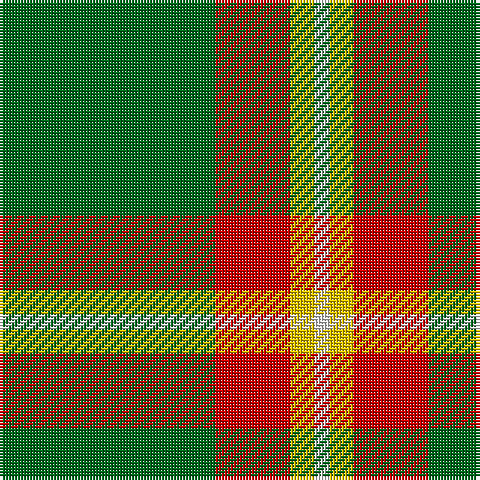

This page is one **sett** — a single exact thread-count. It belongs to the [tartan](/tartans/g72r25ly8w5/)
(the same proportion at any scale), whose colour order is pattern [GRYW](/stripes/gryw/).

Sourced from tartans-authority.  It is a [4 stripe tartan](/stripes/stripes4/).

Original link http://www.tartansauthority.com/tartan-ferret/display/7880/

## Thread count
G/72 R25 Y8 LN/5

## Palette

Palette: <strong>Tartan Register</strong>
<table><thead><tr><th>Colour</th><th>Threads</th><th>Shade</th><th>Base</th><th>OKLCh</th></tr></thead><tbody><tr><td>G/</td><td style="text-align:right;font-variant-numeric:tabular-nums">72</td><td><code style="background-color:#006818;">#006818</code> <small style="color:#888">#006818</small></td><td>G <code style="background-color:#006100;">#006100</code></td><td><small style="color:#888">oklch(45.0% 0.142 145.0)</small></td></tr><tr><td>R</td><td style="text-align:right;font-variant-numeric:tabular-nums">25</td><td><code style="background-color:#C80000;">#C80000</code> <small style="color:#888">#C80000</small></td><td>R <code style="background-color:#CC0000;">#CC0000</code></td><td><small style="color:#888">oklch(52.3% 0.215 29.2)</small></td></tr><tr><td>Y</td><td style="text-align:right;font-variant-numeric:tabular-nums">8</td><td><code style="background-color:#E8C000;">#E8C000</code> <small style="color:#888">#E8C000</small></td><td>Y <code style="background-color:#F2BF00;">#F2BF00</code></td><td><small style="color:#888">oklch(81.9% 0.168 93.7)</small></td></tr><tr><td>LN/</td><td style="text-align:right;font-variant-numeric:tabular-nums">5</td><td><code style="background-color:#E0E0E0;">#E0E0E0</code> <small style="color:#888">#E0E0E0</small></td><td>W <code style="background-color:#F7F7F7;">#F7F7F7</code></td><td><small style="color:#888">oklch(90.7% 0.000 89.9)</small></td></tr></tbody></table>

# Sample pattern

## Nearest tartans

The nearest existing variants by ΔTartan distance, with this tartan at the top so the swatches line up against it.

ΔTartan

Tartan

Sett

—

<a href="/ttd/edit/#slug=g72r25ly8w5">Sugell (Name?)</a> <a class="nn-out" href="/setts/s4/g72r25ly8w5/" title="open its dictionary page">↗</a>

0.94

<a href="/ttd/edit/#slug=p4g10r1ly1~x2">Wilson's, No 192</a> <a class="nn-out" href="/setts/s4/p4g10r1ly1~x2/" title="open its dictionary page">↗</a>

1.10

<a href="/ttd/edit/#slug=r8g12w5k11g42k3~x2">Sir Billi (Corporate)</a> <a class="nn-out" href="/setts/s6/r8g12w5k11g42k3~x2/" title="open its dictionary page">↗</a>

1.13

<a href="/ttd/edit/#slug=p4g10w1r1~x2">Wilson's, No 189</a> <a class="nn-out" href="/setts/s4/p4g10w1r1~x2/" title="open its dictionary page">↗</a>

1.23

<a href="/ttd/edit/#slug=dp4g10r1ly1~x2">Wilson's No.192</a> <a class="nn-out" href="/setts/s4/dp4g10r1ly1~x2/" title="open its dictionary page">↗</a>

1.33

<a href="/ttd/edit/#slug=g56dy13ly13w5~x2">Colonial Marine (Aliens Legacy)</a> <a class="nn-out" href="/setts/s4/g56dy13ly13w5~x2/" title="open its dictionary page">↗</a>

1.42

<a href="/ttd/edit/#slug=dp4g10r1w1~x2">Wilson's No.189</a> <a class="nn-out" href="/setts/s4/dp4g10r1w1~x2/" title="open its dictionary page">↗</a>

1.45

<a href="/ttd/edit/#slug=g3w1g12r6g3k3g2~x4">Arkansas</a> <a class="nn-out" href="/setts/s7/g3w1g12r6g3k3g2~x4/" title="open its dictionary page">↗</a>

1.54

<a href="/ttd/edit/#slug=dg11lo1dg1lo6k1lo1~x4">Big Spruce Brewing</a> <a class="nn-out" href="/setts/s6/dg11lo1dg1lo6k1lo1~x4/" title="open its dictionary page">↗</a>

1.55

<a href="/ttd/edit/#slug=g14k3r3lr2~x2">Bacon, Green (Fashion)</a> <a class="nn-out" href="/setts/s4/g14k3r3lr2~x2/" title="open its dictionary page">↗</a>

1.58

<a href="/ttd/edit/#slug=r2g2r1g12r3k1~x4">Connell (Personal?)</a> <a class="nn-out" href="/setts/s6/r2g2r1g12r3k1~x4/" title="open its dictionary page">↗</a>

## Neighbour map

Every grey dot is one of 14299 variants placed by the first two principal components of the ΔTartan feature space (44% of its variance). Red is this tartan; blue dots are its nearest — click one to open its page.

<svg viewBox="0 0 640 380" role="img" style="max-width:100%;height:auto;border:1px solid #e0e0e0;border-radius:4px;display:block" xmlns="http://www.w3.org/2000/svg"><image href="/nn/cloud.v1.png" width="640" height="380"/><a href="/setts/s4/p4g10r1ly1~x2/"><circle cx="348.1" cy="222.1" r="4" fill="#3465a4"><title>Wilson's, No 192</title></circle></a><a href="/setts/s6/r8g12w5k11g42k3~x2/"><circle cx="373.7" cy="191.9" r="4" fill="#3465a4"><title>Sir Billi (Corporate)</title></circle></a><a href="/setts/s4/p4g10w1r1~x2/"><circle cx="343.3" cy="220.0" r="4" fill="#3465a4"><title>Wilson's, No 189</title></circle></a><a href="/setts/s4/dp4g10r1ly1~x2/"><circle cx="357.4" cy="230.6" r="4" fill="#3465a4"><title>Wilson's No.192</title></circle></a><a href="/setts/s4/g56dy13ly13w5~x2/"><circle cx="364.7" cy="224.6" r="4" fill="#3465a4"><title>Colonial Marine (Aliens Legacy)</title></circle></a><a href="/setts/s4/dp4g10r1w1~x2/"><circle cx="343.3" cy="223.6" r="4" fill="#3465a4"><title>Wilson's No.189</title></circle></a><a href="/setts/s7/g3w1g12r6g3k3g2~x4/"><circle cx="367.1" cy="208.6" r="4" fill="#3465a4"><title>Arkansas</title></circle></a><a href="/setts/s6/dg11lo1dg1lo6k1lo1~x4/"><circle cx="351.6" cy="201.1" r="4" fill="#3465a4"><title>Big Spruce Brewing</title></circle></a><a href="/setts/s4/g14k3r3lr2~x2/"><circle cx="347.5" cy="250.5" r="4" fill="#3465a4"><title>Bacon, Green (Fashion)</title></circle></a><a href="/setts/s6/r2g2r1g12r3k1~x4/"><circle cx="445.8" cy="217.8" r="4" fill="#3465a4"><title>Connell (Personal?)</title></circle></a><circle cx="392.4" cy="208.0" r="5" fill="#c00000"/></svg>

ID: /setts/s4/g72r25ly8w5/
