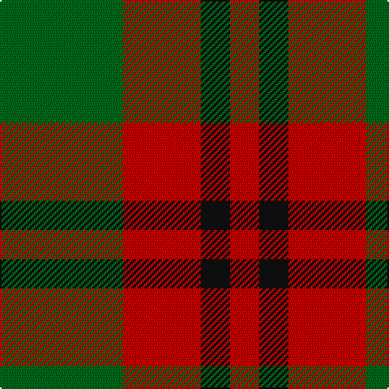

In pattern [GRKR](/patterns/grkr/).

This was sourced from tartans-authority.  It is a [4 stripes tartan](/stripes/stripes4/).

Original link http://www.tartansauthority.com/tartan-ferret/display/10991/

## Thread count
G/76 R48 K18 R/18

## Palette
Each colour and its ΔE from the base-6 reference it is a variant of.

| Colour | Shade | Base | ΔE (OKLab) |
|---|---|---|---|
| G | <code style="background-color:#006818;">#006818</code> `#006818` | G <code style="background-color:#006400;">#006400</code> | 0.02 |
| K | <code style="background-color:#101010;">#101010</code> `#101010` | K <code style="background-color:#000000;">#000000</code> | 0.17 |
| R | <code style="background-color:#C80000;">#C80000</code> `#C80000` | R <code style="background-color:#C80000;">#C80000</code> | 0.00 |

# Sample pattern

## Nearest tartans

The nearest existing variants by ΔTartan distance.

1. [Wilson's No.188](/setts/s4/g8r16g8b4-b2888c4-g006818-rc80000/) — ΔT 0.85
1. [Royal Guard of Oman 4th Band Squadron](/setts/s4/g76r48k18r18-g006400-k101010-r880000/) — ΔT 1.19
1. [Wilson's No.195](/setts/s4/r20g28k8b4-b2888c4-g006818-k101010-rc80000/) — ΔT 1.37
1. [Wilson's, No 188](/setts/s3/r16g8b4-b5480b0-g008000-rc00000/) — ΔT 1.52
1. [Dunoon Irish (Corporate)](/setts/s4/w12g78r78w12-g006c3c-rb84c00-wfcfcfc/) — ΔT 1.52
1. [Prince of Orange](/setts/s4/b12ba56y40b6-b5c8ca8-ba441800-yd87c00/) — ΔT 1.53
1. [Dunoon Irish](/setts/s4/w12g78r78w12-g003820-rb84c00-wfcfcfc/) — ΔT 1.55
1. [Red Watch (Fashion) #1](/setts/s4/g24k8r12k4-g006818-k101010-r880000/) — ΔT 1.56
1. [Wilson's No.208](/setts/s4/g14b4r8b4-b2888c4-g006818-rc80000/) — ΔT 1.58
1. [Wilson's No.203](/setts/s4/b8r16g20y4-b2888c4-g006818-rc80000-ye8c000/) — ΔT 1.61

## Neighbour map

Every grey dot is one of 15726 variants placed by the first two principal components of the ΔTartan feature space (44% of its variance). Red is this tartan; blue dots are its nearest — click one to open its page.

<svg viewBox="0 0 640 380" role="img" style="max-width:100%;height:auto;border:1px solid #e0e0e0;border-radius:4px;display:block" xmlns="http://www.w3.org/2000/svg"><image href="/nn/cloud.v1.png" width="640" height="380"/><a href="/setts/s4/g8r16g8b4-b2888c4-g006818-rc80000/"><circle cx="242.2" cy="313.6" r="4" fill="#3465a4"><title>Wilson's No.188</title></circle></a><a href="/setts/s4/g76r48k18r18-g006400-k101010-r880000/"><circle cx="287.6" cy="314.7" r="4" fill="#3465a4"><title>Royal Guard of Oman 4th Band Squadron</title></circle></a><a href="/setts/s4/r20g28k8b4-b2888c4-g006818-k101010-rc80000/"><circle cx="232.7" cy="258.3" r="4" fill="#3465a4"><title>Wilson's No.195</title></circle></a><a href="/setts/s3/r16g8b4-b5480b0-g008000-rc00000/"><circle cx="312.0" cy="317.0" r="4" fill="#3465a4"><title>Wilson's, No 188</title></circle></a><a href="/setts/s4/w12g78r78w12-g006c3c-rb84c00-wfcfcfc/"><circle cx="249.7" cy="258.0" r="4" fill="#3465a4"><title>Dunoon Irish (Corporate)</title></circle></a><a href="/setts/s4/b12ba56y40b6-b5c8ca8-ba441800-yd87c00/"><circle cx="284.0" cy="245.8" r="4" fill="#3465a4"><title>Prince of Orange</title></circle></a><a href="/setts/s4/w12g78r78w12-g003820-rb84c00-wfcfcfc/"><circle cx="233.9" cy="251.6" r="4" fill="#3465a4"><title>Dunoon Irish</title></circle></a><a href="/setts/s4/g24k8r12k4-g006818-k101010-r880000/"><circle cx="283.5" cy="298.5" r="4" fill="#3465a4"><title>Red Watch (Fashion) #1</title></circle></a><a href="/setts/s4/g14b4r8b4-b2888c4-g006818-rc80000/"><circle cx="226.3" cy="314.8" r="4" fill="#3465a4"><title>Wilson's No.208</title></circle></a><a href="/setts/s4/b8r16g20y4-b2888c4-g006818-rc80000-ye8c000/"><circle cx="177.8" cy="277.0" r="4" fill="#3465a4"><title>Wilson's No.203</title></circle></a><circle cx="260.2" cy="296.3" r="5" fill="#c00000"/></svg>

ID: /setts/s4/g76r48k18r18-g006818-k101010-rc80000/
