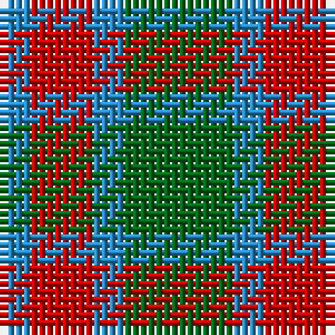

In pattern [BRBG](/patterns/brbg/).

This was sourced from register-of-tartans.  It is a [4 stripes tartan](/stripes/stripes4/).

Original link https://www.tartanregister.gov.uk/tartanDetails.aspx?ref=4739

## Thread count
B/4 R8 B4 G/14

## Palette
Each colour and its ΔE from the base-6 reference it is a variant of.

| Colour | Shade | Base | ΔE (OKLab) |
|---|---|---|---|
| B | <code style="background-color:#2888C4;">#2888C4</code> `#2888C4` | B <code style="background-color:#2A418A;">#2A418A</code> | 0.21 |
| DG | <code style="background-color:#003820;">#003820</code> `#003820` | G <code style="background-color:#006100;">#006100</code> | 0.15 |
| G | <code style="background-color:#006818;">#006818</code> `#006818` | G <code style="background-color:#006100;">#006100</code> | 0.02 |
| LG | <code style="background-color:#789484;">#789484</code> `#789484` | G <code style="background-color:#006100;">#006100</code> | 0.24 |
| R | <code style="background-color:#C80000;">#C80000</code> `#C80000` | R <code style="background-color:#CC0000;">#CC0000</code> | 0.01 |
| Ra | <code style="background-color:#C80000;">#C80000</code> `#C80000` | R <code style="background-color:#CC0000;">#CC0000</code> | 0.01 |

# Sample pattern

## Nearest tartans

The nearest existing variants by ΔTartan distance.

1. [Agnew](/setts/s3/b53g42r14~b304080-g008000-rc00000/) — ΔT 1.24
1. [Wilson's, No 208](/setts/s3/g7b2r4~b5480b0-g008000-rc00000~x2/) — ΔT 1.31
1. [Wilson's No.188](/setts/s4/g2r4g2b1~b2888c4-g006818-rc80000~x4/) — ΔT 1.35
1. [Wilson's No.203](/setts/s4/b2r4g5y1~b2888c4-g006818-rc80000-ye8c000~x4/) — ΔT 1.47
1. [Wilson's No.053](/setts/s5/b2g4k5g4b1~b5c8ca8-g408060-k101010~x2/) — ΔT 1.47
1. [Delroeux (Personal)](/setts/s4/b3g6y1r3~b2c2c80-g006818-rc80000-yfccc00~x10/) — ΔT 1.51
1. [Wilson's No 84, Ferguson](/setts/s3/b5g6r1~b304080-g008000-rc00000~x4/) — ΔT 1.56
1. [Wilson's, No 203](/setts/s4/b2r4g5y1~b5480b0-g008000-rc00000-yf0c000~x4/) — ΔT 1.56
1. [Coleman, Sarah-Louise (Personal)](/setts/s4/g2r1b3r1~b780078-g007800-r888888~x10/) — ΔT 1.57
1. [Creek Indian Nation](/setts/s5/b2g4y1b1r2~b2c2c80-g006818-rc80000-ye8c000~x12/) — ΔT 1.57

## Neighbour map

Every grey dot is one of 15726 variants placed by the first two principal components of the ΔTartan feature space (44% of its variance). Red is this tartan; blue dots are its nearest — click one to open its page.

<svg viewBox="0 0 640 380" role="img" style="max-width:100%;height:auto;border:1px solid #e0e0e0;border-radius:4px;display:block" xmlns="http://www.w3.org/2000/svg"><image href="/nn/cloud.v1.png" width="640" height="380"/><a href="/setts/s3/b53g42r14~b304080-g008000-rc00000/"><circle cx="245.7" cy="345.2" r="4" fill="#3465a4"><title>Agnew</title></circle></a><a href="/setts/s3/g7b2r4~b5480b0-g008000-rc00000~x2/"><circle cx="267.6" cy="339.6" r="4" fill="#3465a4"><title>Wilson's, No 208</title></circle></a><a href="/setts/s4/g2r4g2b1~b2888c4-g006818-rc80000~x4/"><circle cx="239.4" cy="315.0" r="4" fill="#3465a4"><title>Wilson's No.188</title></circle></a><a href="/setts/s4/b2r4g5y1~b2888c4-g006818-rc80000-ye8c000~x4/"><circle cx="176.0" cy="277.5" r="4" fill="#3465a4"><title>Wilson's No.203</title></circle></a><a href="/setts/s5/b2g4k5g4b1~b5c8ca8-g408060-k101010~x2/"><circle cx="223.7" cy="307.3" r="4" fill="#3465a4"><title>Wilson's No.053</title></circle></a><a href="/setts/s4/b3g6y1r3~b2c2c80-g006818-rc80000-yfccc00~x10/"><circle cx="192.8" cy="270.2" r="4" fill="#3465a4"><title>Delroeux (Personal)</title></circle></a><a href="/setts/s3/b5g6r1~b304080-g008000-rc00000~x4/"><circle cx="289.2" cy="322.3" r="4" fill="#3465a4"><title>Wilson's No 84, Ferguson</title></circle></a><a href="/setts/s4/b2r4g5y1~b5480b0-g008000-rc00000-yf0c000~x4/"><circle cx="179.6" cy="278.4" r="4" fill="#3465a4"><title>Wilson's, No 203</title></circle></a><a href="/setts/s4/g2r1b3r1~b780078-g007800-r888888~x10/"><circle cx="193.8" cy="324.5" r="4" fill="#3465a4"><title>Coleman, Sarah-Louise (Personal)</title></circle></a><a href="/setts/s5/b2g4y1b1r2~b2c2c80-g006818-rc80000-ye8c000~x12/"><circle cx="142.1" cy="273.4" r="4" fill="#3465a4"><title>Creek Indian Nation</title></circle></a><circle cx="224.0" cy="315.7" r="5" fill="#c00000"/></svg>

ID: /setts/s4/g7b2r4b2~b2888c4-g006818-rc80000~x2/
