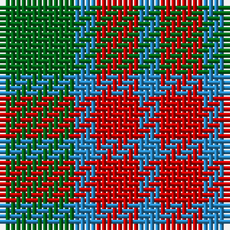

This page is one **sett** — a single exact thread-count. It belongs to the [tartan](/tartans/g7b2r4/)
(the same proportion at any scale), whose colour order is pattern [BRBG](/stripes/brbg/).

Sourced from register-of-tartans.  It is a [4 stripe tartan](/stripes/stripes4/).

Original link https://www.tartanregister.gov.uk/tartanDetails.aspx?ref=4739

## Also known as

This cloth is also recorded under:

- Wilson's, No 208

## Register references

External register numbers recorded for this tartan.

- Scottish Register of Tartans: [4739](https://www.tartanregister.gov.uk/tartanDetails.aspx?ref=4739)
- Scottish Tartans Authority (ITI): 740
- Scottish Tartans World Register: 740

## Thread count
G/14 B4 R8 B/4

## Palette
Each colour and the base-6 reference it is a variant of.

| Colour | Shade | Base |
|---|---|---|
| B | <code style="background-color:#2888C4;">#2888C4</code> `oklch(60.1% 0.125 241.5)` <small>#2888C4</small> | B <code style="background-color:#2A418A;">#2A418A</code> |
| DG | <code style="background-color:#003820;">#003820</code> `oklch(30.0% 0.070 158.3)` <small>#003820</small> | G <code style="background-color:#006100;">#006100</code> |
| G | <code style="background-color:#006818;">#006818</code> `oklch(45.0% 0.142 145.0)` <small>#006818</small> | G <code style="background-color:#006100;">#006100</code> |
| LG | <code style="background-color:#789484;">#789484</code> `oklch(64.0% 0.040 160.0)` <small>#789484</small> | G <code style="background-color:#006100;">#006100</code> |
| R | <code style="background-color:#C80000;">#C80000</code> `oklch(52.3% 0.215 29.2)` <small>#C80000</small> | R <code style="background-color:#CC0000;">#CC0000</code> |
| Ra | <code style="background-color:#C80000;">#C80000</code> `oklch(52.3% 0.215 29.2)` <small>#C80000</small> | R <code style="background-color:#CC0000;">#CC0000</code> |

# Sample pattern

## Nearest tartans

The nearest existing variants by ΔTartan distance, with this tartan at the top so the swatches line up against it.

ΔTartan

Tartan

Sett

—

<a href="/ttd/edit/#slug=g7t2r4~x2">Wilson's No.208</a> <a class="nn-out" href="/setts/s4/g7t2r4~x2/" title="open its dictionary page">↗</a>

1.24

<a href="/ttd/edit/#slug=db53g42r14">Agnew</a> <a class="nn-out" href="/setts/s3/db53g42r14/" title="open its dictionary page">↗</a>

1.31

<a href="/ttd/edit/#slug=g7t2r4~x2">Wilson's, No 208</a> <a class="nn-out" href="/setts/s3/g7t2r4~x2/" title="open its dictionary page">↗</a>

1.36

<a href="/ttd/edit/#slug=g2r4g2t1~x4">Wilson's No.188</a> <a class="nn-out" href="/setts/s4/g2r4g2t1~x4/" title="open its dictionary page">↗</a>

1.47

<a href="/ttd/edit/#slug=t2r4g5ly1~x4">Wilson's No.203</a> <a class="nn-out" href="/setts/s4/t2r4g5ly1~x4/" title="open its dictionary page">↗</a>

1.51

<a href="/ttd/edit/#slug=db3g6ly1r3~x10">Delroeux (Personal)</a> <a class="nn-out" href="/setts/s4/db3g6ly1r3~x10/" title="open its dictionary page">↗</a>

1.56

<a href="/ttd/edit/#slug=db5g6r1~x4">Wilson's No 84, Ferguson</a> <a class="nn-out" href="/setts/s3/db5g6r1~x4/" title="open its dictionary page">↗</a>

1.57

<a href="/ttd/edit/#slug=db2g4ly1db1r2~x12">Creek Indian Nation</a> <a class="nn-out" href="/setts/s5/db2g4ly1db1r2~x12/" title="open its dictionary page">↗</a>

1.57

<a href="/setts/s4/dp3o1g2~x10/">Coleman, Sarah-Louise (Personal)</a>

1.58

<a href="/ttd/edit/#slug=g6p5t1~x4">Wilson's, No 55</a> <a class="nn-out" href="/setts/s3/g6p5t1~x4/" title="open its dictionary page">↗</a>

1.61

<a href="/ttd/edit/#slug=lo28r24dg55dp19~x2">Hirstwood (Name)</a> <a class="nn-out" href="/setts/s4/lo28r24dg55dp19~x2/" title="open its dictionary page">↗</a>

## Neighbour map

Every grey dot is one of 14299 variants placed by the first two principal components of the ΔTartan feature space (44% of its variance). Red is this tartan; blue dots are its nearest — click one to open its page.

<svg viewBox="0 0 640 380" role="img" style="max-width:100%;height:auto;border:1px solid #e0e0e0;border-radius:4px;display:block" xmlns="http://www.w3.org/2000/svg"><image href="/nn/cloud.v1.png" width="640" height="380"/><a href="/setts/s3/db53g42r14/"><circle cx="248.0" cy="346.2" r="4" fill="#3465a4"><title>Agnew</title></circle></a><a href="/setts/s3/g7t2r4~x2/"><circle cx="268.7" cy="339.0" r="4" fill="#3465a4"><title>Wilson's, No 208</title></circle></a><a href="/setts/s4/g2r4g2t1~x4/"><circle cx="240.3" cy="313.7" r="4" fill="#3465a4"><title>Wilson's No.188</title></circle></a><a href="/setts/s4/t2r4g5ly1~x4/"><circle cx="177.5" cy="277.0" r="4" fill="#3465a4"><title>Wilson's No.203</title></circle></a><a href="/setts/s4/db3g6ly1r3~x10/"><circle cx="194.8" cy="269.2" r="4" fill="#3465a4"><title>Delroeux (Personal)</title></circle></a><a href="/setts/s3/db5g6r1~x4/"><circle cx="291.6" cy="323.6" r="4" fill="#3465a4"><title>Wilson's No 84, Ferguson</title></circle></a><a href="/setts/s5/db2g4ly1db1r2~x12/"><circle cx="144.5" cy="273.3" r="4" fill="#3465a4"><title>Creek Indian Nation</title></circle></a><a href="/setts/s4/dp3o1g2~x10/"><circle cx="195.5" cy="324.5" r="4" fill="#3465a4"><title>Coleman, Sarah-Louise (Personal)</title></circle></a><a href="/setts/s3/g6p5t1~x4/"><circle cx="273.8" cy="304.5" r="4" fill="#3465a4"><title>Wilson's, No 55</title></circle></a><a href="/setts/s4/lo28r24dg55dp19~x2/"><circle cx="163.0" cy="320.7" r="4" fill="#3465a4"><title>Hirstwood (Name)</title></circle></a><circle cx="225.9" cy="316.4" r="5" fill="#c00000"/></svg>

ID: /setts/s4/g7t2r4~x2/
