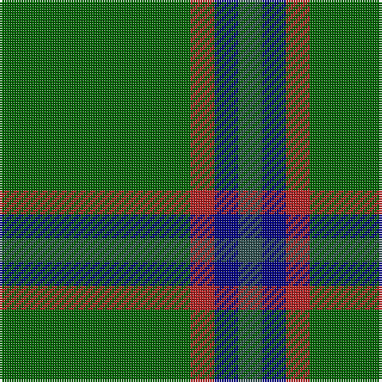

In pattern [BBRG](/patterns/bbrg/).

This was sourced from register-of-tartans.  It is a [4 stripes tartan](/stripes/stripes4/).

Original link https://www.tartanregister.gov.uk/tartanDetails.aspx?ref=10110

## Thread count
G/80 R10 DB10 N/10

## Palette
Each colour and its ΔE from the base-6 reference it is a variant of.

| Colour | Shade | Base | ΔE (OKLab) |
|---|---|---|---|
| DB | <code style="background-color:#000080;">#000080</code> `#000080` | B <code style="background-color:#2C4084;">#2C4084</code> | 0.14 |
| G | <code style="background-color:#006400;">#006400</code> `#006400` | G <code style="background-color:#006400;">#006400</code> | 0.00 |
| N | <code style="background-color:#2F4F4F;">#2F4F4F</code> `#2F4F4F` | B <code style="background-color:#2C4084;">#2C4084</code> | 0.11 |
| R | <code style="background-color:#B22222;">#B22222</code> `#B22222` | R <code style="background-color:#C80000;">#C80000</code> | 0.04 |

# Sample pattern

ID: /setts/s4/g80r10b10ba10-b000080-ba2f4f4f-g006400-rb22222/
