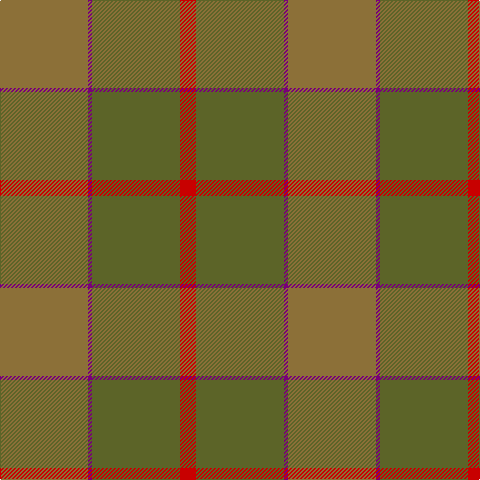

In pattern [GBGR](/patterns/gbgr/).

This was sourced from tartans-authority.  It is a [4 stripes tartan](/stripes/stripes4/).

Original link http://www.tartansauthority.com/tartan-ferret/display/11134/

## Thread count
LT/88 P4 G88 R/16

## Palette
Each colour and its ΔE from the base-6 reference it is a variant of.

| Colour | Shade | Base | ΔE (OKLab) |
|---|---|---|---|
| G | <code style="background-color:#5C6428;">#5C6428</code> `#5C6428` | G <code style="background-color:#006400;">#006400</code> | 0.09 |
| LT | <code style="background-color:#8C7038;">#8C7038</code> `#8C7038` | G <code style="background-color:#006400;">#006400</code> | 0.18 |
| P | <code style="background-color:#780078;">#780078</code> `#780078` | B <code style="background-color:#2C4084;">#2C4084</code> | 0.16 |
| R | <code style="background-color:#C80000;">#C80000</code> `#C80000` | R <code style="background-color:#C80000;">#C80000</code> | 0.00 |

# Sample pattern

## Nearest tartans

The nearest existing variants by ΔTartan distance.

1. [Outlander #1](/setts/s6/g104y4b48r6ya52b8-b5c5c5c-g808080-r960000-ye8c000-yaa08858/) — ΔT 1.99
1. [McGuigan, Julia (St Monans, Fife) (Personal)](/setts/s4/g18ga104gb30y8-g70714d-ga5a601e-gb4e3d20-ybfab40/) — ΔT 2.11
1. [Outlander #1](/setts/s6/r104y4b48ra6ya52b8-b5c5c5c-r888888-raa00000-yfccc00-yaa08858/) — ΔT 2.21
1. [McWilliams Hunting (2014)](/setts/s4/r88ra4g88b16-b4c0000-g767e52-rb07430-ra781c38/) — ΔT 2.23
1. [Highland Greenford (Personal)](/setts/s4/g100ga50y4b12-b440044-g5c6428-ga604000-yc4bc68/) — ΔT 2.35
1. [Sanix Muted](/setts/s4/g6ga60g80r6-g003820-ga603800-r880000/) — ΔT 2.46
1. [London Regiment (Military)](/setts/s6/g68b54r6b54g68w6-b687488-g747c60-rc80000-wfcfcfc/) — ΔT 2.46
1. [Jardine](/setts/s8/b36r36g36ra4ga4r36ga4ra4-b5c5c5c-g787878-ga789484-ra46000-rac80000/) — ΔT 2.47
1. [MacKinnon Htg (Clan)](/setts/s7/g4ga32g32ga4g32ga32g4-g604000-ga006818/) — ΔT 2.47
1. [de Meuron (Neuchâtel) Day, The](/setts/s7/g80b10g12ga52gb26gc18ga6-b2613cd-g4f310f-ga214211-gb184f06-gc1e5b30/) — ΔT 2.57

## Neighbour map

Every grey dot is one of 15726 variants placed by the first two principal components of the ΔTartan feature space (44% of its variance). Red is this tartan; blue dots are its nearest — click one to open its page.

<svg viewBox="0 0 640 380" role="img" style="max-width:100%;height:auto;border:1px solid #e0e0e0;border-radius:4px;display:block" xmlns="http://www.w3.org/2000/svg"><image href="/nn/cloud.v1.png" width="640" height="380"/><a href="/setts/s6/g104y4b48r6ya52b8-b5c5c5c-g808080-r960000-ye8c000-yaa08858/"><circle cx="420.5" cy="215.9" r="4" fill="#3465a4"><title>Outlander #1</title></circle></a><a href="/setts/s4/g18ga104gb30y8-g70714d-ga5a601e-gb4e3d20-ybfab40/"><circle cx="536.8" cy="289.9" r="4" fill="#3465a4"><title>McGuigan, Julia (St Monans, Fife) (Personal)</title></circle></a><a href="/setts/s6/r104y4b48ra6ya52b8-b5c5c5c-r888888-raa00000-yfccc00-yaa08858/"><circle cx="405.6" cy="208.0" r="4" fill="#3465a4"><title>Outlander #1</title></circle></a><a href="/setts/s4/r88ra4g88b16-b4c0000-g767e52-rb07430-ra781c38/"><circle cx="408.2" cy="247.0" r="4" fill="#3465a4"><title>McWilliams Hunting (2014)</title></circle></a><a href="/setts/s4/g100ga50y4b12-b440044-g5c6428-ga604000-yc4bc68/"><circle cx="504.4" cy="250.5" r="4" fill="#3465a4"><title>Highland Greenford (Personal)</title></circle></a><a href="/setts/s4/g6ga60g80r6-g003820-ga603800-r880000/"><circle cx="535.3" cy="319.9" r="4" fill="#3465a4"><title>Sanix Muted</title></circle></a><a href="/setts/s6/g68b54r6b54g68w6-b687488-g747c60-rc80000-wfcfcfc/"><circle cx="466.6" cy="311.9" r="4" fill="#3465a4"><title>London Regiment (Military)</title></circle></a><a href="/setts/s8/b36r36g36ra4ga4r36ga4ra4-b5c5c5c-g787878-ga789484-ra46000-rac80000/"><circle cx="354.7" cy="252.3" r="4" fill="#3465a4"><title>Jardine</title></circle></a><a href="/setts/s7/g4ga32g32ga4g32ga32g4-g604000-ga006818/"><circle cx="443.0" cy="318.1" r="4" fill="#3465a4"><title>MacKinnon Htg (Clan)</title></circle></a><a href="/setts/s7/g80b10g12ga52gb26gc18ga6-b2613cd-g4f310f-ga214211-gb184f06-gc1e5b30/"><circle cx="382.3" cy="261.2" r="4" fill="#3465a4"><title>de Meuron (Neuchâtel) Day, The</title></circle></a><circle cx="467.3" cy="278.7" r="5" fill="#c00000"/></svg>

ID: /setts/s4/g88b4ga88r16-b780078-g8c7038-ga5c6428-rc80000/
