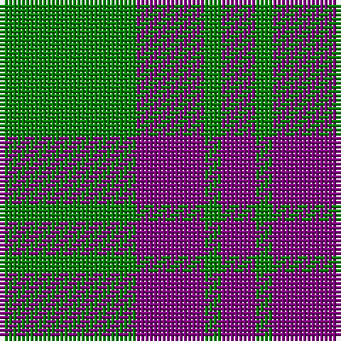

In pattern [BGBG](/stripes/bgbg/).

This was sourced from weddslist.  It is a [4 stripe tartan](/stripes/stripes4/).

Original link http://www.weddslist.com/cgi-bin/tartans/pg.pl?source=sts

## Thread count
G/32 P16 G4 P/8

## Palette
Each colour and the base-6 reference it is a variant of.

| Colour | Shade | Base |
|---|---|---|
| G | <code style="background-color:#008000;">#008000</code> `oklch(52.0% 0.177 142.5)` <small>#008000</small> | G <code style="background-color:#006100;">#006100</code> |
| P | <code style="background-color:#800080;">#800080</code> `oklch(42.1% 0.193 328.4)` <small>#800080</small> | B <code style="background-color:#2A418A;">#2A418A</code> |

# Sample pattern

## Nearest tartans

The nearest existing variants by ΔTartan distance, with this tartan at the top so the swatches line up against it.

ΔTartan

Tartan

Sett

—

<a href="/ttd/edit/#slug=g8p4g1p2~x4">Wilson's, No 211</a> <a class="nn-out" href="/setts/s4/g8p4g1p2~x4/" title="open its dictionary page">↗</a>

0.89

<a href="/setts/s4/g28dp10g3~x2/">Elphinstone Clan Tartan Tartan Number: 115. Earliest known date: 1842 The village of Elphinstone is next to Tranent near Edinburgh in East Lothian. Sir Henry Elphinstone of Pittendriech in Midlothian was created Baron Elphinstone in 1509 and fell at Flodden Field. The Elphinstone tartan first appeared in the text of the Vestiarium Scoticum (1842). It is similar to some extent with the Montgomerie tartan and to the Montgomerie Hunting sett, suggesting a link to an early provenance. D.W. Stewart (1893) maintained that he could date the Montgomerie of Eglinton to 1707. See products available Copyright © Blair Urquhart, Comrie, 2015</a>

1.23

<a href="/ttd/edit/#slug=dg21lo44dg86t10">Special Saffron (Fashion)</a> <a class="nn-out" href="/setts/s4/dg21lo44dg86t10/" title="open its dictionary page">↗</a>

1.35

<a href="/setts/s4/g6dp2g1~x4/">Elphinstone</a>

1.35

<a href="/setts/s4/g6dp2g1~x20/">Elphinstone Check (Clan)</a>

1.38

<a href="/setts/s4/g12p3g1~x2/">Elphinstone</a>

1.55

<a href="/ttd/edit/#slug=dg21lo43dg86b10">Special, Saffron</a> <a class="nn-out" href="/setts/s4/dg21lo43dg86b10/" title="open its dictionary page">↗</a>

1.55

<a href="/ttd/edit/#slug=y8k3y17k13y6k3y4~x2">Scott Black and Grey</a> <a class="nn-out" href="/setts/s7/y8k3y17k13y6k3y4~x2/" title="open its dictionary page">↗</a>

1.59

<a href="/ttd/edit/#slug=o8k3o17k13o6k3o4~x2">Scott Black &amp; Grey (Corporate)</a> <a class="nn-out" href="/setts/s7/o8k3o17k13o6k3o4~x2/" title="open its dictionary page">↗</a>

1.59

<a href="/ttd/edit/#slug=dg86lo44dg21lo44dg86t10">Special Saffron</a> <a class="nn-out" href="/setts/s6/dg86lo44dg21lo44dg86t10/" title="open its dictionary page">↗</a>

1.63

<a href="/ttd/edit/#slug=dg2o14dg8o3dg12db2~x2">Confederate Infantry</a> <a class="nn-out" href="/setts/s6/dg2o14dg8o3dg12db2~x2/" title="open its dictionary page">↗</a>

## Neighbour map

Every grey dot is one of 14299 variants placed by the first two principal components of the ΔTartan feature space (44% of its variance). Red is this tartan; blue dots are its nearest — click one to open its page.

<svg viewBox="0 0 640 380" role="img" style="max-width:100%;height:auto;border:1px solid #e0e0e0;border-radius:4px;display:block" xmlns="http://www.w3.org/2000/svg"><image href="/nn/cloud.v1.png" width="640" height="380"/><a href="/setts/s4/g28dp10g3~x2/"><circle cx="408.4" cy="287.6" r="4" fill="#3465a4"><title>Elphinstone Clan Tartan Tartan Number: 115. Earliest known date: 1842 The village of Elphinstone is next to Tranent near Edinburgh in East Lothian. Sir Henry Elphinstone of Pittendriech in Midlothian was created Baron Elphinstone in 1509 and fell at Flodden Field. The Elphinstone tartan first appeared in the text of the Vestiarium Scoticum (1842). It is similar to some extent with the Montgomerie tartan and to the Montgomerie Hunting sett, suggesting a link to an early provenance. D.W. Stewart (1893) maintained that he could date the Montgomerie of Eglinton to 1707. See products available Copyright © Blair Urquhart, Comrie, 2015</title></circle></a><a href="/setts/s4/dg21lo44dg86t10/"><circle cx="372.7" cy="262.0" r="4" fill="#3465a4"><title>Special Saffron (Fashion)</title></circle></a><a href="/setts/s4/g6dp2g1~x4/"><circle cx="408.3" cy="314.5" r="4" fill="#3465a4"><title>Elphinstone</title></circle></a><a href="/setts/s4/g6dp2g1~x20/"><circle cx="408.3" cy="314.5" r="4" fill="#3465a4"><title>Elphinstone Check (Clan)</title></circle></a><a href="/setts/s4/g12p3g1~x2/"><circle cx="452.3" cy="257.5" r="4" fill="#3465a4"><title>Elphinstone</title></circle></a><a href="/setts/s4/dg21lo43dg86b10/"><circle cx="379.1" cy="263.5" r="4" fill="#3465a4"><title>Special, Saffron</title></circle></a><a href="/setts/s7/y8k3y17k13y6k3y4~x2/"><circle cx="362.7" cy="273.5" r="4" fill="#3465a4"><title>Scott Black and Grey</title></circle></a><a href="/setts/s7/o8k3o17k13o6k3o4~x2/"><circle cx="356.0" cy="269.5" r="4" fill="#3465a4"><title>Scott Black &amp; Grey (Corporate)</title></circle></a><a href="/setts/s6/dg86lo44dg21lo44dg86t10/"><circle cx="355.1" cy="256.4" r="4" fill="#3465a4"><title>Special Saffron</title></circle></a><a href="/setts/s6/dg2o14dg8o3dg12db2~x2/"><circle cx="313.8" cy="262.0" r="4" fill="#3465a4"><title>Confederate Infantry</title></circle></a><circle cx="375.3" cy="281.6" r="5" fill="#c00000"/></svg>

ID: /setts/s4/g8p4g1p2~x4/
