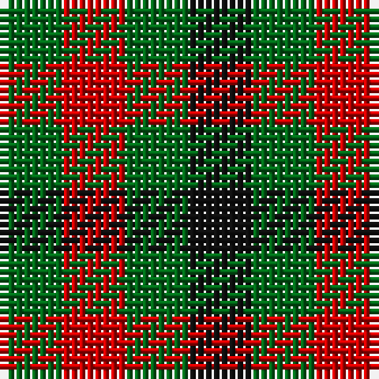

In pattern [GRGK](/patterns/grgk/).

This was sourced from register-of-tartans.  It is a [4 stripes tartan](/stripes/stripes4/).

Original link https://www.tartanregister.gov.uk/tartanDetails.aspx?ref=4720

## Thread count
G/8 R8 G8 K/8

## Palette
Each colour and its ΔE from the base-6 reference it is a variant of.

| Colour | Shade | Base | ΔE (OKLab) |
|---|---|---|---|
| DG | <code style="background-color:#003820;">#003820</code> `#003820` | G <code style="background-color:#006400;">#006400</code> | 0.16 |
| G | <code style="background-color:#006818;">#006818</code> `#006818` | G <code style="background-color:#006400;">#006400</code> | 0.02 |
| K | <code style="background-color:#101010;">#101010</code> `#101010` | K <code style="background-color:#000000;">#000000</code> | 0.17 |
| R | <code style="background-color:#C80000;">#C80000</code> `#C80000` | R <code style="background-color:#C80000;">#C80000</code> | 0.00 |
| Ra | <code style="background-color:#C80000;">#C80000</code> `#C80000` | R <code style="background-color:#C80000;">#C80000</code> | 0.00 |

# Sample pattern

## Nearest tartans

The nearest existing variants by ΔTartan distance.

1. [Ballindalloch Check](/setts/s5/b8r8b8r8g8-b4c0c28-g004c00-ra0783c/) — ΔT 1.43
1. [Wilson's No.204](/setts/s3/k22g18r20-g006818-k101010-rc80000/) — ΔT 1.80
1. [Wilson's, No 187](/setts/s3/k8g8r8-g008000-k000000-rc00000/) — ΔT 2.09
1. [Rob Roy, Black & Tan (Fashion)](/setts/s2/g100k100-g8c7038-k101010/) — ΔT 2.17
1. [Wilson's, No 204](/setts/s3/r20k22g18-g008000-k000000-rc00000/) — ΔT 2.22
1. [Seaforth (Estate Check)](/setts/s9/g12r12k12r12g12r12k12r12ra12-g886000-k000000-ra0783c-ra8c0000/) — ΔT 2.35
1. [Seaforth Estate Check Estate Check Weavers Tartan Tartan Number: 5344. Earliest known date: pre 1990 No details. See products available Copyright © Blair Urquhart, Comrie, 2015](/setts/s9/g6r6k6r6g6r6k6r6ra6-g886000-k000000-ra0783c-ra8c0000/) — ΔT 2.35
1. [Wilson's No.185](/setts/s3/k22g18b20-b780078-g006818-k101010/) — ΔT 2.35
1. [Shepherd (Brown & White)](/setts/s4/g6w6g6w6-g604000-wc0c0c0/) — ΔT 2.42
1. [Hogg](/setts/s4/k8w8b8w8-b441800-k101010-we0e0e0/) — ΔT 2.49

## Neighbour map

Every grey dot is one of 15726 variants placed by the first two principal components of the ΔTartan feature space (44% of its variance). Red is this tartan; blue dots are its nearest — click one to open its page.

<svg viewBox="0 0 640 380" role="img" style="max-width:100%;height:auto;border:1px solid #e0e0e0;border-radius:4px;display:block" xmlns="http://www.w3.org/2000/svg"><image href="/nn/cloud.v1.png" width="640" height="380"/><a href="/setts/s5/b8r8b8r8g8-b4c0c28-g004c00-ra0783c/"><circle cx="71.8" cy="366.0" r="4" fill="#3465a4"><title>Ballindalloch Check</title></circle></a><a href="/setts/s3/k22g18r20-g006818-k101010-rc80000/"><circle cx="67.9" cy="366.0" r="4" fill="#3465a4"><title>Wilson's No.204</title></circle></a><a href="/setts/s3/k8g8r8-g008000-k000000-rc00000/"><circle cx="14.0" cy="366.0" r="4" fill="#3465a4"><title>Wilson's, No 187</title></circle></a><a href="/setts/s2/g100k100-g8c7038-k101010/"><circle cx="167.7" cy="366.0" r="4" fill="#3465a4"><title>Rob Roy, Black &amp; Tan (Fashion)</title></circle></a><a href="/setts/s3/r20k22g18-g008000-k000000-rc00000/"><circle cx="38.6" cy="366.0" r="4" fill="#3465a4"><title>Wilson's, No 204</title></circle></a><a href="/setts/s9/g12r12k12r12g12r12k12r12ra12-g886000-k000000-ra0783c-ra8c0000/"><circle cx="14.0" cy="366.0" r="4" fill="#3465a4"><title>Seaforth (Estate Check)</title></circle></a><a href="/setts/s9/g6r6k6r6g6r6k6r6ra6-g886000-k000000-ra0783c-ra8c0000/"><circle cx="14.0" cy="366.0" r="4" fill="#3465a4"><title>Seaforth Estate Check Estate Check Weavers Tartan Tartan Number: 5344. Earliest known date: pre 1990 No details. See products available Copyright © Blair Urquhart, Comrie, 2015</title></circle></a><a href="/setts/s3/k22g18b20-b780078-g006818-k101010/"><circle cx="80.7" cy="366.0" r="4" fill="#3465a4"><title>Wilson's No.185</title></circle></a><a href="/setts/s4/g6w6g6w6-g604000-wc0c0c0/"><circle cx="138.4" cy="366.0" r="4" fill="#3465a4"><title>Shepherd (Brown &amp; White)</title></circle></a><a href="/setts/s4/k8w8b8w8-b441800-k101010-we0e0e0/"><circle cx="40.5" cy="366.0" r="4" fill="#3465a4"><title>Hogg</title></circle></a><circle cx="94.6" cy="366.0" r="5" fill="#c00000"/></svg>

ID: /setts/s4/g8r8g8k8-g006818-k101010-rc80000/
