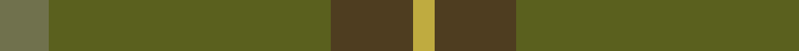
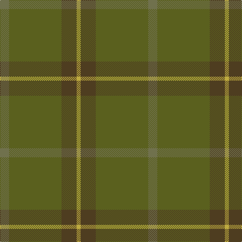

In pattern [GGGY](/patterns/gggy/).

This was sourced from register-of-tartans.  It is a [4 stripes tartan](/stripes/stripes4/).

Original link https://www.tartanregister.gov.uk/tartanDetails.aspx?ref=10605

## Attestations

This cloth appears in 2 source records; the oldest owns this page.

- 16/01/2012 — McGuigan, Julia (St Monans, Fife) (Personal) (register-of-tartans, [record](https://www.tartanregister.gov.uk/tartanDetails.aspx?ref=10605))
- undated — McGuigan, Julia (St Monans, Fife Name Tartan Tartan Number: 10605. Earliest known date: 16/01/2012 Inspired by the MacNeil of Colonsay tartan (STR ref #2688), as the surname McGuigan is considered a sept of MacNeil of Colonsay and Gigha. Using the green, red and white stripes of the MacNeil of Colonsay tartan, the colours have been toned down to create a softer palette. See products available Copyright © Blair Urquhart, Comrie, 2015 (house-of-tartan, [record](http://www.house-of-tartan.scotland.net/house/TartanViewjs.asp?colr=Def&tnam=10605))

## Register references

External register numbers recorded for this tartan.

- Scottish Register of Tartans: [10605](https://www.tartanregister.gov.uk/tartanDetails.aspx?ref=10605)

## Thread count
Ga/18 G104 T30 O/8

## Palette
Each colour and its ΔE from the base-6 reference it is a variant of.

| Colour | Shade | Base | ΔE (OKLab) |
|---|---|---|---|
| G | <code style="background-color:#5A601E;">#5A601E</code> `#5A601E` | G <code style="background-color:#006100;">#006100</code> | 0.09 |
| Ga | <code style="background-color:#70714D;">#70714D</code> `#70714D` | G <code style="background-color:#006100;">#006100</code> | 0.15 |
| O | <code style="background-color:#BFAB40;">#BFAB40</code> `#BFAB40` | Y <code style="background-color:#F2BF00;">#F2BF00</code> | 0.10 |
| T | <code style="background-color:#4E3D20;">#4E3D20</code> `#4E3D20` | G <code style="background-color:#006100;">#006100</code> | 0.14 |

# Sample pattern

## Nearest tartans

The nearest existing variants by ΔTartan distance.

1. [Glen Boig Trade Tartan Tartan Number: 915. Earliest known date: Modern Many new designs have been given district names to promote their Scottish connections. However, these names should not be confused with the District tartans which have earned their title through 'use and wont' and not a little history. See products available Copyright © Blair Urquhart, Comrie, 2015](/setts/s5/g37ga9g3b9ga3~b441800-g5c6428-ga604000~x2/) — ΔT 1.33
1. [Glen Boig](/setts/s5/g13ga3g1b3ga1~b4c3428-g006818-ga604000~x6/) — ΔT 1.64
1. [Sanix Muted](/setts/s4/g3ga30g40r3~g003820-ga603800-r880000~x2/) — ΔT 1.74
1. [Highland Greenford (Personal)](/setts/s4/g50ga25y2b6~b440044-g5c6428-ga604000-yc4bc68~x2/) — ΔT 1.84
1. [McWilliams (2014)](/setts/s4/g22b1ga22r4~b780078-g8c7038-ga5c6428-rc80000~x4/) — ΔT 2.11
1. [Tricor (Corporate)](/setts/s7/g23r4ga6gb6g4w1g4~g8c7038-ga604000-gb00643c-r98481c-wc0c0c0~x4/) — ΔT 2.11
1. [Gayre Bodyguard](/setts/s8/g18r6g75b6g13ga35g12b6~b2c4084-g005020-ga503c14-rdc0000/) — ΔT 2.15
1. [Cairns, David (Personal)](/setts/s5/b11ba1b4ba8r1~b393939-ba5b5b5b-ra40b00~x8/) — ΔT 2.17
1. [MacKinnon Htg (Clan)](/setts/s7/g1ga8g8ga1g8ga8g1~g604000-ga006818~x4/) — ΔT 2.29
1. [Cairns, David (Personal)](/setts/s5/b11r1b4r8ra1~b5c5c5c-r888888-ra880000~x8/) — ΔT 2.36

## Neighbour map

Every grey dot is one of 15726 variants placed by the first two principal components of the ΔTartan feature space (44% of its variance). Red is this tartan; blue dots are its nearest — click one to open its page.

<svg viewBox="0 0 640 380" role="img" style="max-width:100%;height:auto;border:1px solid #e0e0e0;border-radius:4px;display:block" xmlns="http://www.w3.org/2000/svg"><image href="/nn/cloud.v1.png" width="640" height="380"/><a href="/setts/s5/g37ga9g3b9ga3~b441800-g5c6428-ga604000~x2/"><circle cx="555.4" cy="283.3" r="4" fill="#3465a4"><title>Glen Boig Trade Tartan Tartan Number: 915. Earliest known date: Modern Many new designs have been given district names to promote their Scottish connections. However, these names should not be confused with the District tartans which have earned their title through 'use and wont' and not a little history. See products available Copyright © Blair Urquhart, Comrie, 2015</title></circle></a><a href="/setts/s5/g13ga3g1b3ga1~b4c3428-g006818-ga604000~x6/"><circle cx="568.5" cy="290.1" r="4" fill="#3465a4"><title>Glen Boig</title></circle></a><a href="/setts/s4/g3ga30g40r3~g003820-ga603800-r880000~x2/"><circle cx="536.9" cy="317.0" r="4" fill="#3465a4"><title>Sanix Muted</title></circle></a><a href="/setts/s4/g50ga25y2b6~b440044-g5c6428-ga604000-yc4bc68~x2/"><circle cx="506.1" cy="248.8" r="4" fill="#3465a4"><title>Highland Greenford (Personal)</title></circle></a><a href="/setts/s4/g22b1ga22r4~b780078-g8c7038-ga5c6428-rc80000~x4/"><circle cx="470.1" cy="273.8" r="4" fill="#3465a4"><title>McWilliams (2014)</title></circle></a><a href="/setts/s7/g23r4ga6gb6g4w1g4~g8c7038-ga604000-gb00643c-r98481c-wc0c0c0~x4/"><circle cx="507.6" cy="206.5" r="4" fill="#3465a4"><title>Tricor (Corporate)</title></circle></a><a href="/setts/s8/g18r6g75b6g13ga35g12b6~b2c4084-g005020-ga503c14-rdc0000/"><circle cx="540.9" cy="253.8" r="4" fill="#3465a4"><title>Gayre Bodyguard</title></circle></a><a href="/setts/s5/b11ba1b4ba8r1~b393939-ba5b5b5b-ra40b00~x8/"><circle cx="545.7" cy="320.9" r="4" fill="#3465a4"><title>Cairns, David (Personal)</title></circle></a><a href="/setts/s7/g1ga8g8ga1g8ga8g1~g604000-ga006818~x4/"><circle cx="445.5" cy="312.4" r="4" fill="#3465a4"><title>MacKinnon Htg (Clan)</title></circle></a><a href="/setts/s5/b11r1b4r8ra1~b5c5c5c-r888888-ra880000~x8/"><circle cx="505.2" cy="297.6" r="4" fill="#3465a4"><title>Cairns, David (Personal)</title></circle></a><circle cx="538.8" cy="286.7" r="5" fill="#c00000"/></svg>

ID: /setts/s4/g9ga52gb15y4~g70714d-ga5a601e-gb4e3d20-ybfab40~x2/
