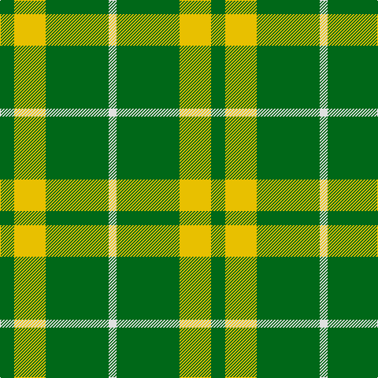

This page is one **sett** — a single exact thread-count. It belongs to the [tartan](/tartans/g9ly20g40w5/)
(the same proportion at any scale), whose colour order is pattern [GYGW](/stripes/gygw/).

Sourced from house-of-tartan.  It is a [4 stripe tartan](/stripes/stripes4/).

Original link http://www.house-of-tartan.scotland.net/house/TartanViewjs.asp?colr=Def&tnam=2464

## Thread count
G/18 Y40 G80 LN/10

## Palette

Palette: <strong>Tartan Register</strong>
<table><thead><tr><th>Colour</th><th>Threads</th><th>Shade</th><th>Base</th><th>OKLCh</th></tr></thead><tbody><tr><td>G/</td><td style="text-align:right;font-variant-numeric:tabular-nums">18</td><td><code style="background-color:#006818;">#006818</code> <small style="color:#888">#006818</small></td><td>G <code style="background-color:#006100;">#006100</code></td><td><small style="color:#888">oklch(45.0% 0.142 145.0)</small></td></tr><tr><td>Y</td><td style="text-align:right;font-variant-numeric:tabular-nums">40</td><td><code style="background-color:#E8C000;">#E8C000</code> <small style="color:#888">#E8C000</small></td><td>Y <code style="background-color:#F2BF00;">#F2BF00</code></td><td><small style="color:#888">oklch(81.9% 0.168 93.7)</small></td></tr><tr><td>G</td><td style="text-align:right;font-variant-numeric:tabular-nums">80</td><td><code style="background-color:#006818;">#006818</code> <small style="color:#888">#006818</small></td><td>G <code style="background-color:#006100;">#006100</code></td><td><small style="color:#888">oklch(45.0% 0.142 145.0)</small></td></tr><tr><td>LN/</td><td style="text-align:right;font-variant-numeric:tabular-nums">10</td><td><code style="background-color:#E0E0E0;">#E0E0E0</code> <small style="color:#888">#E0E0E0</small></td><td>W <code style="background-color:#F7F7F7;">#F7F7F7</code></td><td><small style="color:#888">oklch(90.7% 0.000 89.9)</small></td></tr></tbody></table>

# Sample pattern

## Nearest tartans

The nearest existing variants by ΔTartan distance, with this tartan at the top so the swatches line up against it.

ΔTartan

Tartan

Sett

—

<a href="/ttd/edit/#slug=g9ly20g40w5~x2">O'Neill Irish Family Tartan Tartan Number: 2464. Earliest known date: 1985 O'Neill is an Irish family tartan. The dark yellow stripe is mustard or dark saffron. See products available Copyright © Blair Urquhart, Comrie, 2015</a> <a class="nn-out" href="/setts/s4/g9ly20g40w5~x2/" title="open its dictionary page">↗</a>

1.28

<a href="/ttd/edit/#slug=g81r10ly20~x2">McMoosie</a> <a class="nn-out" href="/setts/s3/g81r10ly20~x2/" title="open its dictionary page">↗</a>

1.41

<a href="/ttd/edit/#slug=g20w2g9w2ly5w7g10~x2">Heritage (Commemorative)</a> <a class="nn-out" href="/setts/s7/g20w2g9w2ly5w7g10~x2/" title="open its dictionary page">↗</a>

1.48

<a href="/ttd/edit/#slug=g9lo20g40w5~x2">O'Neill</a> <a class="nn-out" href="/setts/s4/g9lo20g40w5~x2/" title="open its dictionary page">↗</a>

1.55

<a href="/ttd/edit/#slug=g56dy13ly13w5~x2">Colonial Marine (Aliens Legacy)</a> <a class="nn-out" href="/setts/s4/g56dy13ly13w5~x2/" title="open its dictionary page">↗</a>

1.67

<a href="/ttd/edit/#slug=dg21ly43dg86t10">Special Saffron Tartan Tartan Number: 201. Earliest known date: pre 2003 Y = Saffron See products available Copyright © Blair Urquhart, Comrie, 2015</a> <a class="nn-out" href="/setts/s4/dg21ly43dg86t10/" title="open its dictionary page">↗</a>

1.78

<a href="/ttd/edit/#slug=g19w5g2k5w2~x2">Loch Rannoch</a> <a class="nn-out" href="/setts/s5/g19w5g2k5w2~x2/" title="open its dictionary page">↗</a>

1.79

<a href="/ttd/edit/#slug=db9dg16g56ly4~x2">Oxford University</a> <a class="nn-out" href="/setts/s4/db9dg16g56ly4~x2/" title="open its dictionary page">↗</a>

1.81

<a href="/ttd/edit/#slug=dg20w2dg9w2ly5w7dg10~x2">Heritage #2</a> <a class="nn-out" href="/setts/s7/dg20w2dg9w2ly5w7dg10~x2/" title="open its dictionary page">↗</a>

1.83

<a href="/ttd/edit/#slug=g37w9g3k9w3">Loch Rannoch</a> <a class="nn-out" href="/setts/s5/g37w9g3k9w3/" title="open its dictionary page">↗</a>

1.85

<a href="/ttd/edit/#slug=k2ly1g7t1~x2">Wilson's No.140</a> <a class="nn-out" href="/setts/s4/k2ly1g7t1~x2/" title="open its dictionary page">↗</a>

## Neighbour map

Every grey dot is one of 14359 variants placed by the first two principal components of the ΔTartan feature space (44% of its variance). Red is this tartan; blue dots are its nearest — click one to open its page.

<svg viewBox="0 0 640 380" role="img" style="max-width:100%;height:auto;border:1px solid #e0e0e0;border-radius:4px;display:block" xmlns="http://www.w3.org/2000/svg"><image href="/nn/cloud.v1.png" width="640" height="380"/><a href="/setts/s3/g81r10ly20~x2/"><circle cx="440.5" cy="274.5" r="4" fill="#3465a4"><title>McMoosie</title></circle></a><a href="/setts/s7/g20w2g9w2ly5w7g10~x2/"><circle cx="379.3" cy="230.1" r="4" fill="#3465a4"><title>Heritage (Commemorative)</title></circle></a><a href="/setts/s4/g9lo20g40w5~x2/"><circle cx="404.7" cy="281.9" r="4" fill="#3465a4"><title>O'Neill</title></circle></a><a href="/setts/s4/g56dy13ly13w5~x2/"><circle cx="363.8" cy="225.2" r="4" fill="#3465a4"><title>Colonial Marine (Aliens Legacy)</title></circle></a><a href="/setts/s4/dg21ly43dg86t10/"><circle cx="356.7" cy="255.8" r="4" fill="#3465a4"><title>Special Saffron Tartan Tartan Number: 201. Earliest known date: pre 2003 Y = Saffron See products available Copyright © Blair Urquhart, Comrie, 2015</title></circle></a><a href="/setts/s5/g19w5g2k5w2~x2/"><circle cx="332.3" cy="217.3" r="4" fill="#3465a4"><title>Loch Rannoch</title></circle></a><a href="/setts/s4/db9dg16g56ly4~x2/"><circle cx="384.0" cy="221.3" r="4" fill="#3465a4"><title>Oxford University</title></circle></a><a href="/setts/s7/dg20w2dg9w2ly5w7dg10~x2/"><circle cx="371.7" cy="226.5" r="4" fill="#3465a4"><title>Heritage #2</title></circle></a><a href="/setts/s5/g37w9g3k9w3/"><circle cx="356.6" cy="204.1" r="4" fill="#3465a4"><title>Loch Rannoch</title></circle></a><a href="/setts/s4/k2ly1g7t1~x2/"><circle cx="336.9" cy="248.6" r="4" fill="#3465a4"><title>Wilson's No.140</title></circle></a><circle cx="361.9" cy="261.2" r="5" fill="#c00000"/></svg>

ID: /setts/s4/g9ly20g40w5~x2/
