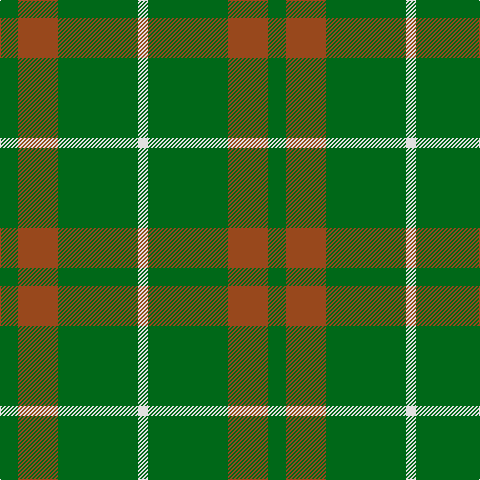

In pattern [GRGW](/stripes/grgw/).

This was sourced from tartans-authority.  It is a [4 stripe tartan](/stripes/stripes4/).

Original link http://www.tartansauthority.com/tartan-ferret/display/2464/

## Thread count
G/18 T40 G80 LN/10

## Palette
Each colour and the base-6 reference it is a variant of.

| Colour | Shade | Base |
|---|---|---|
| G | <code style="background-color:#006818;">#006818</code> `oklch(45.0% 0.142 145.0)` <small>#006818</small> | G <code style="background-color:#006100;">#006100</code> |
| LN | <code style="background-color:#E0E0E0;">#E0E0E0</code> `oklch(90.7% 0.000 89.9)` <small>#E0E0E0</small> | W <code style="background-color:#F7F7F7;">#F7F7F7</code> |
| T | <code style="background-color:#98481C;">#98481C</code> `oklch(49.6% 0.121 46.1)` <small>#98481C</small> | R <code style="background-color:#CC0000;">#CC0000</code> |

# Sample pattern

## Nearest tartans

The nearest existing variants by ΔTartan distance.

1. [O'Neill, Red (Corporate?)](/setts/s4/g9o20g46lg5~x2/) — ΔT 0.90
1. [Ledford Family Tartan Tartan Number: 835. Earliest known date: 1987 A quantity of this cloth was woven in 1998 for a Ledford family in the USA. See products available Copyright © Blair Urquhart, Comrie, 2015](/setts/s3/g9o4ly1~x4/) — ΔT 0.98
1. [Ledford](/setts/s3/dg9y4lo1~x8/) — ΔT 1.07
1. [O'Neill](/setts/s4/g9lo20g40w5~x2/) — ΔT 1.13
1. [Highland Spring (Green)](/setts/s4/g7r3g23m7~x2/) — ΔT 1.21
1. [Wilson's, No 212](/setts/s3/g9r2t2~x4/) — ΔT 1.22
1. [O'Neill (Australia)](/setts/s6/o20g40w5g40o20g9~x2/) — ΔT 1.24
1. [O'Neill, Red](/setts/s6/g46o20g9o20g46lg5~x2/) — ΔT 1.36
1. [Highland Spring (1997) (Corporate)](/setts/s4/dp7g23r3g7~x2/) — ΔT 1.38
1. [Wilson's No.212](/setts/s4/r2g9r2t2~x4/) — ΔT 1.45

## Neighbour map

Every grey dot is one of 14299 variants placed by the first two principal components of the ΔTartan feature space (44% of its variance). Red is this tartan; blue dots are its nearest — click one to open its page.

<svg viewBox="0 0 640 380" role="img" style="max-width:100%;height:auto;border:1px solid #e0e0e0;border-radius:4px;display:block" xmlns="http://www.w3.org/2000/svg"><image href="/nn/cloud.v1.png" width="640" height="380"/><a href="/setts/s4/g9o20g46lg5~x2/"><circle cx="463.7" cy="288.5" r="4" fill="#3465a4"><title>O'Neill, Red (Corporate?)</title></circle></a><a href="/setts/s3/g9o4ly1~x4/"><circle cx="415.8" cy="303.5" r="4" fill="#3465a4"><title>Ledford Family Tartan Tartan Number: 835. Earliest known date: 1987 A quantity of this cloth was woven in 1998 for a Ledford family in the USA. See products available Copyright © Blair Urquhart, Comrie, 2015</title></circle></a><a href="/setts/s3/dg9y4lo1~x8/"><circle cx="421.5" cy="306.5" r="4" fill="#3465a4"><title>Ledford</title></circle></a><a href="/setts/s4/g9lo20g40w5~x2/"><circle cx="405.5" cy="281.2" r="4" fill="#3465a4"><title>O'Neill</title></circle></a><a href="/setts/s4/g7r3g23m7~x2/"><circle cx="474.2" cy="288.5" r="4" fill="#3465a4"><title>Highland Spring (Green)</title></circle></a><a href="/setts/s3/g9r2t2~x4/"><circle cx="414.8" cy="318.5" r="4" fill="#3465a4"><title>Wilson's, No 212</title></circle></a><a href="/setts/s6/o20g40w5g40o20g9~x2/"><circle cx="421.9" cy="295.0" r="4" fill="#3465a4"><title>O'Neill (Australia)</title></circle></a><a href="/setts/s6/g46o20g9o20g46lg5~x2/"><circle cx="455.5" cy="286.0" r="4" fill="#3465a4"><title>O'Neill, Red</title></circle></a><a href="/setts/s4/dp7g23r3g7~x2/"><circle cx="471.7" cy="289.2" r="4" fill="#3465a4"><title>Highland Spring (1997) (Corporate)</title></circle></a><a href="/setts/s4/r2g9r2t2~x4/"><circle cx="343.7" cy="288.2" r="4" fill="#3465a4"><title>Wilson's No.212</title></circle></a><circle cx="413.2" cy="286.9" r="5" fill="#c00000"/></svg>

ID: /setts/s4/g9o20g40w5~x2/
