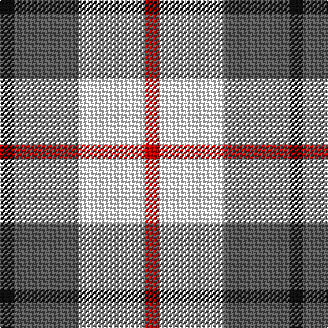

In pattern [KBWR](/patterns/kbwr/).

This was sourced from tartans-authority.  It is a [4 stripes tartan](/stripes/stripes4/).

Original link http://www.tartansauthority.com/tartan-ferret/display/10734/

## Thread count
K/10 N48 W48 R/10

## Palette
Each colour and its ΔE from the base-6 reference it is a variant of.

| Colour | Shade | Base | ΔE (OKLab) |
|---|---|---|---|
| K | <code style="background-color:#101010;">#101010</code> `#101010` | K <code style="background-color:#000000;">#000000</code> | 0.17 |
| N | <code style="background-color:#5C5C5C;">#5C5C5C</code> `#5C5C5C` | B <code style="background-color:#2C4084;">#2C4084</code> | 0.14 |
| R | <code style="background-color:#C80000;">#C80000</code> `#C80000` | R <code style="background-color:#C80000;">#C80000</code> | 0.00 |
| W | <code style="background-color:#FCFCFC;">#FCFCFC</code> `#FCFCFC` | W <code style="background-color:#F4F4F0;">#F4F4F0</code> | 0.03 |

# Sample pattern

## Nearest tartans

The nearest existing variants by ΔTartan distance.

1. [City of London](/setts/s4/k10w48b48ka10-b666666-k000000-ka101010-wffffff/) — ΔT 0.52
1. [MacRae of Conchra #3](/setts/s4/r14w72b72y14-b2c2c80-rc80000-wf0f0d8-ye8c000/) — ΔT 0.68
1. [Louisburg](/setts/s4/r44y20w6b16-b1c0070-r888888-wf8f8f8-ye8c000/) — ΔT 1.27
1. [Boswell Dress Check (Personal)](/setts/s5/b16w26r6w4k10-b3850c8-k101010-rc80000-wf8f8f8/) — ΔT 1.33
1. [MacRae of Conchra](/setts/s4/r4w32b32y4-b102040-rc00000-we0e0e0-yf0c000/) — ΔT 1.33
1. [Boswell Dress (Personal)](/setts/s5/b16w26r6w4k10-b3850c8-k101010-rc80000-wffffff/) — ΔT 1.35
1. [Ardalansish Tweed (Fashion)](/setts/s6/b8y8b16w32ba8w8-b441800-ba5c5c5c-wf0d8bc-ya08858/) — ΔT 1.37
1. [MacLeod, of Argentina](/setts/s5/b20w6b24y28r8-b304080-rc00000-we0e0e0-yf0c000/) — ΔT 1.38
1. [Merrilees Dress (Dance)](/setts/s6/k46b12k12r10w70r20-b1474b4-k101010-rc80000-wf8f8f8/) — ΔT 1.40
1. [Louisburg Canadian District Tartan Tartan Number: 5500. Earliest known date: 1994 Louisburg is a tiny seaside town in Nova Scotia about 20 miles southeast of Sydney and site of the 1758 Battle of Louisburgh. It was designed by Edith MacIntyre of Louisbourg with the assistance of Jean Kyte and Jean composed the following poem about the colours. CIDD count slightly different - RB/20 W8 Y20 LN/34 (John Fitzpatrick's July 2008 review of Canadian tartans). Gray fog and sea and rocks. The yellow sun. white spindrift on the harbour restless beneath an azure sky. Curent owners (2008): The Louisbourg Heritage Society P.O. Box 396 Louisbourg, B0A 1M0 Nova Scotia, Canada See products available Copyright © Blair Urquhart, Comrie, 2015](/setts/s4/r44y20w6k16-k000000-r888888-wf8f8f8-ye8c000/) — ΔT 1.44

## Neighbour map

Every grey dot is one of 15726 variants placed by the first two principal components of the ΔTartan feature space (44% of its variance). Red is this tartan; blue dots are its nearest — click one to open its page.

<svg viewBox="0 0 640 380" role="img" style="max-width:100%;height:auto;border:1px solid #e0e0e0;border-radius:4px;display:block" xmlns="http://www.w3.org/2000/svg"><image href="/nn/cloud.v1.png" width="640" height="380"/><a href="/setts/s4/k10w48b48ka10-b666666-k000000-ka101010-wffffff/"><circle cx="146.7" cy="240.1" r="4" fill="#3465a4"><title>City of London</title></circle></a><a href="/setts/s4/r14w72b72y14-b2c2c80-rc80000-wf0f0d8-ye8c000/"><circle cx="161.4" cy="236.1" r="4" fill="#3465a4"><title>MacRae of Conchra #3</title></circle></a><a href="/setts/s4/r44y20w6b16-b1c0070-r888888-wf8f8f8-ye8c000/"><circle cx="219.5" cy="237.2" r="4" fill="#3465a4"><title>Louisburg</title></circle></a><a href="/setts/s5/b16w26r6w4k10-b3850c8-k101010-rc80000-wf8f8f8/"><circle cx="166.4" cy="218.0" r="4" fill="#3465a4"><title>Boswell Dress Check (Personal)</title></circle></a><a href="/setts/s4/r4w32b32y4-b102040-rc00000-we0e0e0-yf0c000/"><circle cx="207.3" cy="215.5" r="4" fill="#3465a4"><title>MacRae of Conchra</title></circle></a><a href="/setts/s5/b16w26r6w4k10-b3850c8-k101010-rc80000-wffffff/"><circle cx="164.8" cy="216.9" r="4" fill="#3465a4"><title>Boswell Dress (Personal)</title></circle></a><a href="/setts/s6/b8y8b16w32ba8w8-b441800-ba5c5c5c-wf0d8bc-ya08858/"><circle cx="177.6" cy="229.6" r="4" fill="#3465a4"><title>Ardalansish Tweed (Fashion)</title></circle></a><a href="/setts/s5/b20w6b24y28r8-b304080-rc00000-we0e0e0-yf0c000/"><circle cx="187.7" cy="257.7" r="4" fill="#3465a4"><title>MacLeod, of Argentina</title></circle></a><a href="/setts/s6/k46b12k12r10w70r20-b1474b4-k101010-rc80000-wf8f8f8/"><circle cx="153.4" cy="193.9" r="4" fill="#3465a4"><title>Merrilees Dress (Dance)</title></circle></a><a href="/setts/s4/r44y20w6k16-k000000-r888888-wf8f8f8-ye8c000/"><circle cx="201.1" cy="230.8" r="4" fill="#3465a4"><title>Louisburg Canadian District Tartan Tartan Number: 5500. Earliest known date: 1994 Louisburg is a tiny seaside town in Nova Scotia about 20 miles southeast of Sydney and site of the 1758 Battle of Louisburgh. It was designed by Edith MacIntyre of Louisbourg with the assistance of Jean Kyte and Jean composed the following poem about the colours. CIDD count slightly different - RB/20 W8 Y20 LN/34 (John Fitzpatrick's July 2008 review of Canadian tartans). Gray fog and sea and rocks. The yellow sun. white spindrift on the harbour restless beneath an azure sky. Curent owners (2008): The Louisbourg Heritage Society P.O. Box 396 Louisbourg, B0A 1M0 Nova Scotia, Canada See products available Copyright © Blair Urquhart, Comrie, 2015</title></circle></a><circle cx="156.0" cy="239.7" r="5" fill="#c00000"/></svg>

ID: /setts/s4/k10b48w48r10-b5c5c5c-k101010-rc80000-wfcfcfc/
