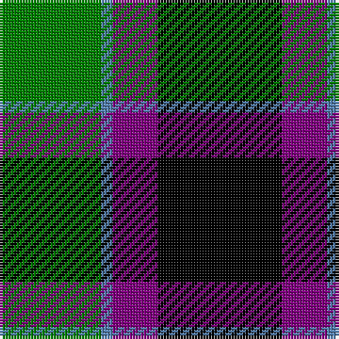

In pattern [GBBK](/patterns/gbbk/).

This was sourced from weddslist.  It is a [4 stripes tartan](/stripes/stripes4/).

Original link http://www.weddslist.com/cgi-bin/tartans/pg.pl?source=sts

## Thread count
G/36 B4 P16 K/44

## Palette
Each colour and its ΔE from the base-6 reference it is a variant of.

| Colour | Shade | Base | ΔE (OKLab) |
|---|---|---|---|
| B | <code style="background-color:#5480B0;">#5480B0</code> `#5480B0` | B <code style="background-color:#2A418A;">#2A418A</code> | 0.19 |
| G | <code style="background-color:#008000;">#008000</code> `#008000` | G <code style="background-color:#006100;">#006100</code> | 0.10 |
| K | <code style="background-color:#000000;">#000000</code> `#000000` | K <code style="background-color:#000000;">#000000</code> | 0.00 |
| P | <code style="background-color:#800080;">#800080</code> `#800080` | B <code style="background-color:#2A418A;">#2A418A</code> | 0.17 |

# Sample pattern

## Nearest tartans

The nearest existing variants by ΔTartan distance.

1. [Wilson's, Folio 131](/setts/s5/b12k17g19w2k5x2~b304080-g008000-k000000-we0e0e0/) — ΔT 0.84
1. [Wilson's, No 150 "Coburg"](/setts/s6/g18b2g4k14ba12k3x2~b5480b0-ba800080-g008000-k000000/) — ΔT 1.07
1. [Wilson's No 158](/setts/s6/g21w2g4k17b14k3x2~b800080-g008000-k000000-we0e0e0/) — ΔT 1.11
1. [Wilson's, No 160](/setts/s6/g21y2g4k16b14k3x2~b800080-g008000-k000000-yf0c000/) — ΔT 1.12
1. [MacKirdy](/setts/s5/k2g12k11b12w1x2~b304080-g008000-k000000-we0e0e0/) — ΔT 1.17
1. [Graham W](/setts/s6/g21w2g4k17b14k3~b5a3094-g004c00-k000000-wd0d0d0/) — ΔT 1.18
1. [Melville](/setts/s6/k5y2g18k17b16k3x2~b6e5058-g11450d-k000000-yaaaaaa/) — ΔT 1.23
1. [Melville](/setts/s6/k5y2g18k17b16k3~b6e5058-g11450d-k000000-yaaaaaa/) — ΔT 1.23
1. [Graham of Montrose](/setts/s6/g4b15w2k16g19k4x2~b304080-g008000-k000000-we0e0e0/) — ΔT 1.27
1. [Melville](/setts/s6/k4w2g18k13b12k2x2~b304080-g008000-k000000-we0e0e0/) — ΔT 1.28

## Neighbour map

Every grey dot is one of 15726 variants placed by the first two principal components of the ΔTartan feature space (44% of its variance). Red is this tartan; blue dots are its nearest — click one to open its page.

<svg viewBox="0 0 640 380" role="img" style="max-width:100%;height:auto;border:1px solid #e0e0e0;border-radius:4px;display:block" xmlns="http://www.w3.org/2000/svg"><image href="/nn/cloud.v1.png" width="640" height="380"/><a href="/setts/s5/b12k17g19w2k5x2~b304080-g008000-k000000-we0e0e0/"><circle cx="161.2" cy="242.0" r="4" fill="#3465a4"><title>Wilson's, Folio 131</title></circle></a><a href="/setts/s6/g18b2g4k14ba12k3x2~b5480b0-ba800080-g008000-k000000/"><circle cx="173.6" cy="222.1" r="4" fill="#3465a4"><title>Wilson's, No 150 &quot;Coburg&quot;</title></circle></a><a href="/setts/s6/g21w2g4k17b14k3x2~b800080-g008000-k000000-we0e0e0/"><circle cx="178.7" cy="210.7" r="4" fill="#3465a4"><title>Wilson's No 158</title></circle></a><a href="/setts/s6/g21y2g4k16b14k3x2~b800080-g008000-k000000-yf0c000/"><circle cx="181.8" cy="211.0" r="4" fill="#3465a4"><title>Wilson's, No 160</title></circle></a><a href="/setts/s5/k2g12k11b12w1x2~b304080-g008000-k000000-we0e0e0/"><circle cx="157.2" cy="227.7" r="4" fill="#3465a4"><title>MacKirdy</title></circle></a><a href="/setts/s6/g21w2g4k17b14k3~b5a3094-g004c00-k000000-wd0d0d0/"><circle cx="197.2" cy="222.2" r="4" fill="#3465a4"><title>Graham W</title></circle></a><a href="/setts/s6/k5y2g18k17b16k3x2~b6e5058-g11450d-k000000-yaaaaaa/"><circle cx="192.1" cy="234.3" r="4" fill="#3465a4"><title>Melville</title></circle></a><a href="/setts/s6/k5y2g18k17b16k3~b6e5058-g11450d-k000000-yaaaaaa/"><circle cx="192.1" cy="234.3" r="4" fill="#3465a4"><title>Melville</title></circle></a><a href="/setts/s6/g4b15w2k16g19k4x2~b304080-g008000-k000000-we0e0e0/"><circle cx="158.2" cy="225.0" r="4" fill="#3465a4"><title>Graham of Montrose</title></circle></a><a href="/setts/s6/k4w2g18k13b12k2x2~b304080-g008000-k000000-we0e0e0/"><circle cx="155.7" cy="222.4" r="4" fill="#3465a4"><title>Melville</title></circle></a><circle cx="200.0" cy="242.6" r="5" fill="#c00000"/></svg>

ID: /setts/s4/k11b4ba1g9x4~b800080-ba5480b0-g008000-k000000/
