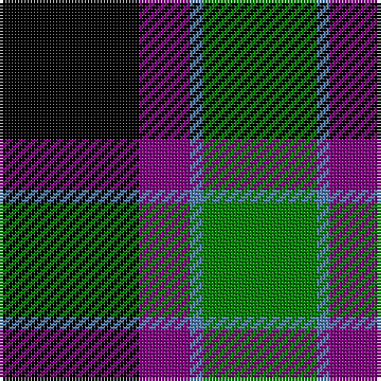

This page is one **sett** — a single exact thread-count. It belongs to the [tartan](/tartans/k11p4t1g9/)
(the same proportion at any scale), whose colour order is pattern [GBBK](/stripes/gbbk/).

Sourced from weddslist.  It is a [4 stripe tartan](/stripes/stripes4/).

Original link http://www.weddslist.com/cgi-bin/tartans/pg.pl?source=sts

## Thread count
K/44 P16 B4 G/36

## Palette

Palette: <strong>Ingles Buchan</strong> <small style="color:#888">(1 of 4 colours)</small>
<table><thead><tr><th>Colour</th><th>Threads</th><th>Shade</th><th>Base</th><th>OKLCh</th></tr></thead><tbody><tr><td>K/</td><td style="text-align:right;font-variant-numeric:tabular-nums">44</td><td><code style="background-color:#000000;">#000000</code> <small style="color:#888">#000000</small></td><td>K <code style="background-color:#000000;">#000000</code></td><td><small style="color:#888">oklch(0.0% 0.000 0.0)</small></td></tr><tr><td>P</td><td style="text-align:right;font-variant-numeric:tabular-nums">16</td><td><code style="background-color:#800080;">#800080</code> <small style="color:#888">#800080</small></td><td>B <code style="background-color:#2A418A;">#2A418A</code></td><td><small style="color:#888">oklch(42.1% 0.193 328.4)</small></td></tr><tr><td>B</td><td style="text-align:right;font-variant-numeric:tabular-nums">4</td><td><code style="background-color:#5480B0;">#5480B0</code> <small style="color:#888">#5480B0</small></td><td>B <code style="background-color:#2A418A;">#2A418A</code></td><td><small style="color:#888">oklch(58.8% 0.089 251.5)</small></td></tr><tr><td>G/</td><td style="text-align:right;font-variant-numeric:tabular-nums">36</td><td><code style="background-color:#008000;">#008000</code> <small style="color:#888">#008000</small></td><td>G <code style="background-color:#006100;">#006100</code></td><td><small style="color:#888">oklch(52.0% 0.177 142.5)</small></td></tr></tbody></table>

# Sample pattern

## Nearest tartans

The nearest existing variants by ΔTartan distance, with this tartan at the top so the swatches line up against it.

ΔTartan

Tartan

Sett

—

<a href="/ttd/edit/#slug=k11p4t1g9~x4">Wilson's, No 228</a> <a class="nn-out" href="/setts/s4/k11p4t1g9~x4/" title="open its dictionary page">↗</a>

0.84

<a href="/ttd/edit/#slug=db12k17g19w2k5~x2">Wilson's, Folio 131</a> <a class="nn-out" href="/setts/s5/db12k17g19w2k5~x2/" title="open its dictionary page">↗</a>

1.07

<a href="/ttd/edit/#slug=g18t2g4k14p12k3~x2">Wilson's, No 150 &quot;Coburg&quot;</a> <a class="nn-out" href="/setts/s6/g18t2g4k14p12k3~x2/" title="open its dictionary page">↗</a>

1.11

<a href="/ttd/edit/#slug=g21w2g4k17p14k3~x2">Wilson's No 158</a> <a class="nn-out" href="/setts/s6/g21w2g4k17p14k3~x2/" title="open its dictionary page">↗</a>

1.12

<a href="/ttd/edit/#slug=g21ly2g4k16p14k3~x2">Wilson's, No 160</a> <a class="nn-out" href="/setts/s6/g21ly2g4k16p14k3~x2/" title="open its dictionary page">↗</a>

1.16

<a href="/ttd/edit/#slug=k2g12k11db12w1~x2">MacKirdy</a> <a class="nn-out" href="/setts/s5/k2g12k11db12w1~x2/" title="open its dictionary page">↗</a>

1.18

<a href="/ttd/edit/#slug=dg21lb2dg4k17dp14k3">Graham W</a> <a class="nn-out" href="/setts/s6/dg21lb2dg4k17dp14k3/" title="open its dictionary page">↗</a>

1.23

<a href="/ttd/edit/#slug=k5lr2dg18k17n16k3~x2">Melville</a> <a class="nn-out" href="/setts/s6/k5lr2dg18k17n16k3~x2/" title="open its dictionary page">↗</a>

1.23

<a href="/ttd/edit/#slug=k5lr2dg18k17n16k3">Melville</a> <a class="nn-out" href="/setts/s6/k5lr2dg18k17n16k3/" title="open its dictionary page">↗</a>

1.27

<a href="/ttd/edit/#slug=k4g19k16w2db15g4~x2">Graham of Montrose</a> <a class="nn-out" href="/setts/s6/k4g19k16w2db15g4~x2/" title="open its dictionary page">↗</a>

1.28

<a href="/ttd/edit/#slug=k4w2g18k13db12k2~x2">Melville</a> <a class="nn-out" href="/setts/s6/k4w2g18k13db12k2~x2/" title="open its dictionary page">↗</a>

## Neighbour map

Every grey dot is one of 14359 variants placed by the first two principal components of the ΔTartan feature space (44% of its variance). Red is this tartan; blue dots are its nearest — click one to open its page.

<svg viewBox="0 0 640 380" role="img" style="max-width:100%;height:auto;border:1px solid #e0e0e0;border-radius:4px;display:block" xmlns="http://www.w3.org/2000/svg"><image href="/nn/cloud.v1.png" width="640" height="380"/><a href="/setts/s5/db12k17g19w2k5~x2/"><circle cx="165.0" cy="242.0" r="4" fill="#3465a4"><title>Wilson's, Folio 131</title></circle></a><a href="/setts/s6/g18t2g4k14p12k3~x2/"><circle cx="176.7" cy="221.4" r="4" fill="#3465a4"><title>Wilson's, No 150 &quot;Coburg&quot;</title></circle></a><a href="/setts/s6/g21w2g4k17p14k3~x2/"><circle cx="181.7" cy="209.6" r="4" fill="#3465a4"><title>Wilson's No 158</title></circle></a><a href="/setts/s6/g21ly2g4k16p14k3~x2/"><circle cx="184.7" cy="209.9" r="4" fill="#3465a4"><title>Wilson's, No 160</title></circle></a><a href="/setts/s5/k2g12k11db12w1~x2/"><circle cx="161.1" cy="228.6" r="4" fill="#3465a4"><title>MacKirdy</title></circle></a><a href="/setts/s6/dg21lb2dg4k17dp14k3/"><circle cx="200.7" cy="223.5" r="4" fill="#3465a4"><title>Graham W</title></circle></a><a href="/setts/s6/k5lr2dg18k17n16k3~x2/"><circle cx="195.2" cy="236.0" r="4" fill="#3465a4"><title>Melville</title></circle></a><a href="/setts/s6/k5lr2dg18k17n16k3/"><circle cx="195.2" cy="236.0" r="4" fill="#3465a4"><title>Melville</title></circle></a><a href="/setts/s6/k4g19k16w2db15g4~x2/"><circle cx="162.0" cy="225.6" r="4" fill="#3465a4"><title>Graham of Montrose</title></circle></a><a href="/setts/s6/k4w2g18k13db12k2~x2/"><circle cx="159.6" cy="222.8" r="4" fill="#3465a4"><title>Melville</title></circle></a><circle cx="203.1" cy="241.3" r="5" fill="#c00000"/></svg>

ID: /setts/s4/k11p4t1g9~x4/
